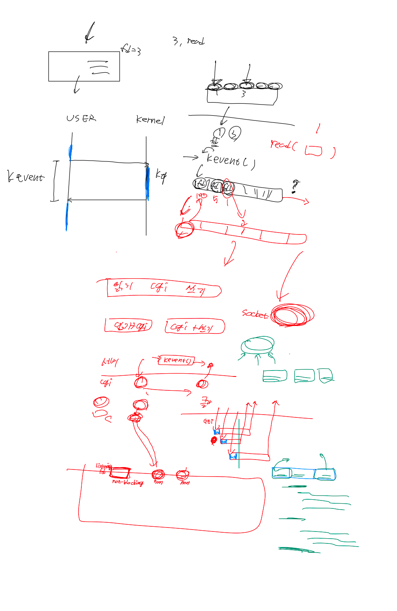

# webserv 개념 공부

[I/O의 Sync와 Blocking 그리고 Multiplexing](https://jiwondev.tistory.com/118)

[[네이버클라우드 기술&경험] IO Multiplexing (IO 멀티플렉싱) 기본 개념부터 심화까지 -1부-](https://blog.naver.com/n_cloudplatform/222189669084)

[[네이버클라우드 기술&경험] IO Multiplexing (IO 멀티플렉싱) 기본 개념부터 심화까지 -2부-](https://blog.naver.com/PostView.naver?blogId=n_cloudplatform&logNo=222255261317&parentCategoryNo=&categoryNo=11&viewDate=&isShowPopularPosts=false&from=postView)

- 위에 3개 글 정독..

### Sync, Async, blocking, non-blocking 개념 정리

- I/O Multiplexing == async + blocking 이다.

### kqueue 개념 정리

- 파일, 소켓, 프로세스, 시그널 등 다양한 이벤트를 관리
    
- level 트리거, edge 트리거
    
- 그럼 kqueue를 사용한 상황에서 I/O non-blocking은 왜 해야 하는가? ← 아직 잘 모르겠음..

### cgi를 구현하는 방법에 대한 고민

- cgi 프로세스를 fork 한 뒤, pipe를 kqueue에 등록하여 확인
- **EVFILT_PROC** 플래그를 이용한 프로세스 이벤트 관리
- 여러 cgi 요청에 대해 어떻게 처리해야 하는가? → 각 요청마다 fork?

### 웹 서버에 요청이 들어온 뒤 어떻게 요청을 처리해야 하는가에 대한 고민

- 요청 읽기 → 요청에 맞게 처리 → 응답 제작 → 응답 쓰기
- 위 과정을 각 요청마다 하는가? 아니면 여러 요청에 대해 병렬적으로 하는가?
- 요청을 전부 읽은 뒤 다음 요청을 처리? → 엄청 긴 요청이라면?
- 비동기 응답을 어떻게 구현할 것인가?
    - **클라이언트 한명이 서로 다른 크기의 이미지 3장을 웹서버에 요청했어. 그림 A, B, C 순서로 요청했지만 A 파일의 크기가 너무 커서 클라이언트는 B C A 순서로 응답을 받았어. 이 때 웹 서버 입장에서는 이 이미지 3장 요청을 어떤 식으로 처리해야돼?**
    - 여러 개 + 엄청 큰 파일의 I/O를 어떻게 처리해야 할 지 고민해야함..
    - 한 파일씩 처리 = 너무 오래 걸릴 것 같음, 병렬적으로 처리 = 어떻게?

### 정민이와의 이야기..

- 브라우저가 페이지를 새로고침하면 엄청나게 많은 요청과 응답이 오간다. 이 과정에서 웹 서버와의 커넥션은 어떻게 될까?
    ![[Pasted image 20231128214246.png]]
    
    - http 1.1부터는 keep-alive 메커니즘을 사용
        - 한 번 생성된 TCP 연결을 요청-응답 후에 바로 종료하지 않고 유지
        - 여러 요청을 순차적으로 처리
    - 다만 1.1에서는 TCP 연결 하나에, 한번에 하나의 요청을 처리
        - 요청에 대한 응답이 완료되어야 그 다음 요청을 처리
        - 여러 요청을 동시에 처리할 수 없음 → http/2에 tcp 하나에서의 multiplexing 도입