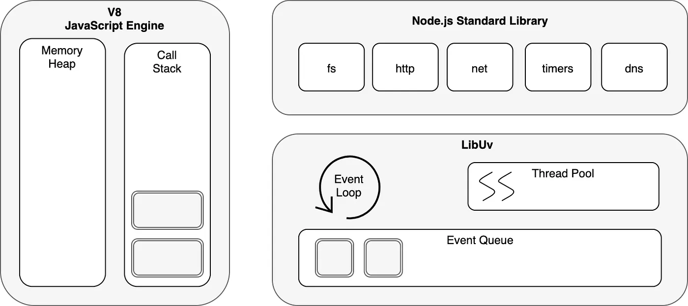
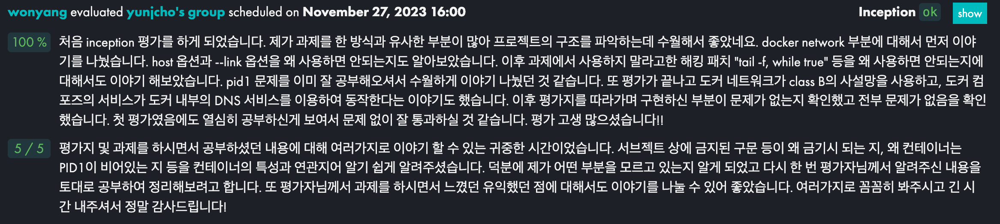
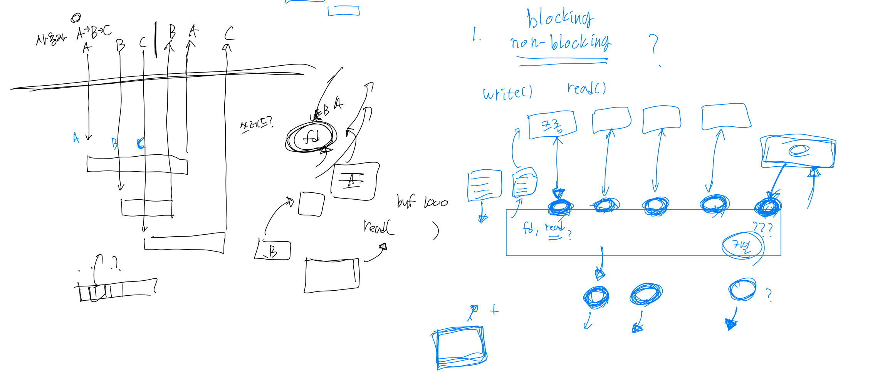

### CORS

[CORS는 왜 이렇게 우리를 힘들게 하는걸까?](https://evan-moon.github.io/2020/05/21/about-cors/#cors%EC%97%90-%EB%8C%80%ED%95%9C-%EA%B8%B0%EB%B3%B8%EC%A0%81%EC%9D%B8-%EB%82%B4%EC%9A%A9)

- SOP(Same-Origin Policy)를 지키기 위함
    - 같은 출처에서만 리소스를 공유할 수 있음 → 왜? → CSRF, XSS 공격을 막기 위함
    - CORS를 준수하면 같은 출처가 아닌 상황에서도 리소스를 받을 수 있음
- 같은 출처의 구분
    - 스킴, 호스트, 포트 3가지가 동일하면 같은 출처로 인식
    - 출처를 비교하는 로직은 브라우저에 구현된 스펙이다.
- 요청 헤더의 Origin 값과 응답 헤더의 **Access-Control-Request-Headers** 값을 비교하여 출처 확인
- CORS 정책 위반 에러는 요청의 성공 여부와는 상관이 없음
    - 브라우저가 CORS 정책 위반 여부를 판단하는 시점은 요청에 대한 응답을 받은 이후이기 때문

[웹개발 짜증유발자! CORS가 뭔가요?](https://www.youtube.com/watch?v=bW31xiNB8Nc)

[교차 출처 리소스 공유 (CORS) - HTTP | MDN](https://developer.mozilla.org/ko/docs/Web/HTTP/CORS)

### CSRF

[사이트 간 요청 위조](https://ko.wikipedia.org/wiki/%EC%82%AC%EC%9D%B4%ED%8A%B8_%EA%B0%84_%EC%9A%94%EC%B2%AD_%EC%9C%84%EC%A1%B0)

- CSRF: 사이트 간 요청 위조 (Cross-site request forgery)
- 사용자가 자신의 의지와는 무관하게 공격자가 의도한 행위(수정, 삭제, 등록)를 특정 웹사이트에 요청하게 하는 공격
- 공격 과정
    - 이용자가 웹사이트에 로그인하여 정상적인 쿠키를 받음
    - 공격자가 링크를 이용자에게 전달 - 링크 안 이미지태그에는 공격 요청 url이 들어가 있음
    - 사용자가 공격용 페이지를 열면, 브라우저는 이미지 파일을 받아오기 위해 공격용 url을 열음
    - 이용자의 승인이나 인지 없이 공격이 완료됨 - 해당 사이트는 쿠키를 이용한 본인확인만 하므로 의도치 않은 수정이 가능

### XSS

[사이트 간 스크립팅](https://ko.wikipedia.org/wiki/%EC%82%AC%EC%9D%B4%ED%8A%B8_%EA%B0%84_%EC%8A%A4%ED%81%AC%EB%A6%BD%ED%8C%85)

- XSS: 사이트 간 스크립팅 (Cross-site scripting)
- 웹 사이트에 악성 스크립트를 삽입할 수 있는 취약점
- 해커가 사용자의 정보(쿠키, 세션 등)를 탈취, 자동으로 비정상적인 기능 수행

### NodeJS Event Loop

[NodeJS Event Loop파헤치기](https://medium.com/zigbang/nodejs-event-loop%ED%8C%8C%ED%97%A4%EC%B9%98%EA%B8%B0-16e9290f2b30)

- NodeJS는 Single Thread 기반인데 어떻게 Non Blocking I/O를 지원하는가?
- V8: JS코드를 기계어로 해석하여 OS가 실행할 수 있는 상태로 만들어 줌
    - NodeJS 환경에서 자바스크립트로 File, Network I/O를 할 수 있는 이유
- libuv: 비동기 I/O를 지원하는 C언어 라이브러리
    - 윈도우, 리눅스 커널을 Wrapping하여 추상화한 구조
    - 커널의 비동기 API(리눅스 - AIO)가 지원할 수 없는 작업을 비동기화 하기 위해 별도의 Thread Pool을 가지고 있음 → 그럼 싱글 스레드 기반이 맞나?? → 자바스크립트 실행은 Main Thread에 의해서만 진행됨
    - Event Loop, Event Queue를 관리함
- 동기적 call stack 실행만 있다고 가정 했을 때 File, Network I/O가 느려진다면 남은 실행은 점점 Blocking되어 느려짐
    - 이 병목을 해결하기 위해 NodeJS가 선택한 방식이 **비동기 callback 프로그래밍 모델인 Event Loop**
    - Single Thread와 궁합이 좋은 방식
- NodeJS는 자바 스크립트 실행을 위한 Main Thread 1개 + Event Loop를 위한 Thread 1개가 아니다!
    - Event Loop는 Main Thread 안에서 실행됨 → 비동기 callback 작업이 수행될 수 있도록 도와줌

- libuv가 비동기 callback을 수행하는 과정
    - 요청이 들어오면 Event Loop가 해당 요청이 Blocking I/O인지 아닌지 판별
    - 커널의 비동기 I/O (리눅스의 AIO)의 지원을 받을 수 있는 Non-Blocking I/O 요청 → 커널의 interface로 해당 요청 처리 → Event Queue에 callback을 등록
    - Blocking I/O (File, Network 작업들)라면 libuv 내의 별도의 Thread Pool에서 Worker Thread를 선택하여 작업을 위임 → 작업 완료 후 Event Queue로 callback을 등록
    - Event Loop는 주기적으로 call stack이 비어있는지 체크 → Event Queue에 실행 대기 중인 callback이 있다면 callback들을 call stack으로 이동 → Main Thread에 의해 실행될 수 있게 만들어줌

### yunjcho’s Inception 평가

- docker network에서 host 옵션은 무엇일까?
- —link 옵션을 사용하지 않게 된 이유
- Dockerfile의 Entrypoint에 tail -f, while true를 사용하지 않아야 하는 이유
    - pid 1 문제
- docker network는 class B 사설망을 사용하고 도커 내부의 DNS 서비스를 이용함
- 도커는 호스트의 커널을 사용하기 때문에 VM에 비해 보안 문제에 취약하다?

### webserv 고민 몇 가지,,

- kqueue를 사용하는 상황에서 non-blocking이 왜 필요한가?
    
    - kqueue에서 반환하는 이벤트는 blocking이 안걸리는 것이 보장된게 아닌가?
- 파일, 파이프를 I/O하는 과정에서도 kqueue와 nonblocking이 필요한가?
    
    - 이를 이용해서 얻을 수 있는 이점이 뭘까?
- 사용자가 이미지 A, B, C를 요청했을때, 비동기적으로 응답해주는 방법이 있을까?
    
    - 파일 I/O는 blocking이라고 들었는데, 이를 비동기적으로 처리하려면 쓰레드를 사용해야 하는 것 아닌가?
- cgi를 매 사용자마다 fork로 호출해야 할까?
    
    - 1000명의 사용자가 요청을 한다면 1000개 fork 해야하는가?
    - 그렇다고 요청이 필요할 때만 fork를 하는게 맞는가?
- **Partial I/O??**
    
- **writev?**
    

[열혈 TCP/IP 13-2. readv & writev 입출력 함수](https://1d1cblog.tistory.com/360)

[Nginx Architecture 분석](https://cyuu.tistory.com/172)

### 도커 네트워크

- 상황: 리액트 페이지를 제공하는 프론트 서버와 api를 제공하는 백엔드 서버를 도커로 이식했을 때 사용자의 브라우저에서 fetch가 제대로 이뤄지지 않음
- 문제점: fetch에서 사용하는 api 요청 path를 백엔드 서버의 도커 컴포즈 서비스 명으로 변경했음
    - 도커 DNS가 이를 자동으로 변환하여 도커 내의 백엔드 서버 ip를 찾아 요청하도록 유도한 것이었음
    - 리액트, fetch 특성상 요청을 날리는 주체가 프론트서버가 아닌 사용자의 브라우저였기 때문에 도커 네트워크 외부에서 요청을 날려 컴포즈 서비스 명을 DNS로 변환하지 못함
- 해결: 도커 내의 백엔드 서버는 도커를 돌리는 호스트 머신과 포트 포워딩을 하여 연결
    - fetch에서 사용하는 요청 path는 해당 호스트 머신의 IP로 변경
    - 브라우저에서 호스트 머신 IP로 요청하면 요청이 포트 포워딩이 되어 도커 내의 백엔드 서버로 감