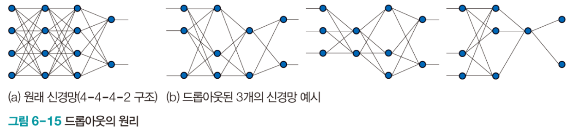

## 학교
### 컨볼루션 신경망 시각화
- 그동안은 딥러닝 학습 알고리즘의 수렴 특성을 관찰할 수 있도록 **학습 곡선 시각화**를 했음
- 컨볼루션층의 커널, 컨볼루션층과 풀링층이 추출해주는 특징 맵을 시각화할 수 있음
- XAI: 설명 가능 인공지능
  - 딥러닝으로 구현한 인공지능은 성능이 뛰어나지만 왜 그런 의사결정을 했는지 설명하는 능력은 떨어짐 -> 직관적으로 보아야 함
  - 커널과 특징 맵의 시각화를 이용해 의사결정에 대한 이유를 해석
  - 커널, 특징 맵 시각화는 가장 낮은 수준의 설명 가능 -> 쉽게 적용 가능하고 많은 정보를 주기 때문에 애용함

- 모델이 컨볼루션층에서 특징을 추출하는데 사용한 커널 시각화

- 커널로 추출된 특징 맵 시각화


- 컨볼루션 신경망은 다양한 커널을 이용해 이미지에서 특징 정보를 추출함
- 추출된 특징 정보를 이용하여 classification 함
- 매번 느낌으로만 이해했는데 시각화해서 보니 CNN의 원리를 확실히 알게 되었다.

### 딥러닝 규제

- 딥러닝 학습 알고리즘이 사용하는 매개변수는 매우 방대함
  - 컨볼루션층 4개, 완전연결층 2개의 간단한 CNN 모델도 매개변수가 89만개 이상임
- 학습 중 overfitting에 빠질 가능성이 있는데, 딥러닝에서는 이를 방지하려 신경망을 작게 만들지 않음
  - 다양한 규제 기법(regulation)을 적용해 overfitting을 방지함
- 자주 사용하는 regulation에는 data augmentation, dropout, weight decay가 있음
### data augmentation: 데이터 증대

- overfitting을 방지하는 가장 확실한 방법은 훈련 데이터 셋을 늘리는 것
- 데이터 셋을 추가로 수집하는 것은 많은 시간과 비용이 들음
- 주어진 데이터를 적절하게 변형하여 인위적으로 증대하는 전략이 data augmentation
- 영상 데이터의 경우 상하좌우 이동, 약간 회전, 좌우 상하 반전, 명암 조절 등 여러가지 변환을 조합하여 영상의 개수를 늘림

```python
from torchvision.transforms import Compose, RandomAffine, Random VerticalFlip, RandomHorizontalFlip, RandomCrop, Resize

transform = Compose([
	transform = Compose([
    RandomAffine(degrees=(-20, 20), translate=(0.2, 0.2)),  # 주어진 범위 내에서 랜덤하게 회전 혹은 이동을 적용
    RandomCrop((24, 24)),  # 랜덤한 영역을 크롭
    Resize((32, 32)),  # 크롭한 이미지의 크기를 늘려 확대
    RandomHorizontalFlip(p=0.5),  # 랜덤하게 수평 회전
    RandomVerticalFlip(p=0.5)  # 랜덤하게 수직 회전
])
])
```

### dropout: 드롭아웃
- 가중치를 임의로 선택해 불능으로 만들고 학습하는 단순한 아이디어
- overfitting을 해소하는 데 매우 효과적

- 일정 비율의 edge를 불능으로 만들어 학습에 참여하지 않게 함
  - edge의 입력을 0으로 설정해 계산에 영향을 미치지 못하게 함
  - 0.25로 설정하면 전체 가중치 중 25%를 불능으로 만듬
  - 불능이 될 edge는 랜덤하게 선택
- 2023년 현재 트렌드로는 dropout을 잘 사용하지 않음
  - dropout이 안 좋아서라기 보다는 더 좋은 기법들이 등장했기 때문
  - normalization을 이용한 방법들이 사용됨

### weight decay: 가중치 감쇠
- 큰 가중치 값이 overfitting을 일으키는 주요 원인에 해당됨
- 성능을 유지한 채로 가중치의 크기를 낮출 수 있다면 overfitting을 어느 정도 막을 수 있음
- 기본적으로 Loss Function으로 MSE를 사용함
  
- L1(lasso regularization), L2(ridge regularization) 가중치 감쇠를 사용
  
  

## 개발
### 무중단 배포
공부 자료: [[Infra] 무중단 배포 방식(Rolling / BlueGreen / Canary)](https://llshl.tistory.com/47)

- 애플리케이션이 중단되는 일 없이 배포하는 것
- 애플리케이션의 새로운 버전을 배포하기 위해서는 기존 실행하던 서비스를 종료하고 새로운 버전을 다운 받아야 함
  - 이 시간동안 애플리케이션은 중된됨 -> 다운타임(downtime)
- 무중단 배포에는 총 3가지 방법이 있음
1. Rolling 배포

- 사용 중인 인스턴스 내에서 새 버전을 점진적으로 교체
- 서비스 중인 인스턴스 중 하나를 로드밸런서에서 라우팅하지 않도록 한 뒤, 새 버전을 적용하여 다시 라우팅
- 장점
  - 인스턴스마다 차례로 배포하기 때문에 손쉽게 롤백이 가능
  - 추가적으로 인스턴스를 늘리지 않아도 됨
- 단점
  - 배포하는 과정에서 인스턴스의 수가 감소하기 때문에 트래픽이 몰릴 수 있음
  - 배포 중 구버전과 신버전이 공존하기 때문에 호환성 문제가 발생

2. Blue Green 배포

- Blue는 구버전 Green은 신버전을 의미
- 운영 중인 구버전과 동일하게 신버전의 인스턴스를 구성한 뒤, 로드밸런서를 통해 모든 트래픽을 한번에 신버전 쪽으로 전환
- 장점
  - 구버전의 인스턴스가 남아있어 손쉬운 롤백 가능
  - 구버전의 환경을 다음 배포에 재사용 가능
- 단점
  - 시스템 자원이 두배로 필요함
  - 새로운 환경에 대한 사전 테스트가 필요함

3. 카나리 배포

- 광부들이 카나리아 새를 이용해 유독 가스 누출을 감지했던 것에서 유래..
- 신버전을 소수의 유저들에게만 배포한 뒤, 문제가 없는 것을 확인해 가며 점차 많은 유저에게 배포
  - 인스타에서 이런 방식으로 배포하는 것을 본 적이 있다
- Blue Green 배포와 유사하지만 트래픽을 한번에 바꾸는 대신 단계적으로 전환
  - 부정적인 영향을 최소화하며 문제 시 롤백할 수 있음
- 장점
  - 문제 상황을 빠르게 감지
- 단점
  - 네트워크 트래픽 제어 부담

### 객체지향
05장 책임과 메시지
- 객체는 자신이 맡은 책임을 수행하는 **자율적인** 존재이다.
  - 이번 장에서는 자율적인 존재라는 부분을 강조했음
- 객체에 너무 많은 책임이 있을 경우 그 객체의 자율성이 떨어진다.
  - 객체가 책임을 수행하기 위해 방법을 선택할 자유의 범위를 제한
  - 적절한 정도의 책임을 부여해야 함
- 자율적인 책임의 특징은 객체가 '어떻게(how)'해야 하는가가 아니라 '무엇(what)'을 해야 하는가를 설명한다는 것이다.
  - 어떻게 해야 하는가를 책임으로 주게 되면 자율성이 떨어짐
  - 무엇을 해야 하는가를 책임으로 주지 않으면 책임의 의도가 모호해짐
- 객체에게 적절한 책임을 부여해야 한다는 게 중요한 것 같다..

### Markdown
- 기존에는 TIL를 노션에서 작성했음
- 이를 github에 올리기 위해 vscode를 이용해 문서를 작성할 환경을 구축

참고 자료: [vscode 마크다운 이미지 쉽게 넣기](https://blue-mina.tistory.com/131)
- Markdown 문서 안에 이미지를 넣기 위해서는 온라인 링크 혹은 로컬 파일 경로를 적어줘야 함
- 문서를 작성하면서 이미지를 복사-붙여넣기 하는 과정이 번거로워 extention을 사용
1. 이미지를 문서에 cmd + alt + v로 붙여 넣음
2. 문서에는 로컬 이미지 경로가 Markdown 문법으로 넣어짐
3. 로컬 이미지 파일은 resources라는 폴더에 저장됨
4. Good!

- 문서가 쌓여가면서 resources 폴더 안에 이미지 파일이 엄청 많아질텐데 이를 어떻게 관리할지도 생각해 봐야겠다..
