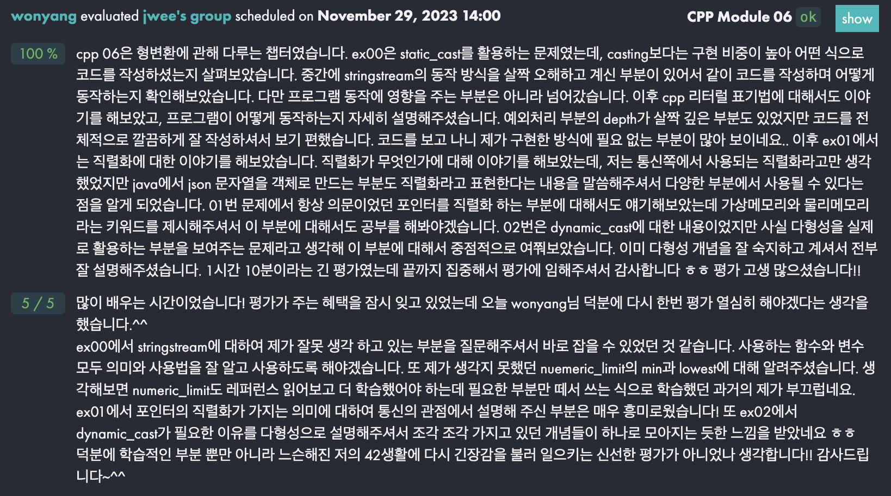
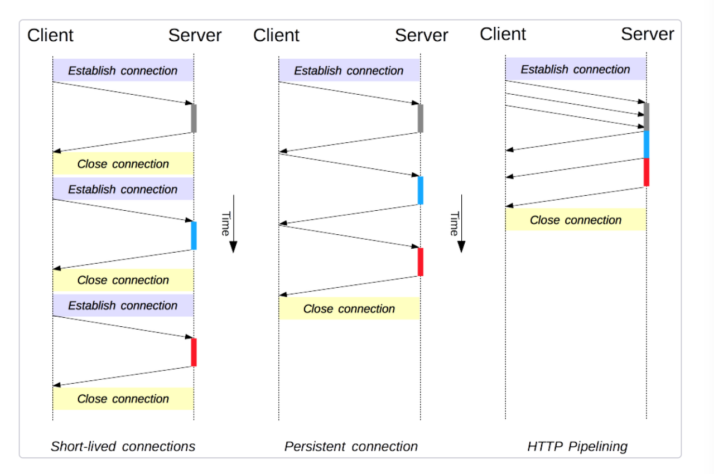

## JSON 파서 만들기

### 공부 자료
- [나만의 JSON 파서로 재귀 파싱 연습하기](https://80000coding.oopy.io/4b9531a2-d526-45cf-9ba0-c29a1d3908e1)
- [JSON](https://ko.wikipedia.org/wiki/JSON)
- [배커스-나우르 표기법](https://ko.wikipedia.org/wiki/%EB%B0%B0%EC%BB%A4%EC%8A%A4-%EB%82%98%EC%9A%B0%EB%A5%B4_%ED%91%9C%EA%B8%B0%EB%B2%95)
- [프로젝트 repo](https://github.com/gemstoneyang/JSON-Parser)

### 괄호가 포함된 사칙연산
**BNF**
```
<expression> ::= <term> | <expression> "+" <term> | <expression> "-" <term>
<term> ::= <factor> | <term> "*" <factor> | <term> "/" <factor>
<factor> ::= <number> | "(" <expression> ")"
<number> ::= <digit> | <digit> <number>
<digit> ::= 0 | 1 | 2 | 3 | 4 | 5 | 6 | 7 | 8 | 9
```

- TokenType에 왼쪽 괄호, 오른쪽 괄호 추가
- Lexer가 괄호를 구분하여 토큰값 반환
- Parser에서 factor 부분 표현 반영
  - 괄호가 있을 경우 expression 값 파싱
  - 재귀 하향 활용

### 소수점이 포함된 사칙연산
**BNF**
```
<expression> ::= <term> | <expression> "+" <term> | <expression> "-" <term>
<term> ::= <factor> | <term> "*" <factor> | <term> "/" <factor>
<factor> ::= <number> | "(" <expression> ")"
<number> ::= <integer_part> | <integer_part> "." <fractional_part>
<integer_part> ::= <digit> | <digit> <integer_part>
<fractional_part> ::= <digit> | <digit> <fractional_part>
<digit> ::= 0 | 1 | 2 | 3 | 4 | 5 | 6 | 7 | 8 | 9
```
- Token 구조체의 type을 double로 변경
- number를 정수부 + 소수부로 재정의

### JSON 구조 학습
참고 자료: [JSON](https://ko.wikipedia.org/wiki/JSON)
- JSON 자료형
  - number: 정수, 실수(고정 소수점, 부동 소수점)
  - String: 큰 따옴표(")로 구분, 이스케이프 문법 지원
  - Boolean: true, false
  - Array: 순서가 있는 리스트. 대괄호로 나타냄
  - Object: 순서가 없는 key/value 쌍
  - null: 빈 값
- JSON의 메시지 단위는 배열이나 객체임

### JSON BNF 작성
```
<json> ::= <object> | <array>

<object> ::= "{" <members> "}" | "{}"
<members> ::= <pair> | <pair> "," <members>
<pair> ::= <string> ":" <value>

<array> ::= "[" <elements> "]" | "[]"
<elements> ::= <value> | <value> "," <elements>

<value> ::= <string> | <number> | <object> | <array> | <boolean> | <null>

<string> ::= '"' <characters> '"' | '""'
<characters> ::= <character> | <character> <characters>
<character> ::= <normal-character> | <escaped-character>
<normal-character> ::= any-Unicode-character-except-"-or-\-or-control-character
<escaped-character> ::= <escape>
<escape> ::= '\' ( '"' | '\' | '/' | 'b' | 'f' | 'n' | 'r' | 't' | <unicode> )
<unicode> ::= 'u' <hexdig> <hexdig> <hexdig> <hexdig>
<hexdig> ::= "0" | "1" | "2" | "3" | "4" | "5" | "6" | "7" | "8" | "9" | "A" | "B" | "C" | "D" | "E" | "F"


<number> ::= <integer> <fraction> <exponent>
<integer> ::= <digit> | <onenine> <digits> | "-" <digits> | "-" <onenine> <digits>
<digits> ::= <digit> | <digit> <digits>
<digit> ::= "0" | <onenine>
<onenine> ::= "1" | "2" | "3" | "4" | "5" | "6" | "7" | "8" | "9"
<fraction> ::= "." <digits> | ""
<exponent> ::= "E" <sign> <digits> | "e" <sign> <digits> | ""
<sign> ::= "+" | "-" | ""

<boolean> ::= "true" | "false"
<null> ::= "null"

```

### JsonData 구조체 정의
```c++
#pragma once
#ifndef __JSONDATA_HPP__
#define __JSONDATA_HPP__

#include <stdexcept>
#include <string>
#include <utility>
#include <vector>

enum JsonType { STRING, NUMBER, OBJECT, ARRAY, BOOLEAN, NULLTYPE };

class JsonData {
 public:
  JsonData(const std::string& str);
  JsonData(double num);
  JsonData(const std::vector<std::pair<std::string, JsonData> >& obj);
  JsonData(const std::vector<JsonData>& arr);
  JsonData(bool b);
  JsonData();

  JsonType getType() const;
  std::string getString() const;
  double getNumber() const;
  const std::vector<JsonData>& getArray() const;
  const std::vector<std::pair<std::string, JsonData> >& getObject() const;
  bool getBoolean() const;

 private:
  JsonType _type;
  std::string _str;
  double _num;
  std::vector<JsonData> _arr;
  std::vector<std::pair<std::string, JsonData> > _obj;
  bool _b;
};

#endif
```

## jwee's CPP Module 06 동료 평가

### stringstream
[레퍼런스](https://cplusplus.com/reference/sstream/stringstream/)
```c++
#include <iostream>
#include <sstreaim>
#include <string>

int main(void) {
  std::stringstream ss;
  std::string str = "8";

  ss << static_cast<int>(str);

  std::cout << ss.str() << std::endl; // 8

  return 0;
}
```

- `stringstream`에 정수를 넣은 뒤, str() 메서드를 호출하면 ascii code 8에 해당하는 문자가 나올 수 있다?
- 예제 코드 작성 결과 8이라는 문자가 반환됨

### Serialization: 직렬화
참고 자료: [직렬화](https://ko.wikipedia.org/wiki/%EC%A7%81%EB%A0%AC%ED%99%94)

**통신 관점**

- 네트워크 통신을 위한 채널은 `byte stream`으로 이뤄져 있음
- 프로그램 내의 데이터를 채널을 통해 전송하기 위해서는 그 값을 byte로 변환해야됨
- 이때 직렬화를 이용해 byte로 데이터를 변환한 뒤 전송
- 데이터를 받은 수신자는 byte stream을 역직렬화 하여 복호화

**자바 객체 직렬화**

참고 자료: [Java의 객체 직렬화와 JSON 직렬화](https://atoz-develop.tistory.com/entry/JAVA%EC%9D%98-%EA%B0%9D%EC%B2%B4-%EC%A7%81%EB%A0%AC%ED%99%94Serialization%EC%99%80-JSON-%EC%A7%81%EB%A0%AC%ED%99%94)
- 자바에서 객체에 저장된 데이터를 문자열로 변환하는 과정을 직렬화라고 표현
- Http 통신에서는 결국 문자열을 주고 받으므로 이 관점에서는 문자열 또한 직렬화라고 볼 수 있다는 점을 알게 되었다.

- 객체 -> JSON 문자열
```java
List<Member> memberList = new ArrayList<>();
memberList.add(new Member("Kate", 30, "1234"));
memberList.add(new Member("Jason", 23, "5678"));
memberList.add(new Member("Aaron", 35, "9012"));

ObjectMapper mapper = new ObjectMapper();

// object to json
mapper.configure(MapperFeature.PROPAGATE_TRANSIENT_MARKER, true);
mapper.writeValue(new File("test.json"), memberList);
```

- JSON 문자열 -> 객체

```java
ObjectMapper mapper = new ObjectMapper();

// json to object
mapper.configure(MapperFeature.PROPAGATE_TRANSIENT_MARKER, true);
mapper.writeValue(new File("test.json"), memberList);
System.out.println(mapper.readValue(new File("test.json"), new ArrayList<Member>().getClass()));
```

### dynamic_cast
참고 자료: [dynamic_cast](https://en.cppreference.com/w/cpp/language/dynamic_cast), [virtual table](https://pabloariasal.github.io/2017/06/10/understanding-virtual-tables/), [객체 지향의 4가지 특징](https://www.codestates.com/blog/content/%EA%B0%9D%EC%B2%B4-%EC%A7%80%ED%96%A5-%ED%94%84%EB%A1%9C%EA%B7%B8%EB%9E%98%EB%B0%8D-%ED%8A%B9%EC%A7%95)

- 다형성을 위한 cast
- 다른 cast와는 다르게 (`static_cast`, `const_cast`, `reinterpret_cast`) run-time에 cast가 수행됨
- 해당 객체의 virtual table을 확인하여 cast가 가능한지 반환
- 서로 다른 기능을 가진 객체들을 공통점으로 추상화하여 관리 -> 필요할 때 dynamic_cast를 하는 것이 다형성이라고 보았다.

## webserv 고민

### blocking I/O 비동기 처리
참고 자료: [Nginx Architecture](https://cyuu.tistory.com/172), [NodeJS EventLoop](https://medium.com/zigbang/nodejs-event-loop%ED%8C%8C%ED%97%A4%EC%B9%98%EA%B8%B0-16e9290f2b30)
- 기존에 "한 클라이언트가 서로 다른 크기의 이미지 3장을 요청한 경우 비동기적으로 응답해주는 방법"에 대해서 고민했었다.
  - 실제 브라우저에서 요청을 받아올 때는 이렇게 받기 때문에 고민이 시작됐다.
- 파일 I/O는 `blocking I/O` 작업이기 때문에 커널의 `AIO 시스템 콜`을 사용할 수 없음
- nginx의 경우 `Thread Pool`을 두고 여기에 맡기는 듯하다.
- 얼마 전 공부한 node.js 또한 `single thread`로 동작하기 때문에 같은 문제가 있음
  - node.js 안에서 비동기 처리를 담당하는 LibUv 또한 `Thread Pool`을 이용해 `blocking I/O` 작업을 수행

### http 1.1
참고 자료: [HTTP 1.1, HTTP 2.0](https://dkrnfls.tistory.com/289)

- http 1.0은 매 요청-응답 과정마다 TCP를 연결-해제 하였음
- http 1.1은 `Persistent connection`을 도입
  - TCP 연결-해제 과정이 사라짐
  - 다만 요청-응답 사이의 대기시간 동안은 동작을 수행할 수 없음 -> `Pipelining` 도입
- Pipelining
  - 클라이언트에서는 요청을 응답에 상관없이 보냄
  - 서버에서는 응답을 요청이 들어온 순서대로 보냄
  - 중간에 응답의 순서가 잘못되거나 빠졌다면 누락이 발생한 요청을 다시 보냄

### HOL Blocking(Head Of Line Blocking)
참고 자료: [HOL Blocking 이란?](https://velog.io/@dnr6054/HOL-Blocking)
- HTTP1.1의 HOL Blocking
  - 클라이언트에서 A, B, C 요청을 보냄
  - A는 100초, B는 20초, C는 10초가 소요
  - B, C 요청은 이미 다 수행했지만 A 먼저 응답을 보내야 하므로 B, C 요청은 blocking됨
  - HTTP/2는 세 요청이 비동기적으로 처리됨
- TCP의 HOL Blocking
  - TCP는 패킷을 전송할 때 전달을 보장하기 때문에, 패킷이 손실되면 재전송하게 됨
  - 재전송이 발생하면 패킷의 순서가 역전되지 않도록 후속 패킷이 대기함
  - TCP 상에서 3개의 패킷을 보낼 때, 먼저 보낸 패킷에서 손실이 발생하면 뒤의 패킷도 막힘

### 결론
- HTTP 1.1을 구현하는 과제이므로 비동기 처리를 구분할 필요가 없을 듯?
- 모든 요청을 동기적으로(순차적으로) 처리하도록 설계하기