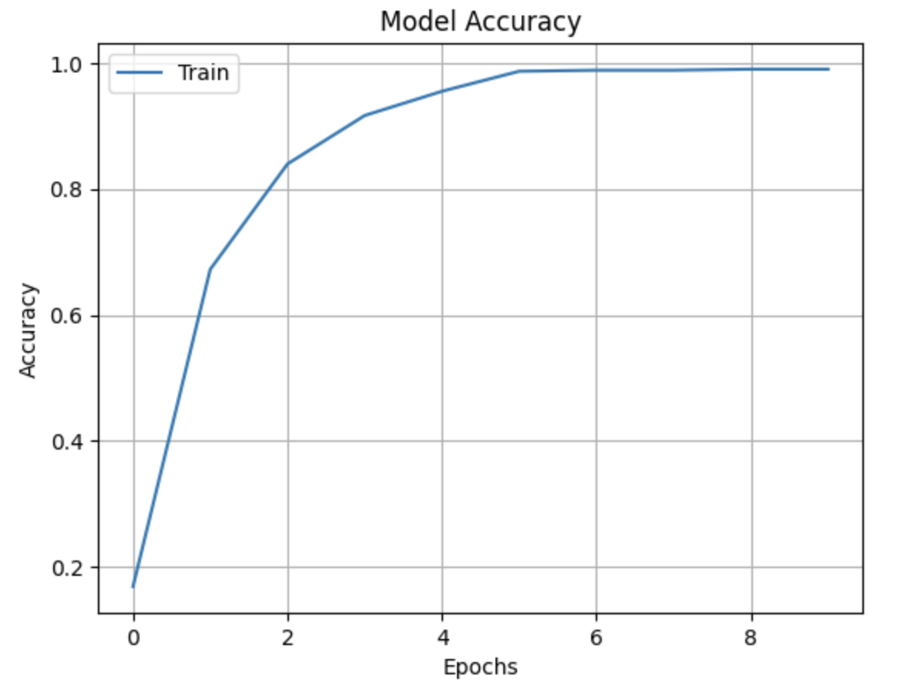
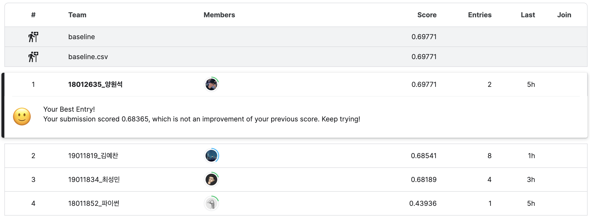
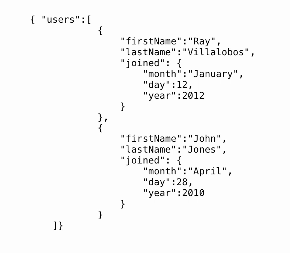
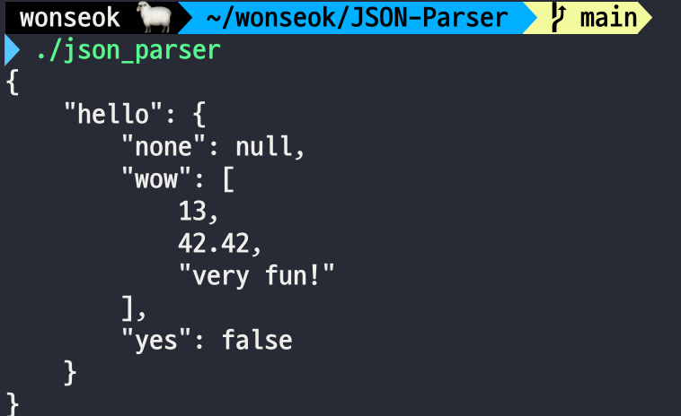

## 인공지능
### 전이 학습 (transfer learning)
- 인공지능 분야의 주니어 개발자가 가장 쉽게 접근할 수 있는 방법
- 어떤 분야에서의 능숙함이 다른 분야의 학습에 크게 도움을 주는 사례 -> 학습의 전이(transfer learning)
- 기계학습 분야에서 전이학습
  - 어떤 도메인에서 수집한 데이터로 학습한 모델 -> 다른 도메인의 데이터를 인식하는데 활용
    - 두 도메인이 유사성을 가지고 있어야 함
    - ImageNet이라는 1000개의 클래스로 학습된 CNN 모델을 새의 종 모델로 다시 학습해 높은 정확률의 모델을 만들 수 있음
- 전이 학습은 주로 데이터가 부족하여 스크래치 학습(learn from scratch)으로 높은 성능을 달성하기 어려운 상황에서 활용
  - 스크래치 학습: 완전 처음부터 학습하는 것
    - weight를 initialization 한 뒤, 처음부터 학습
    - 굉장히 많은 데이터가 필요함
    - 데이터가 많지 않으면 overfitting이 일어남
  - 예시: CUB200 데이터셋
    - 200종의 새 영상이 있는데 클래스별로 60장 정도의 영상만이 있음 -> 매우 적음
    - ImageNet은 각 클래스에 1000장 정도의 데이터가 있음
    - CUB200 데이터셋만으로 학습을 할 경우 overfitting이 일어날 가능성이 큼
    - 따라서 전이 학습을 활용하여 학습을 진행

### 현대적인 컨볼루션 신경망 모델
- AlexNet, VGG, GoogLeNet, ResNet
  - 공통적으로 컨볼루션층을 충분히 많이 쌓아 신경망의 층을 깊게 만들음
  - 층이 깊으면 학습이 잘 안됨(그레디언트 소멸) -> 여러가지 아이디어를 이용해 문제를 해결함
  - MobileNet: 높은 성능을 유지한 채로 신경망 구조를 작게 만들어 임베디드 소프트웨어나 스마트폰앱에 맞게 개조한 모델
- ILSVRC 경진대회(1000개의 클래스를 분류하는 대회)에서 높은 성능을 보여준 모델들
  - 현재는 열리고 있지 않지만, 당시에는 굉장히 상징적인 대회였음
- 전이 학습을 구현할 때는 ImageNet으로 이미 학습이 되어 있는 CNN 신경망을 주로 활용함
  - 현재도 BackBone을 학습하는데는 ImageNet만한 학습 데이터셋이 없음 -> 굉장히 좋다..
  - ImageNet 데이터셋은 딥러닝을 하는 사람들 중엔 모르는 사람이 없을 정도(이만한 데이터셋이 또 없음)
- 사전 학습 모델: ImageNet 정도의 데이터셋으로 **충분히** 학습이 완료된 모델
  - AlexNet-ImageNet, Alexnet-CUB200, AlexNet-MNist가 있다면 충분히 학습한 모델은 ImageNet 밖에 없음
- ImageNet
  - 21841 클래스에 대해 1400만 장 이상의 방대한 영상이 있음
  - 영상의 크기는 영상마다 다르지만 평균 469 * 387로 알려져 있음
- ImageNet을 사용해 스크래치 학습을 할 수 있으면 좋겠지만 스크래치 학습을 하려면 많은 시간과 자원이 필요함(교수님 연구실 GPU로 7일 정도..)
  - 따라서 사전 학습된 모델을 제공함
  - Acc@1, Acc@5: 정답이 첫 번째인 경우, 정답이 5등 내에 있는 경우(Top-K)
  - 파라미터 수가 많을 수록 GPU의 메모리를 많이 잡아먹음

### ResNet과 CUB200-2011 데이터셋을 이용한 전이 학습
- 서로 다른 종이지만 부리 모양만 다르거나 발의 색깔만 달라 높은 정확률을 달성하기 어려운 미세 분류 문제(fine-grained classification)
- fine-tuning 방식: 학습률을 낮게 유지하여 조심스럽게 조금씩 가중치를 수정하는 전이 학습 방식
- freezing 방식: 컨볼루션층의 가중치를 동결하고 완전연결층만 수정
- 잘못 학습하면 ImageNet을 다 까먹을 수 있음 -> 적절하게 학습해야 함
- 일반적으로 freezing 방식보다 fine-tuning 방식의 정확률이 뛰어남
  
### 실습: CUB200 조류 이미지 데이터셋 분류
- ResNet 모델을 이용하여 전이 학습한 모델 사용
  - 전이 학습 방법 중 `fine-tuning`으로 진행
  - epoch는 10회로 하였음
  - 5회부터는 `accuracy`가 더 이상 오르지 않는 것처럼 보여서 `overfitting`을 의심했다.
  - epoch을 5회로 줄이고 다시 학습하였으나 score는 소폭 낮아졌다..

- CUB200은 총 200개의 클래스를 가지지만 실습에서는 20개의 클래스만을 사용
- 모든 이미지의 크기가 다르기 때문에 224 * 224 사이즈로 전처리 진행
  - ResNet의 입력값이 224 * 224이기 때문
- 전이 학습을 할 때는 `learning rate`를 낮게 주는 것이 좋다고 한다.
- 데이터셋이 폴더 안에 분류된 이미지로 되어있어, 이를 데이터셋으로 만드는 과정이 살짝 복잡했다.
  - 얼마 전 열렸던 인공지능 챌린지에서도 비슷한 방식을 경험했어서 그 때처럼 하니까 됐다.
- 전처리 과정을 제외하면 나머지는 기존 실습과 크게 다르지 않았다.
  - 그런데 5시간이 지난 지금도 나빼곤 baseline을 아무도 못 넘긴거 보면 다들 조금 헤매는 듯..


- 리더보드: [kaggle Leaderboard](https://www.kaggle.com/competitions/2023-2aiw13p1-cub200/overview)
- 코드: [kaggle Notebook](https://www.kaggle.com/code/wonyangs/18012635-w13p1)

## Json 파싱 프로젝트
### ostringstream
참고 자료: [istringstream, ostringstream, stringstream](https://doitnow-man.tistory.com/entry/C-%EA%B0%9C%EB%B0%9C%EC%9E%90%EB%90%98%EA%B8%B0-6-istringstream-ostringstream-stringstream-%EC%82%AC%EC%9A%A9%EB%B2%95)

- 기존에 사용하던 stringstream = istringstream + ostringstream 개념인듯
- istringstream: 문자열을 원하는 자료형 포맷으로 변경
- ostringstream: 자료형을 문자열로 변경

### 데이터 구조 개선
- 기존에 하나의 클래스(JsonData)로 제작했던 구조를 상속 관계를 활용하여 리팩토링
- JsonElement라는 Base Class를 둔 뒤, 다른 클래스에서 이를 상속 받음
  - Object, String, Array, Number, Null, Boolean 클래스
- toString을 순수 가상 함수로 두어 Json 출력을 용이하게 할 예정
```c++
class JsonElement {
 public:
  virtual ~JsonElement();
  virtual std::string toString(int indentLevel = 0) const = 0;
};
```

### toString
- 이후에 디버깅 할 때 파싱한 JSON이 올바른지 확인하는 용도
- 그냥 문자열로 바로 출력할 수도 있지만 indent를 고려하여 보기 좋게 출력하도록 제작
  
- toString 메서드에 indentLevel이라는 변수를 추가하여 그만큼 들여쓰기 하도록 구현
- Json을 출력할 때 재귀적으로 작동하므로 다음 toString을 호출 할 때 indentLevel을 +1 해주면 된다.
