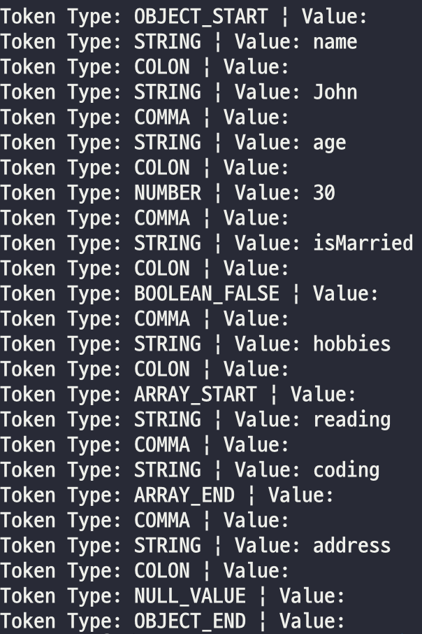

## Json 파싱 프로젝트
### 기존 라이브러리 탐구
- 모던 C++에서 사용되는 Json 파싱 라이브러리로는 `nlohmann/json`가 있음
```c++
#include <nlohmann/json.hpp>

using json = nlohmann::json;

json j;
j["name"] = "John";
j["age"] = 30;
j["is_married"] = false;
j["hobbies"] = {"reading", "coding"};

std::string output = j.dump();
```
- 현재 내 코드는 포인터를 직접 관리하고, 각 타입에 맞는 객체를 생성해 할당해주고 있음
- 연산자 오버로딩과 포인터 wrapping으로 이를 개선시킬 수 있지 않을까..

### Lexer 구현
- JSON 원본 문자열을 읽어 Token으로 분리하는 Lexer 구현
- Token의 종류는 아래와 같다.
```c++
enum TokenType {
  OBJECT_START,   // {
  OBJECT_END,     // }
  ARRAY_START,    // [
  ARRAY_END,      // ]
  COMMA,          // ,
  COLON,          // :
  STRING,         // 문자열
  NUMBER,         // 숫자
  BOOLEAN_TRUE,   // true
  BOOLEAN_FALSE,  // false
  NULL_VALUE,     // null
  END_OF_FILE,    // 끝
  INVALID         // 유효하지 않은 토큰
};
```
- 테스트 문자열

```json
{"name": "John", "age": 30, "isMarried": false, "hobbies": ["reading", "coding"], "address": null}
```

- 분리 결과


