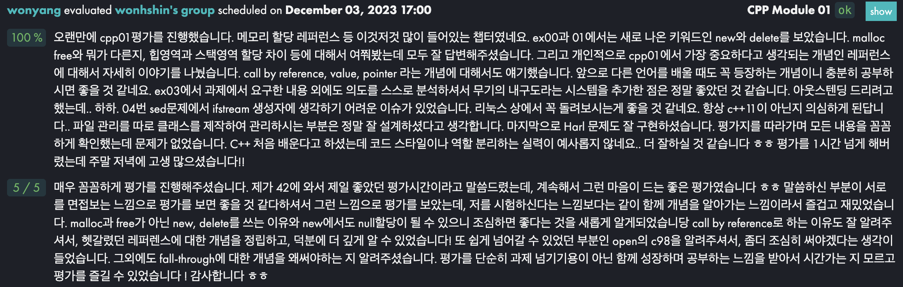

## Json 파싱 프로젝트
### vscode 디버그 설정하기
- Parser를 제작하는 도중 exception이 터졌는데, 위치를 파악하지 못하는 상황이 발생
- cout을 이용해 로그를 찍기엔 코드가 복잡해서 디버그를 활용해보기로 했다.
- task.json: vscode에 실행할 명령어들을 미리 등록해둠
  - label: 해당 task의 이름
  - command: 실행할 명령어
  - args: 명령어에 들어갈 인자
- launch.json: vscode의 디버그 설정
  - preLaunchTask: 디버그를 하기 전 실행할 task
  - task.json에 등록한 task를 지정하였다.
- Makefile에 debug용 명령을 새로 만든 뒤, 이를 task로 지정하고 launch.json에 등록하여 디버그 설정

```json
// task.json
{
	"version": "2.0.0",
    "tasks": [
        {
            "label": "build",
            "type": "shell",
            "command": "make",
            "group": {
                "kind": "build",
                "isDefault": true
            }
        },
		{
            "label": "build (debug)",
            "type": "shell",
            "command": "make",
            "args": ["debug"]
        },
        {
            "label": "clean",
            "type": "shell",
            "command": "make clean"
        },
        {
            "label": "run",
            "type": "shell",
            "command": "./json_parser"
        }
    ]
}
```

```json
// launch.json
{
    "version": "0.2.0",
    "configurations": [
        {
            "name": "(lldb) Launch",
            "type": "cppdbg",
            "request": "launch",
            "program": "${workspaceFolder}/json_parser",
            "args": [],
            "stopAtEntry": false,
            "cwd": "${workspaceFolder}",
            "environment": [],
            "externalConsole": false,
            "MIMode": "lldb",
            "preLaunchTask": "build (debug)"
        }
    ]
}
```


## wonhshin's CPP Module 01

- new, delete vs malloc, free
  - 전자는 생성자, 소멸자를 추가적으로 호출함
  - new가 실패할 경우 null 대신 exception을 throw함 ([출처](https://en.cppreference.com/w/cpp/memory/new/operator_new))
- ifstream 생성자
  - 생성자에 string을 넣는 것은 C++11 이후부터 지원됨 ([출처](https://en.cppreference.com/w/cpp/io/basic_ifstream/basic_ifstream))
- 소멸자 호출 순서 ([출처](https://en.cppreference.com/w/cpp/language/destructor))
  - 배열에서 생성자는 첫 번째 원소부터 호출되고, 소멸자는 마지막 원소부터 역순으로 호출된다.
  - 생성자의 역순으로 해제하여 side effect를 최소화 하기 위함

### Call by Reference
[학습자료](https://namu.wiki/w/%EC%B0%B8%EC%A1%B0%EC%97%90%20%EC%9D%98%ED%95%9C%20%ED%98%B8%EC%B6%9C)
- 프로그래밍 언어론에서 정의하는 Function은 본래 프로그램과 완벽하게 분리되어 어떠한 side effect도 일으키지 않는 코드 블럭을 의미한다.
  - 현대에는 side effect를 일으킬 수 있는 Procedure와 혼용된다.
- Function은 Stack Frame이라는 메모리 구조를 통해 만들어진다.
  - 함수의 파라미터에 해당하는 부분도 Stack Frame에 저장된다.
  - Stack Frame의 파라미터에 저장된 값이 리터럴 형태의 상수 -> Call by Value
  - Stack Frame의 파라미터에 저장된 값이 변수를 가르키는 포인터 -> Call by Reference
- Call by Value는 인자를 다루는 메모리 위치가 다르지만, Call by Reference는 인자를 다루는 메모리 위치가 같음
  - Reference는 별칭(alias)라고 생각하면 된다.

### Call by Reference vs Call by Address
- C언어의 모든 함수는 Call by Value만을 지원한다.
- Call by Address: 함수의 호출 측에서는 값을 전달하는 것처럼 보이지만, 받는 쪽에서는 포인터로 받는다.
- Call by Reference: 함수의 호출 측에서 처음부터 포인터를 명시적으로 전달한다.
- 두 방식 다 컴파일러가 컴파일한 뒤의 결과는 똑같다
  - 레퍼런스를 *로 바꿔버림

## 정민이와 OAuth 공부


참고 자료: [NestJS - Kakao OAuth, JWT 인증 구현](https://velog.io/@leemhoon00/Nestjs-JWT-%EC%9D%B8%EC%A6%9D-%EA%B5%AC%ED%98%84)
- OAuth를 사용하는 이유는 편리함 때문
  - 개발자 입장에서는 복잡한 보안 문제를 생각하지 않아도 된다.
  - 기업 입장에서는 자신들의 서비스를 더욱 많이 이용하도록 할 수 있다.
  - 사용자 입장에서는 새로운 정보 입력 없이 몇 번의 클릭만으로 회원가입과 로그인이 된다.
- 정보를 제공하는 기업은 Client(개발자의 애플리케이션), User(사용자)를 모두 믿을 수 없다.
  - Client와 User를 모두 확인하는 방법이 OAuth
### 카카오 OAuth 동작 과정
1. User가 카카오 로그인 버튼을 클릭한다.
2. Client가 `client id`와 `redirect uri`를 포함한 카카오 로그인 링크를 302로 반환한다.
3. User가 카카오 로그인 페이지에서 로그인한다.
4. 카카오 서버에서 로그인 정보를 확인한다.
5. 로그인 정보가 맞다면 User에게 `code`와 함께 `redirect uri`로 302를 반환한다. **(사용자 인증 성공)**
6. Client는 `code`와 함께 `client secret`을 카카오 서버로 보낸다.
7. 카카오 서버는 `code`와 `client secret`이 맞다면 `token`과 `profile`을 보낸다. **(애플리케이션 인증 성공)**
8. Client는 `token`은 **서버에 보관**하고, `JWT` 등을 User에게 반환하여 관리한다.

### OAuth에 대한 오해
- 카카오 서버로부터 온 token은 외부에 노출해서는 안된다.
  - 반드시 애플리케이션 서버에서만 관리해야됨
  - JWT에 token 값을 담아서 반환하는 것은 매우매우 위험한 행위
- client id는 노출되어도 되는 정보다.
  - client secret만 노출되지 않으면 됨
- OAuth 과정에서 말하는 Client는 사용자가 아닌 애플리케이션이다.
  - 기업 입장에서는 OAuth를 사용하는 Client가 애플리케이션이기 때문
  - 사용자는 User라고 지칭함