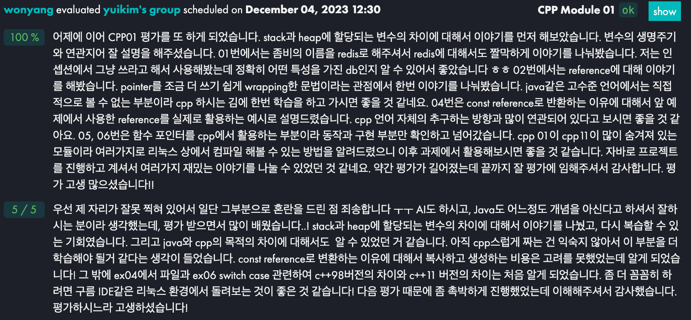
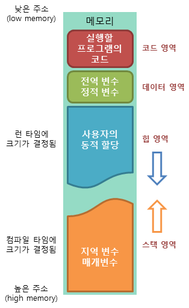
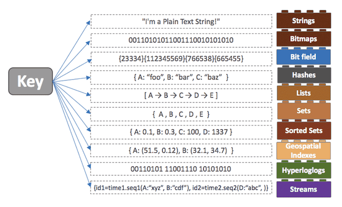
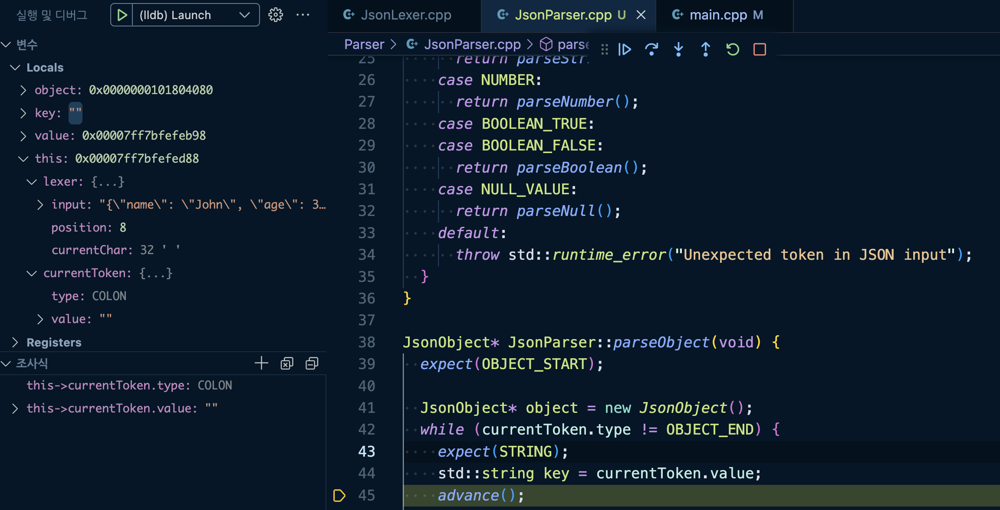
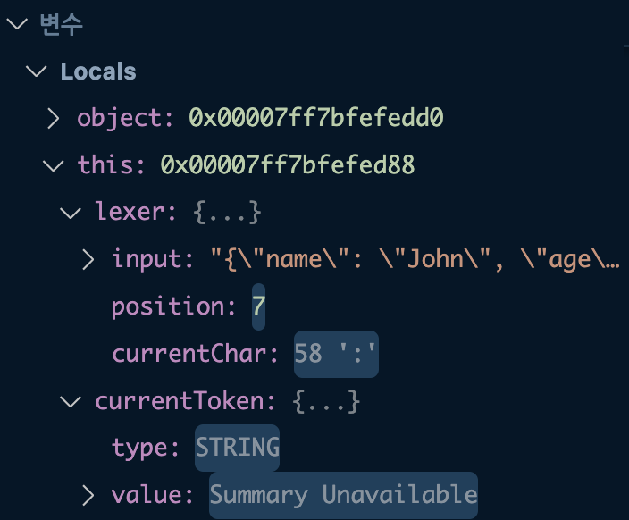
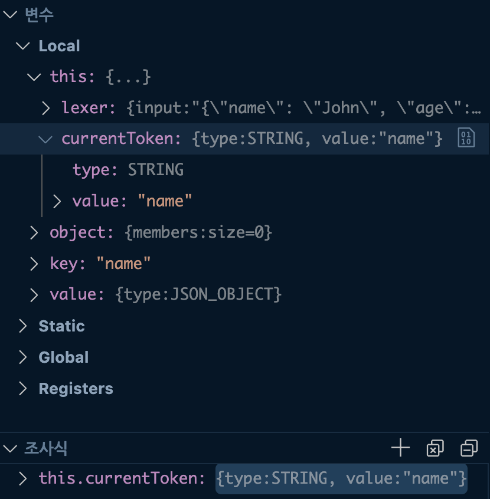
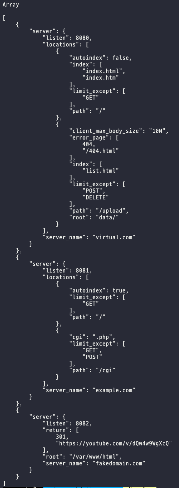

## yuikim's CPP Module 01

### Stack 영역 vs Heap 영역
학습 자료: [스택(Stack)과 힙(Heap) 차이점](https://junghyun100.github.io/%ED%9E%99-%EC%8A%A4%ED%83%9D%EC%B0%A8%EC%9D%B4%EC%A0%90/)

- 프로그램이 실행되기 위해서는 먼저 프로그램이 메모리에 load 되어야 함
- 이후 프로그램에서 사용되는 변수들을 저장할 메모리도 필요함


- Code 영역
  - 실행할 프로그램의 코드가 저장되는 영역
  - 텍스트 영역이라고도 부름
  - CPU는 코드 영역에 저장된 명령어를 하나씩 가져가서 처리함
- Data 영역
  - 프로그램의 전역 변수와 정적(static) 변수가 저장되는 영역
  - 데이터 영역은 프로그램 시작과 함께 할당되고, 프로그램이 종료하면 소멸함
- Stack 영역
  - 함수의 호출과 관계되는 지역 변수와 매개변수가 저장되는 영역
  - 스택 영역은 함수의 호출과 함께 할당되고, 함수의 호출이 완료되면 소멸함
  - 스택 영역에 저장되는 함수의 호출 정보를 `stack frame`이라고 함
  - 스택 영역은 push 동작으로 데이터를 저장하고 pop 동작으로 데이터를 인출함
    - 후입선출(LIFO) 방식에 따라 동작, 가장 늦게 저장된 데이터가 가장 먼저 인출됨
    - 그래서 이름이 Stack 인듯!
  - 스택 영역은 메모리의 높은 주소에서 낮은 주소의 방향으로 할당됨
- Heap 영역
  - 힙 영역은 사용자가 직접 관리해야 하는 메모리 영역
  - 사용자에 의해 메모리 공간이 동적으로 할당되고 해제됨
  - 힙 영역은 메모리의 낮은 주소에서 높은 주소의 방향으로 할당됨

### redis
학습 자료: [Redis란 무엇일까?](https://devlog-wjdrbs96.tistory.com/374)
- 인메모리 데이터베이스
  - 모든 데이터를 메모리(RAM)에 저장하고 조회함
  - RAM에 저장하기 때문에 훨씬 빠른 데이터 접근 속도를 가짐
  - 전원이 꺼질 경우 RAM에 저장된 데이터는 사라짐 -> 주기적으로 데이터를 디스크에 저장하는 방법 등이 필요함
- 다양한 자료구조를 가짐

  - 문자열, 리스트, 집합, 정렬된 집합, 해시, 비트맵 등 다양한 자료구조를 value로 가질 수 있음
  - 데이터를 정렬 해야하는 상황이 있을 때, DBMS를 이용한다면 DB에 데이터를 저장 -> 저장된 데이터를 정렬 -> 다시 읽어오기라는 과정을 디스크에 직접 접근해야 하기 때문에 시간이 더 걸림
  - 레디스를 사용할 경우 Sorted-Set이라는 자료구조를 사용하면 더 빠르고 간단하게 데이터를 정렬할 수 있음
- redis 영속성(persistence)
  - 레디스는 인메모리 데이터 저장소기 때문에 종료시 데이터가 사라짐
  - 레디스의 데이터를 디스크에 저장하여 시스템 재시작 후에도 데이터를 유지할 수 있게 하는 기능
  - RDB (Redis Database)
    - Redis 데이터의 스냅샷을 정기적으로 디스크에 저장하는 방식
    - 설정된 시간 간격, 특정 조건에 따라 데이터 스냅샷을 생성
    - 마지막 스냅샷 이후에 발생한 데이터 변경은 복구할 수 없음
  - AOF (Append Only File)
    - Redis의 모든 쓰기 연산을 디스크에 로그 형태로 기록하는 방식
    - Redis 서버가 재시작 될 때 로그 파일이 재생되어 데이터를 복원함
    - RDB에 비해 데이터 안정성은 더 높지만, 시간이 지남에 따라 파일 크기가 커질 수 있고 데이터 복원 시간이 오래 걸림
  - RDB, AOF 방식을 모두 사용할 수도 있고, 자신의 상황에 맞는 전략을 선택할 수도 있음

## JSON Parser 프로젝트
### 디버깅 조사식 사용법
- 디버깅 모드를 시작 후 조사식에 확인하고 싶은 변수명 등록
- this->currentToken.type 처럼 깊게 있는 변수도 바로 확인할 수 있다.


### 디버깅 중 std::string의 Summary Unavailable 오류 고치기

- std::string 타입의 변수값이 제대로 표기되지 않는 오류가 있었다.
- launch.json의 디버거 type을 cppdbg에서 lldb로 바꿔주었다.
```json
// launch.json
{
    "version": "0.2.0",
    "configurations": [
        {
            "name": "Debug (LLDB)",
            "type": "lldb",
            "request": "launch",
            "program": "${workspaceFolder}/json_parser",
            "args": [],
            "cwd": "${workspaceFolder}",
            "preLaunchTask": "build (debug)",
        }
    ],
}
```
- 이후 `~/.lldbinit` 파일을 만든 뒤, 아래와 같은 스크립트를 추가해줬다.
  - lldb의 경로에 맞게 작성하면 된다. (`which lldb`로 경로 확인)
```bash
command script import /src/bin/lldb/data/formatters/cpp/libstdcxx.py
```

- 이제 string 값이 잘 나온다.

### Parser 구현
- 이전에 제작한 JsonElemets 클래스와 JsonLexer 클래스를 활용해 JsonParser 클래스 구현
- Lexer가 반환한 현재 Token의 값을 보고 각 Element를 파싱
- expect 메서드를 이용해 BNF에 의거한 다음에 와야하는 Token 값을 검증
- 구현 메서드
```c++
#include "../Element/JsonElements.hpp"
#include "../Lexer/JsonLexer.hpp"

class JsonParser {
 private:
  JsonLexer lexer;
  JsonToken currentToken;

 public:
  JsonParser(const std::string& input);

  JsonElement* parse(void);

 private:
  void advance(void);
  void expect(TokenType type);
  void expect(TokenType type1, TokenType type2);

  JsonElement* parseValue(void);
  JsonObject* parseObject(void);
  JsonArray* parseArray(void);
  JsonString* parseString(void);
  JsonNumber* parseNumber(void);
  JsonBoolean* parseBoolean(void);
  JsonNull* parseNull(void);
};

```
- 사용한 JSON 형식 예제 파일
```json
// json 파일 예제
[
    {
        "server": {
            "listen": 8080,
            "server_name": "virtual.com",
            "locations": [
                {
                    "path": "/",
                    "limit_except": ["GET"],
                    "autoindex": false,
                    "index": ["index.html", "index.htm"]
                },
                {
                    "path": "/upload",
                    "root": "data/",
                    "error_page": [404, "/404.html"],
                    "client_max_body_size": "10M",
                    "limit_except": ["POST", "DELETE"],
                    "index": ["list.html"]
                }
            ]
        }
    },
    {
        "server": {
            "listen": 8081,
            "server_name": "example.com",
            "locations": [
                {
                    "path": "/",
                    "autoindex": true,
                    "limit_except": ["GET"]
                },
                {
                    "path": "/cgi",
                    "limit_except": ["GET", "POST"],
                    "cgi": ".php"
                }
            ]
        }
    },
    {
        "server": {
            "listen": 8082,
            "server_name": "fakedomain.com",
            "root": "/var/www/html",
            "return": [301, "https://youtube.com/v/dQw4w9WgXcQ"]
        }
    }
]

```
- JSON Parser를 사용해 파싱한 결과


### 앞으로 해야할 것
- 실사용을 위한 함수 추가
  - 다른 프로젝트에서 Parser를 사용할 때 사용할 메서드를 추가
  - 예제 작성
  - ex: object에서 값 조회, array의 모든 값 반환
- 연산자 overloading 하기
  - 실사용 경험을 높이기 위해 연산자를 이용한 사용방법 생각해보기
- 포인터값 wrapping 하기
  - 지금은 Element를 포인터로 관리하고 있음
  - 스마트포인터의 구조를 공부하고, 이를 본 따 메모리 해제를 관리하지 않아도 되도록 수정
- 라이브러리화
  - 다른 프로젝트에 Parser를 사용할 때 편하게 사용할 수 있도록 인터페이스 만들기
- readme 작성
  - 라이브러리 적용법과 객체 사용법을 적어둔 readme 작성
  - 다른 라이브러리의 readme는 어떻게 적었는지 찾아보기

## TIL 작성 방식과 관련된 몇가지 생각들..
### TIL의 불편한 점
- TIL을 적다보니 불편한 점이 몇가지 생겼다.
- 현재 TIL은 하루에 배운 개념을 단락별로 정리하는 방식
  - 이렇게 정리하다 보니 각 개념들이 날짜별로 분산되어 있음
  - 각각 다른 날에 정리한 개념을 한번에 모아 볼 수 있으면 좋겠다라는 생각이 들음
- 또, 한 단락에 다른 개념 키워드가 등장하는 경우가 있음
  - 이 경우 하이퍼 링크 형태로 다른 개념으로 넘어갈 수 있으면 좋겠다.

### VS Code vs Obsidian
- 처음에는 옵시디언으로 작성하다 VS Code로 넘어오게 됨
  - 옵시디언이 훨씬 이쁘고 편하긴하다.
  - 하지만 옵시디언의 markdown 형식이 표준이 아니라 옵시디언에 종속적인 방식이라 다른 곳에 글을 올리기 어려움
  - github에 업로드 하려니까 깨져서 결국 vs code로 오게 됨
- 옵시디언에서는 개념을 키워드 단위로 분리할 수 있고, 하이퍼링크를 강력하게 지원함
  - 하루에 배운 내용을 한 파일에 전부 넣을 수 있나..?는 잘 모르겠음
  - 옵시디언에서 지원하는 하이퍼링크가 markdown 표준이 아니라 다른 곳에서는 적용할 수 없음
- 옵시디언 같이 사용하면서 글을 다른 곳에 올릴 수 있는 방법은 없을까.. 고민이 된다.

### 블로그 업로드
- 티스토리 같은 블로그에 TIL을 업로드하면 좋을 것 같다.
- 근데 블로그에 올릴거면 내용을 조금 더 다듬은 다음 올려야하나.. 생각이 든다.
  - 여기에 들어가는 시간적 비용도 무시 못해서 선뜻하기 어렵다.
  - 그냥 올리기엔 너무 한 블로그 글을 그대로 정리해둔 느낌이라, 업로드 하기에는 불필요한 글이 될 것 같다.
- 내용을 카테고리별로 모아두는 것도 좋을 것 같다.
- 티스토리 외의 velog도 좋다고 하는데, 나중에 한번 찾아봐야겠다.
