# 인공지능 - 사물탐지
## 이미지 분류(Image Classification) vs 사물 탐지(Object Detection)
- 이미지 분류
  - 이미지에 주 대상 물체가 하나만 있다고 가정
  - 모델의 역할은 이 대상 물체의 카테고리가 무엇인지 식별하는 것
  - 그동안 배운 내용은 이미지 분류 문제였음
  - 출력: 각 클래스에 속할 확률
- 사물 탐지
  - 이미지에 하나 이상의 대상이 존재
  - 이미지 상에서 대상의 카테고리 뿐만 아니라 위치도 함께 특정해야 함
  - Object Detection = Classification + Localization
  - 출력: 각 대상의 위치를 특정하는 경계 좌표 + 해당 물체의 클래스 레이블

### 사물 탐지의 응용
- 자율주행차 기술
  - 자동차 주변에 위치한 차량, 보행자, 도로 및 장애물의 위치 인식
  - 충돌 예방, 차선 인식
- 보안 기술
  - 침입자, 폭탄 등 비정상적인 대상 인식
  - 등록되지 않은 사람이 인식될 경우 침입자로 간주

## 사물 탐지 알고리즘의 프레임워크
- 사물 탐지 프레임워크는 다음 4개 요소로 구성되어 있음
  - 영역 제안, 특징 추출, 비최대 억제, 평가 지표

### 영역 제안(Region Proposal)

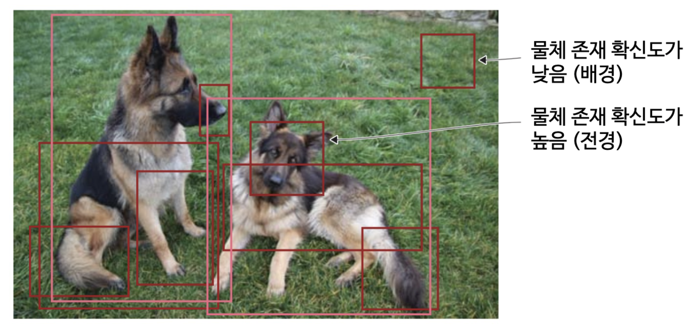

- 시스템이 이미지를 관찰하고 추가 분석이 필요한 **관심 영역(RoI)**을 제안하는 단계
- Region Proposal을 이용해 RoI를 찾아냄
- RoI: 이미지가 해당 위치에 높은 확률로 물체가 존재한다고 판단한 영역
  - 물체 존재 확신도가 높음: 전경(물체), Foreground
  - 물체 존재 확신도가 낮음: 배경(물체X), Background
- 배경 정보는 폐기한 뒤, 정보를 넘겨줌
- Region Proposal 방식은 여러 가지가 있음
  - 초기에는 선택적 탐지 알고리즘을 사용함
- 이 단계에서 생성된 많은 수 (수천 개에 이르기도 함)의 후보 영역이 이후 단계에서 분석 및 분류를 거치게 됨
- 임계값에 따라 전경과 배경을 분류함
  - 임계 값이 너무 낮게 설정되면 가능한 모든 영역을 제안하기 때문에 물체를 놓칠 가능성이 낮지만, 계산 자원을 많이 소모함 = 사물 탐지 자체가 느려짐
- 영역 제안 수와 계산 복잡도는 tradeoff 관계
  - 문제에 적합한 수의 RoI를 제안하도록 설정 해야함

### 특징 추출 및 예측
- 이 모듈에서는 특징 추출을 위해서 사전 학습된 합성곱 신경망이 포함됨
  - 일반화 성능이 높은 이미지 분류 모델을 선택해서 사용하면 됨
  - 지속해서 모델이 업데이트 되고 있으므로 현존하는 가장 성능 좋은 모델을 가져다가 쓰면 됨
- 사전 학습 모델은 물체의 특징을 잘 추출할 수 있음
  - 즉, 일반화 성능이 좋음
- 신경망은 경계 박스, 클래스 예측을 함
- 사물 1개에 대해 여러 개의 경계 박스가 예측될 수 있음
  - RoI가 여러게 넘어올 수 있음
  - 여러 개의 경계 박스를 사물을 가장 잘 표현하는 하나의 박스로 통합해야 하는 기술이 필요함 -> NMS

### 비최대 억제(non-maximum suppression, NMS)

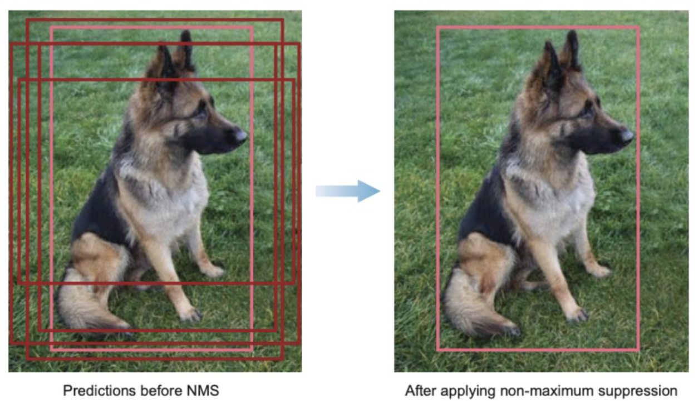

- 사물 탐지 알고리즘의 문제점 중 하나는 같은 물체를 여러 번 탐지한다는 것
  - 물체 하나에 경계 박스가 여러 개 표시될 수 있음
- 비최대 억제는 물체 하나에 경계 박스가 하나만 남도록 하는 기법
  - 확률이 가장 높은 박스 하나만 남기면 됨
- NMS 알고리즘의 작동 과정
  1. 예측 확률이 미리 설정된 신뢰 임계값에 미치지 못하는 경계 박스를 폐기
    - 신뢰 임계값은 수정 가능
  2. 남아 있는 경계 박스를 하나씩 살펴본 후 예측 확률이 가장 높은 것을 선택
  3. 선택된 박스와 예측 클래스가 같은 박스의 중복 영역을 계산
    - 이 지표를 중첩률(Intersection over union, IOU)이라고 함
  4. 중첩률이 0인 박스는 남겨두고, 중첩률이 미리 설정한 임계값(NMS 임계값)보다 큰 경우 경계 박스에서 배제
    - 중첩률이 높다는 뜻 = 같은 물체를 검출하고 있다는 판단 증거

### 사물 탐지 성능 평가 지표
- 초당 프레임 수(frames per second, FPS), 평균평균정밀도(mean Average Percision, mAP)
- 초당 프레임수
  - 탐지 속도의 평가 지표
  - ex) 신경망 X는 Z FPS의 속도에서 mAP Y%를 달성했다. 라고 언급함
- 평균평균정밀도
  - 신경망 예측 정밀도의 평가 지표
  - 0~100 사이의 값으로 나타냄
    - 값이 클수록 성능이 좋음
  - IoU 곡선과 PR 곡선을 이해해야 함

### 중첩률 (IoU)
- 2개의 경계 박스가 중첩되는 정도를 나타내는 값
- 정답 경계 박스(ground truth BB)와 예측 경계 박스(prediction BB)가 있을 때, IoU를 계산해서 해당 탐지가 유효한지 확인
- 중첩률은 0~1까지의 값을 가짐
  - 0: 두 경계 박스가 전혀 겹치지 않음
  - 1: 두 경계박스가 완전히 겹침
  - 값이 클수록 좋음
- 중첩률은 정확한 예측을 정의하는 용도로 사용됨
  - 중첩률이 설정된 임계값보다 크면 정확한 예측이 됨을 의미함
  - 일반적으로 0.5가 많이 사용됨
  - ex) mAP@0.5 (중첩률 임계값 0.5)의 경우 중첩률이 0.5 이상이 될 경우 정답으로 인정함

### PR(Precision - Recall) 곡선
- 재현율, 정밀도를 구해서 그림
- 각 클래스마다 PR 곡선을 하나씩 그려보면서 사물 탐지 모델의 성능을 평가 가능
- PR 곡선 아래의 면적인 AUC(area under the curve)를 계산하여 평균정밀도(AP)를 계산
- 각 클래스의 평균정밀도의 평균인 평균평균정밀도(mAP)를 계산하여 성능을 평가
- 재현율이 증가함에도 불구하고 정밀도가 떨어지지 않는다 -> 모델의 성능이 매우 우수함

## 영역 기반 합성곱 신경망(region-based convolutional neural network, R-CNN)
- R-CNN, Fast R-CNN, Faster R-CNN에 대해 알아보기
- R-CNN은 영역 기반 신경망 구조 중 가장 기본적인 구조
  - 모든 다중 물체 인식 알고리즘의 동작을 이해하기 위한 밑바탕이 되는 구조임
  - 근본이 되는 구조..
- 합성곱 신경망이 물체 인식 및 위치 특정 문제에서 대규모로 응용된 최초의 사례

### R-CNN의 구성 요소

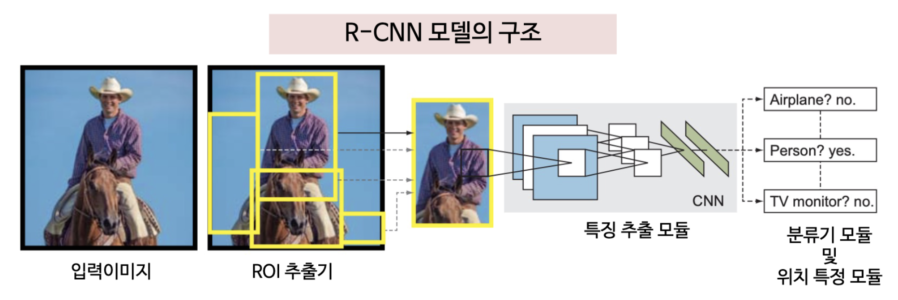

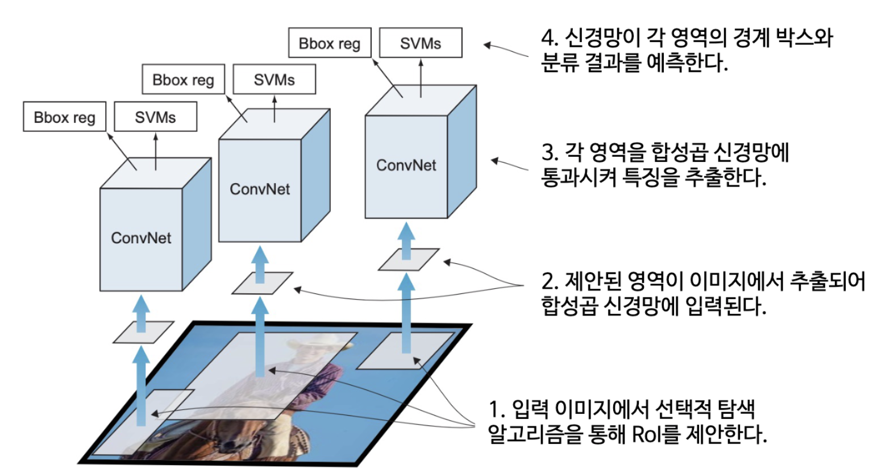

- R-CNN의 구성 요소
  - RoI 추출기, 특징 추출기, 분류 모듈, 위치 특정 모듈
  - R-CNN은 한번에 학습되는 것이 아니라 4가지 구성 요소를 따로 따로 학습하였음
  - 한번에 학습하는 end-to-end 기술은 어려운 기술이라 제안된 당시에는 하기 어려웠음
  - RoI 추출기를 제외한 모든 모듈은 학습이 필요함
- RoI 추출기: 영역 제안 모듈
  - 입력 이미지를 스캔하여 얼굴 패턴이 있는 영역을 찾아 RoI로 제안
  - 제안된 RoI는 고정된 크기로 추출
    - RoI 영역의 크기는 일반적으로 제각각이지만 CNN에 입력하려면 고정된 크기여야 하기 때문
- 특징 추출 모듈
  - **사전 학습된 합성곱 신경망**을 사용
  - 앞에서 추출된 RoI를 입력하여 특징을 추출
- 분류 모듈
  - SVM 등 기존 머신러닝 알고리즘으로 학습한 다음, 특징 추출 모듈에서 추출한 특징을 통해 해당 영역의 물체가 무엇인지 분류
  - 당시 분류기의 성능이 좋지 않아 통계적 방식 모델을 사용함
- 위치 특정 모듈: 경계 박스 회귀 모듈(bounding-box regressor)
  - x, y는 경계 박스의 중심
  - w, h는 경계 박스의 너비와 높이

### R-CNN의 단점
- R-CNN의 학습에 대한 비용과 시간이 많이 들음
  - 3개의 모듈을 별개로 학습시켜야 함
  - 이미 계산한 결과를 재사용할 수 없음
  - 다단계 파이프라인으로 구성된 학습 과정은 R-CNN의 주요 단점
  - end-to-end 학습이 아니였음 -> 매우 불편함
- 사물 탐지 속도가 느림
  - 이미지 1장당 RoI가 2000개 이상이 제안됨
  - 자율주행차 등 실시간 처리 분야에서 큰 문제가 됨
- 학습 과정이 다단계로 구성됨
- 학습의 공간 및 시간 복잡도가 높음
  - SVM 분류기와 경계 박스 회귀 모듈을 학습할 때, 각 RoI에서 추출된 특징을 디스크에 저장해야함
  - 용량이 엄청 많이 들음

## Fast R-CNN
- R-CNN와 비슷하지만 두가지 설계 수정을 통해 처리 속도와 정확도가 개선됨
- CNN 특징 추출기를 맨 앞에 배치하고, 전체 입력 이미지로부터 영역을 제안함
  - 기존에는 2000개 이상의 중첩된 영역을 2000개 이상의 CNN으로 처리
  - 전체 영상에 대해서 한번에 특징 맵을 추출하고, 한번에 RoI를 추출함
- CNN + SVM 분류기 대신 softmax 층을 추가해서 분류를 수행하게 됨
  - classification 분야까지 딥러닝 분야가 대체하게 됨
- Fast R-CNN은 신경망의 마지막 특징맵을 바탕으로 영역을 제안
  - 전체 이미지를 입력 받는 CNN 하나만 학습하면 됨
- SVM 대신 softmax를 사용하여 한번에 학습

### Fast R-CNN의 구성요소
- 특징 추출 모듈: ConvNet으로 시작, 전체 이미지에서 특징 추출
- RoI 추출기: 선택적 탐지 알고리즘을 사용해서 약 2000개 영역을 제안
  - 최대 영역의 개수를 제한함
- RoI 풀링층
  - 기존 R-CNN에서는 resize를 하였음
  - 최대 풀링을 사용하여 똑같은 크기의 feature map을 만들어 냄
- 2개의 출력층
  - softmax 층
  - 경계 박스 회귀 층

### Fast R-CNN의 다중 과업 손실 함수 (multi-task loss function)
- 사물 탐지는 classification + localization을 해야 함
  - 따라서 손실 함수도 각각 하나씩 총 2개가 필요함
- task가 2개 이상으로 구성되어 있는 case를 multi-task라고 부름
- 모든 최적화 문제에서는 최적화 대상이 될 손실 함수가 필요함
- 분류: 예측한 값과 정답값 사이에서 얼마나 멀리 있는지 확인
- 회귀: 정답 위치에서 예측된 경계박스 값이 얼마나 멀리 있는지 확인
- 전체 손실 함수는 분류 손실 함수 + 회귀 손실 함수로 나타냄

## Faster R-CNN
- 기존의 영역 제안 방법은 사전 학습되어야 했기 때문에 이를 딥러닝 기반으로 바꾸자 하여 나옴
- 영역 제안을 위해서 선택적 탐지 알고리즘 대신 영역 제안 신경망(region preposal network, RPN)을 도입
  - 영역 제안을 학습 과정에 포함
- 예측 영역 제안은 RoI 풀링층을 사용하여 재구성
  - 제안된 영역 내에서 이미지를 분류
  - 경계 박스의 오프셋값 예측에 사용
- 성능 측정 시점의 연산량을 줄임
  - 실시간 처리에 가까운 처리를 수행 (당시 최고 성능)
- end-to-end 학습이 가능해짐

### Faster R-CNN의 구조

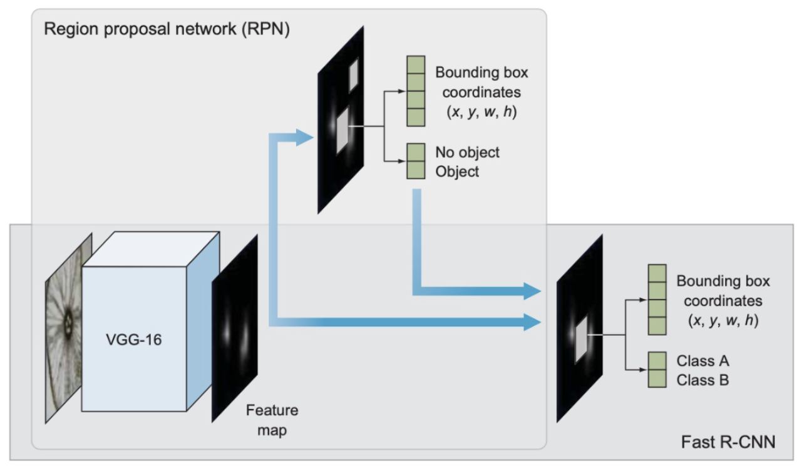

- Faster R-CNN의 구조는 영역 제안 신경망(RPN) + Fast R-CNN으로 구성됨
- 영역 제안 신경망(RPN)
  - 선택적 탐색 알고리즘을 대체하는 합성곱 신경망
  - 특징 추출기에서 생성한 특징 맵에서 추가 분석을 이어갈 RoI를 제안하는 역할 수행
  - RPN의 출력은 물체 존재 확신도와 경계 박스 위치
- Fast R-CNN
  - 특징 추출기 역할을 하는 기본 신경망
  - RoI를 고정 크기로 변환하는 풀링층
  - 2개의 전결합층으로 나뉜 출력층
- RPN 모델도 함께 학습해야함
  - 입력 이미지에서 사전 학습된 CNN을 이용해 특징 추출
  - 이 특징은 병렬로 RPN과 Fast R-CNN으로 전달됨
    - RPN: 이미지 내 어느 위치가 존재하는지 판단. 이미지에 있는 물체가 무엇인지는 모름. 물체인지에 대한 확률만 계산
- end-to-end model
  - 기본 특징 추출기, 영역 제안 모듈, RoI 풀링층, 사물 분류기, 경계 박스 회귀 모듈 모듀를 신경망에 내장함

### Faster R-CNN의 기본 특징 추출기
- Fast R-CNN과 비슷하게 사전 학습된 CNN에서 분류기 부분을 잘라 사용
- 입력 이미지에서 특징을 추출하는데 사용됨
- Faster R-CNN 논문에서는 이미지넷 데이터셋으로 사전 학습된 ZF, VGG 신경망이 사용됨
  - 이후 규모를 줄여 속도를 최적화 한 MobileNet이 제안됨 (330만 개 파라미터)
  - 최고 성능을 갱신한 ResNet-152는 파라미터가 6000만 개에 달함
  - 최근 제안된 DenseNet은 파라미터 수 감축과 성능 개선을 모두 이뤄냄
- 합성곱층은 자신의 이전 층에서 전달된 정보를 더욱 추상화 하는 효과가 있음
  - 코너, 엣지 등을 추출함
  - 첫 번째 층은 대개 모서리를 학습, 두 번째 층은 모서리가 조합된 복잡한 도형을 학습
  - 마지막 층에서 RPN에 입력해 물체가 있는 영역을 추출할 수 있는 특징맵을 만들어 냄

### Faster R-CNN의 영역 제안 모듈(RPN)

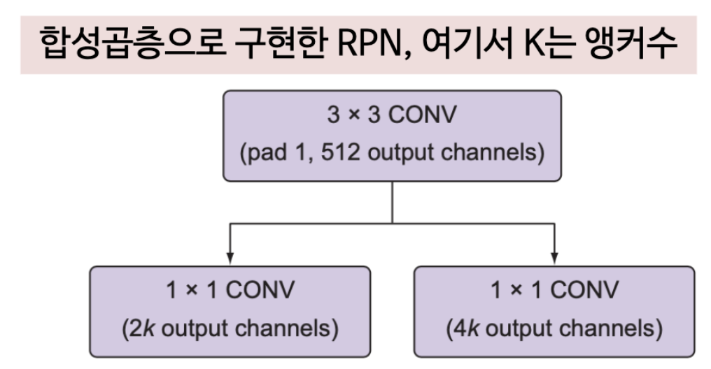

- 사전 학습된 합성곱 신경망에서 만든 특징 맵의 정보를 기초로 물체가 위치했을 법한 역할을 찾아냄
- RPN을 어텐션 네트워크(attention network)라고 부르기도 함
  - 해당 신경망이 전체 신경망의 관심사를 이미지 내 물체가 있을 만한 영역으로 유도하는 역할을 함
- Faster R-CNN은 선택적 탐색 알고리즘 대신 RPN을 사용해서 RoI 제안 기능을 신경망 내에 넣음
  - 학습 가능하게 만들어 end-to-end 학습에 가능하게 함
- RPN은 다음 2개의 층으로 구성됨
  - 3*3 전결합 합성곱층 (512채널)
  - 병렬로 되어 있는 2개의 1*1 합성곱 층 (물체 존재 여부, 경계 박스 회귀)
  - 이 두 층의 예측 목표는 물체의 클래스나 경계 박스가 아님
    - 물체의 클래스 및 경계 박스는 RPN 이후 더 나중 단계에서 예측함
    - RPN의 목표는 해당 영역에 추가 분석이 필요한 물체가 존재하는지 여부를 판단하는 것
- RPN은 현재 영역의 물체 존재 확신도, 즉 해당 영역이 전경인지 배경인지 그 확률을 판단하는 이진 분류기를 포함함
- 추가 분석이 필요한 물체가 존재한다고 판단되면 이 영역을 RoI 풀링층에 전달

### RPN의 전결합 합성곱 신경망 (Fully Convolution Network, FCN)
- 사물 탐지에 사용되는 신경망의 중요한 특징 중 하나는 FCN을 포함한다는 점임
- FCN에는 보통 신경망 마지막 층에 배치되어 예측 결과를 만드는 전결합층이 없음
  - 전결합층을 사용하지 않는 방법: 최종 예측 결과를 내놓는 전결합 소프트맥스 층 대신 평균 풀링을 적용
- FCN의 장점
  - 전결합층 없이 합성곱 연산만 사용하므로 속도가 빠름
  - 이미지와 신경망을 읽어 들일 메모리만 충분하다면 받아드릴 수 있는 이미지의 크기에 제한이 없음
- FCN은 입력 이미지의 크기가 고정된다는 단점이 있지만, 고정 크기 입력을 받는 것이 구현에 편함

### RPN의 경계 박스 회귀층

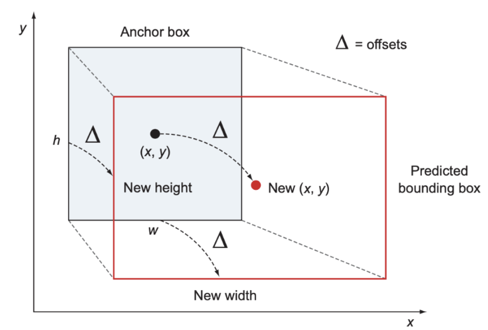

- 경계박스는 튜플 (x, y, w, h)로 결정되는 사각의 물체를 둘러싼 영역
- 이미지 안에 기준 역할을 할 앵커 박스를 정의한 다음, 경계 박스 회귀층이 앵커 박스를 기준으로 한 오프셋인 델타를 예측하도록 함
  - 기준보다 더 쉬운 방법
- 앵커 박스
  - RPN은 슬라이딩 윈도우 접근 방식을 사용하여 특징 맵의 각 위치마다 K개의 영역을 생성
    - 이 K개의 영역을 앵커 박스(anchor box)라고 부름
    - 앵커는 해당 슬라이딩 윈도우의 중심에 위치하고 있음
    - 찾을 대상 물체의 크기와 상관 없이 크기가 다양함
  - 논문에서는 동일한 앵커 박스를 9개 만들음
    - Scale 3개, Aspect Ratio 3개 -> 총 9개의 앵커 박스
    - 슬라이딩 윈도우 당 9개의 앵커 박스를 만들음

### RPN의 학습
- RPN은 앵커 박스의 물체 존재 확신도를 출력할지 여부를 결정
  - 물체 좌표 값의 네가지 요소(위치 파라미터)를 예측하도록 학습됨
- 학습 데이터는 사람이 직접 레이블링한 경계 박스가 사용됨
  - 수동으로 레이블링 된 경계 박스 -> ground truth
- 각각의 앵커 박스에 대해 중첩 확률 p를 계산
  - 이 확률은 앵커 박스가 정답 경계 박스와 얼마나 중첩 되는가를 나타냄
- 앵커 박스가 정답 경계 박스와 중첩되는 부분이 많으면 물체 유무가 참일 확률이 높음
- 한 위치에서 생성되는 앵커 박스의 수가 K개 일때, RPN은 2K의 물체 존재 확신도 점수와 4K개의 좌표를 출력함

### Faster R-CNN의 전결합층
- 전결합층은 출력층에 해당하고 2가지 입력을 받음
  - 하나는 합성곱층에서 출력한 특징 맵
  - 하나는 RPN에서 제안한 RoI
- 출력층은 RoI를 분류하고 해당 영역의 물체의 클래스와 경계 박스를 결정하는 파라미터를 출력
- Faster R-CNN에서는 소프트맥스층이 사물 분류를 담당, 위치 회귀층은 선형 회귀 모델이 경계 박스의 위치를 예측함
- 전결합층의 파라미터 역시 다중 과업 손실 함수를 최적화하는 방법으로 학습 됨

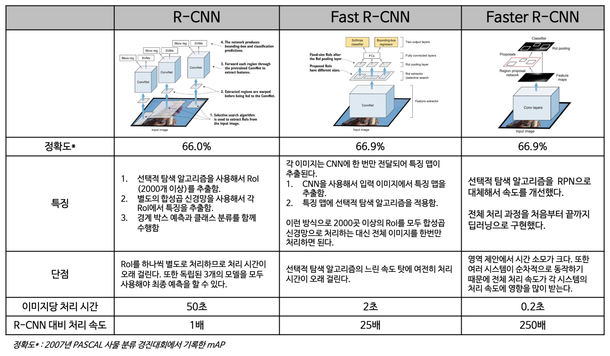

## 다단계 탐지기 vs 단일 단계 탐지기
- R-CNN 및 변종 모델은 모두 다단계 탐지기
- 탐지 과정이 두 단계로 나뉨(2단계 탐지기)
  - 선택적 탐지 알고리즘 or RPN을 통해 RoI 추출
  - 분류기는 제안된 영역만 처리
- 단일 단계 탐지기(SSD, YOLO)는 영역 제안 추출 단계를 건너 뜀
  - 이미지 내 가능한 모든 위치를 대상으로 직접 탐지를 시도
  - 처리가 빠르고 간단하지만 성능이 소폭 하락하는 경향이 있음
- 단일 단계 탐지기는 2단계 탐지기에 비해 성능은 조금 떨어지지만 속도는 훨씬 빠름

### 싱글샷 탐지기
- 2016년에 제안된 모델로 당시 속도와 성능 모두 최고 기록을 경신함
- R-CNN 및 변종은 다단계 탐지기
  - 경계 박스 내의 영역의 물체 존재 확신도를 예측
  - 분류기는 경계 박스를 가지고 물체의 클래스를 예측
- SSD, YOLO는 단일 단계 탐지기
  - 합성곱층에서 위치와 클래스를 한번에 예측
- 물체 존재 확신도는 정답과 경계박스의 중첩률을 계산해서 예측
  - 경계 박스가 정답과 완전히 일치하면 물체 존재 확신도는 1
  - 두 경계 박스가 전혀 겹치지 않는다면 물체 존재 확신도는 0

### 탐지기의 속도 측정 (초당 프레임, FPS)
- Faster R-CNN의 처리 속도는 7FPS
  - 1초당 7장의 이미지만을 처리
- 현재까지는 정확도를 일부 희생하는 방법 외에는 눈에 띄는 속도 개선이 불가능했음
- SSD와 같은 싱글샷 탐지기가 등장하면서 속도 개선과 함께 정확도까지 챙기는 것이 가능해짐
  - SSD300: 59FPS의 속도로 mAP 74.3%를 달성
    - 입력 이미지 크기가 300 * 300이라는 뜻

## SSD

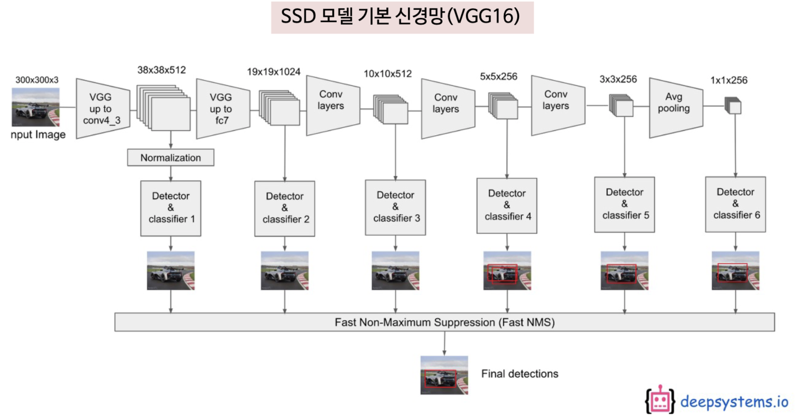

### SSD의 추상적 구조
- SSD는 피드포워드(feedforward)합성곱 신경망 구조를 가짐
  - end-to-end 학습이 가능함
  - 여러 개의 고정 크기 경계 박스를 생성
  - 각 박스에 클래스별 물체 존재 확신도를 부여
  - 비최대 억제 알고리즘(NMS)을 통해 최적 탐지 결과를 제외한 나머지를 배제
- SSD의 세 가지 요소
  - 특징 맵을 추출하는 기본 신경망
  - 다중 스케일 특징층
    - 앵커 박스의 크기는 고정되어 있어 크게 잡힌 물체를 인식할 수 없음
    - 이를 개선하기 위한 요소
  - 비최대 억제
- SSD는 여러 개의 합성곱 층이 NMS로 직접 예측 결과를 전달함
  - 각 층의 필터 크기는 점진적으로 감소하는 형태
- 클래스 당 8732건이 탐지됨
  - CONV4_3: 38 * 38 * 4 = 5776
    - 각 위치마다 4개 박스
  - CONV7: 19 * 19 * 6 = 2166 ...
  - 각 층에서의 합을 모두 더하면 8732
- 이 경계 박스를 그대로 출력하기엔 경계 박스 수가 너무 많음
  - NMS를 적용해서 출력되는 경계 박스 수를 줄임 (YOLO는 98개)

### 싱글샷 탐지기의 예측 결과

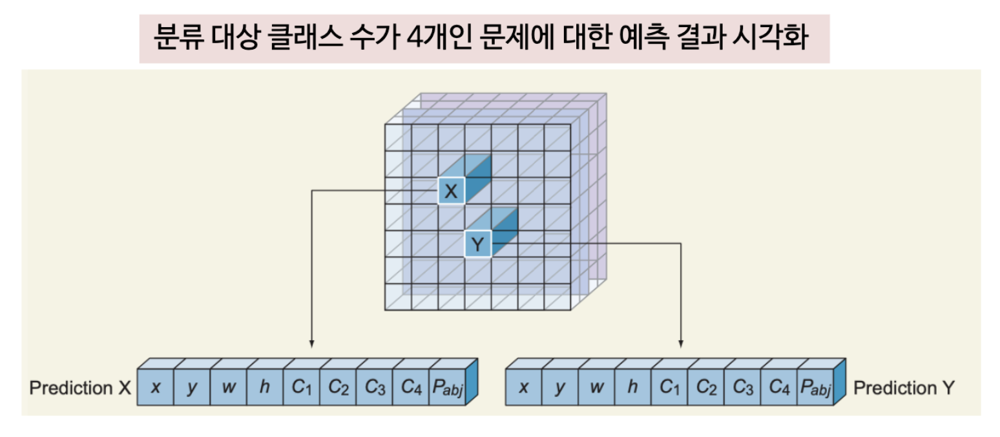

- 신경망은 각 특징에 대해 아래와 같은 값을 예측함
  - 경계 박스를 결정하는 값 (4개): x, y, w, h
  - 물체 존재 확신도 (1개)
  - 각 클래스의 확률을 나타내는 값 (C개)
- 총 예측 결과는 5+C개의 값으로 구성됨

### 기본 신경망

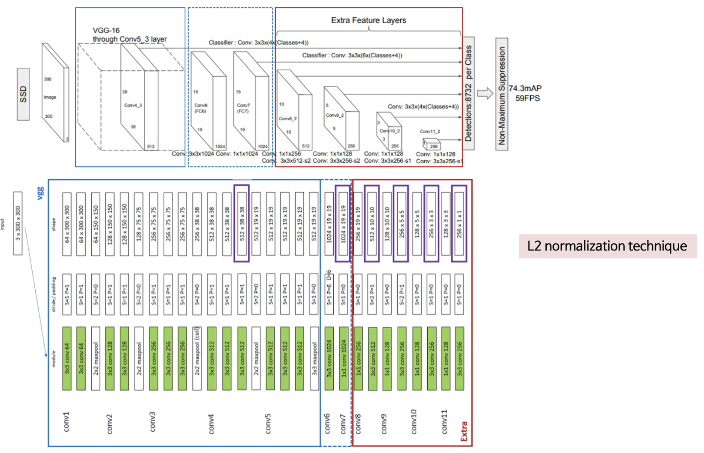

- SSD 신경망 구조에는 VGG16 신경망을 기본 신경망으로 사용하였음
- 분류기에 해당하는 전결합층을 제거 -> 보조 합성곱층을 추가해 사용
- VGG16이 기본 신경망으로 채택된 이유
  - 고해상도 이미지 분류에서 높은 성능을 보임
  - 다양한 문제에서 전이학습으로 좋은 성과를 낸 사례가 많음
- VGG16을 VGG19나 ResNet으로 대체
  - 속도나 정확도가 하락할 수 있음
  - 호환성과 동작에는 문제가 없음

### 기본 신경망의 예측 과정
1. SSD에는 R-CNN의 앵커 박스와 비슷한 역할을 하는 격자가 있음
   - SSD에서는 이 격자점을 프라이어(prior)라고 함
   - 각 격자점마다 해당 앵커를 중심으로 하는 경계 박스를 생성
2. SSD에서는 각 경계 박스를 별도의 이미지로 간주함
   - 경계 박스마다 경계 박스 안에서 보트의 특징을 뽑았는가를 확인함
3. 보트의 특징을 포함하는 경계 박스를 발견했다면 해당 박스의 예측 좌표와 사물 분류 결과를 NMS 층으로 전달
4. NMS 층은 정답과 중첩률이 가장 높은 경계 박스 하나만 남기고 다른 경계 박스는 배제함

### 다중 스케일 특징층
- 기본 신경망 뒤로 이어지는 합성곱 층
- 합성곱 필터의 크기가 점진적으로 감소하도록 배치되어 있음
  - 다양한 배율로 예측 및 탐지를 수행할 수 있음

### 다중 스케일 탐지

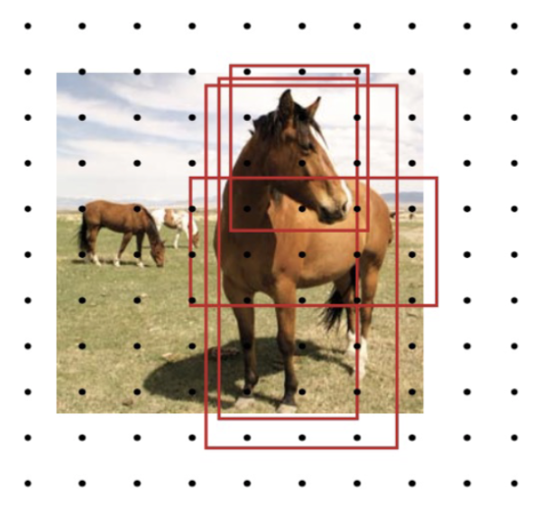

- 앵커 박스의 크기를 벗어나는 물체는 검출하기 어려움
- 가까운 곳에 위치한 물체를 검출하기 어렵기 때문에 다른 스케일의 앵커 박스가 필요함
- 이미지에서 서로 다른 배율로 들어 있는 물체를 처리하려면 이미지를 서로 다른 크기로 전처리하고 그 결과를 합쳐 처리할 방법이 필요함
  - 합성곱 필터의 크기를 달리한 여러 개의 합성곱층을 사용 -> 한 신경망 안에서도 이와 같은 효과를 얻을 수 있음
  - 여러 배율에 해당하는 파라미터를 전체 신경망에서 공유할 수 있음
- 입력 이미지를 작게 리사이징 해서 앵커 박스의 크기에 들어오도록 한 것과 같은 효과
  - 실제로 입력 이미지를 리사이징 하지는 않지만 CNN이 입력 이미지의 크기를 줄이는 성질을 이용한 것
  - 여러 층을 쌓아 큰 물체도 앵커 박스에 들어오도록 줄임
- SSD 연구진은 크기가 점차 감소하는 여섯 층의 합성곱층을 추가함
  - 층수를 결정하는 과정에서도 많은 시행착오가 있음

### 팽창 합성곱 (dilated convolution)

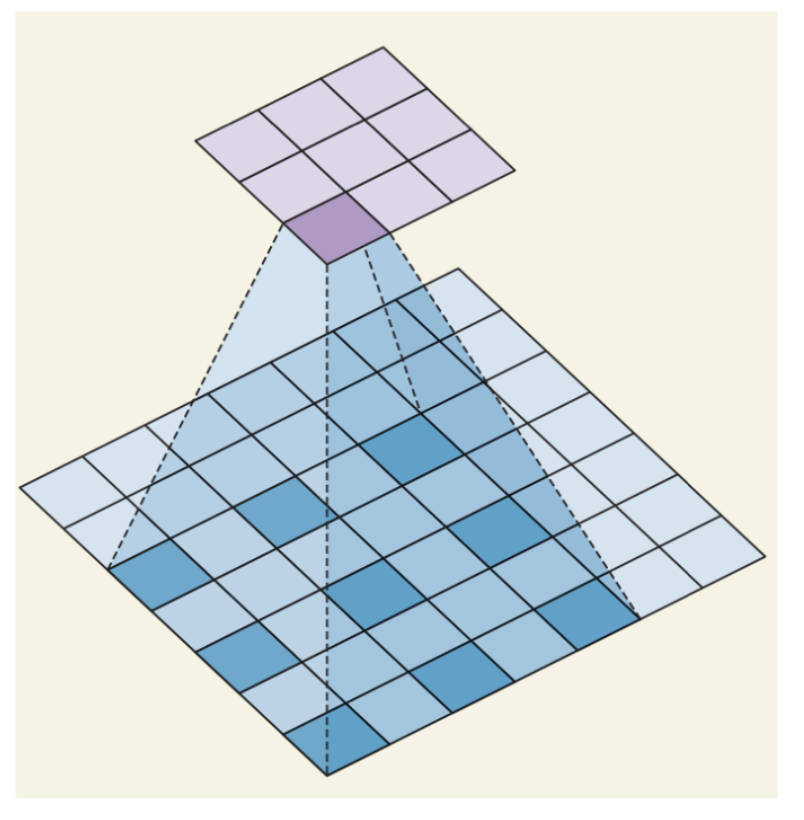

- 새로운 파라미터인 팽창율(dilated rate)이 도입됨
- 팽창률: 커널과 대상 이미지의 거리
- 팽창 합성곱은 같은 계산 비용으로 더 넓은 감수 영역의 효과를 볼 수 있음
  - 실시간 세그먼테이션 분야에서 널리 사용됨
- 합성곱 연산을 여러 번 적용하거나 큰 커널을 사용할 자원이 부족한 경우 사용하면 좋음

### 비최대 억제

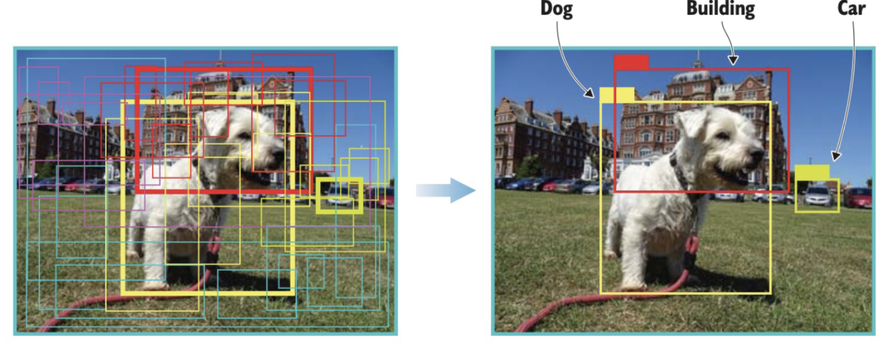

- 추론 시점에 SSD의 순방향 계산에서 생성되는 많은 수의 경계 박스는 대부분 NMS 알고리즘을 통해 배제됨
- 가장 가능성이 높은 예측만 결과로 출력됨
- NMS가 경계 박스를 배제하는 방식
  1. 확신도 기준으로 경계 박스를 정렬
  2. 확신도가 가장 높은 경계 박스부터 그 이전에 본 각각의 경계 박스와 중첩률을 계산
  3. 현재 경계 박스와 같은 클래스로 분류되었고, 일정 중첩률을 초과하는 것이었는지 확인
  4. 임계값보다 중첩률이 높은 경계 박스는 확신도가 더 높은 경계 박스와 지나치게 겹치므로 같은 물체를 가리킨다고 판단해서 폐기
  5. 이런 식으로 이미지 한 장당 최대 200개의 경계 박스를 남김

## YOLO
- 모든 전체 처리 과정이 딥러닝으로 구현된 고속 사물 탐지 모델
  - 고속 실시간 사물 탐지에 도전한 초기 시도 중 한가지
  - 현재도 사물 탐지 알고리즘 중에서 속도가 빠른 편에 속함
- 정확도는 R-CNN에 미치지 못함
  - 빠른 처리 속도 덕분에 사물 탐지 분야에서는 인지도가 높음
  - 실시간 영상 또는 카메라 입력 처리 데모용으로 자주 사용됨
- YOLO는 지금까지 설명했던 신경망과는 조금 다른 접근법을 취함
  - R-CNN과 같은 영역 제안 단계가 아예 없음
  - 입력을 비교적 소수의 격자 형태로 분할
  - 분할된 영역을 대상으로 직접 경계 박스와 사물 분류를 수행
  - 이 결과 많은 수의 경계 박스 후보가 생성되는데, 이를 다시 NMS를 사용해 최종 예측 결과로 좁힘
- YOLOv3를 위주로 살펴볼 예정
  - 현재는 YOLOv5까지 존재함

### YOLOv3의 처리 과정

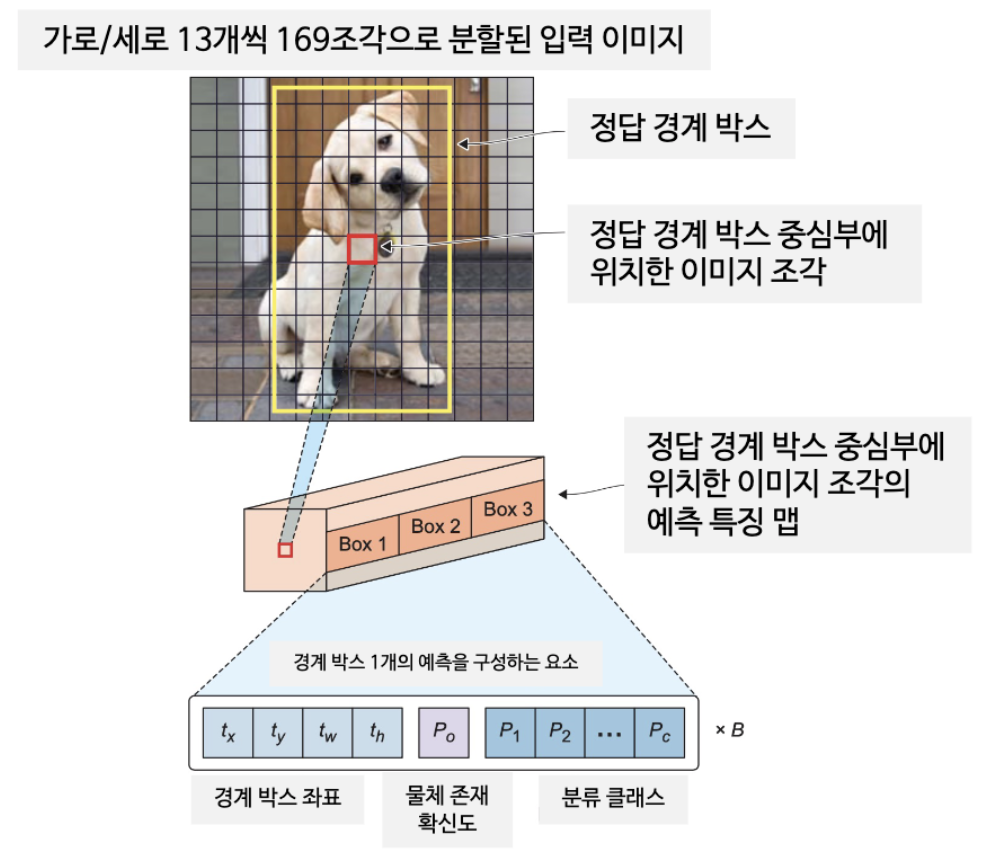

- 이미지를 S * S개의 격자 모양으로 분할
  - 정답 경계 박스의 중심이 이 중 어떤 조각에 포함된다면, 해당 조각에서 물체의 존재가 탐지되어야 함
- 분할된 각 조각마다 B개의 경계 박스, 물체 존재 확신도, 물체의 클래스를 예측함
  - B개의 경계 박스를 결정하는 좌표: 4개의 값을 가진 튜플로 정의
  - 물체 존재 확신도: 해당 이미지 조각에 물체가 포함되어 있을 확률
  - 물체의 클래스 분류: K개 클래스에 대해 물체가 해당 클래스에 속할 확률을 계산
- YOLOv 1, 2에서는 클래스 분류 확률을 구하기 위해 소프트맥스 함수를 사용
  - YOLOv3에서는 대신 시그모이드 함수를 사용함
  - 소프트맥스 함수를 사용하면 경계 박스 하나가 항상 하나의 클래스에만 속한다는 가정이 필요함
  - 어떤 물체가 반드시 한 가지 클래스에만 속하지 않고 "사람과 여자"처럼 둘 이상의 클래스를 갖는 데이터셋도 존재함
  - 다중 레이블을 부여할 수 있는 모델은 정확도가 좀 더 높음
- 업샘플링층
  - 업샘플링: 작았던 영상을 크게 키울 때, 부족한 정보를 채우기 위한 알고리즘
  - 신경망이 작은 물체를 탐지하는데 중요한 정보가 되는 세밀한 특징을 보존 할 수 있음

### YOLOv3 구조

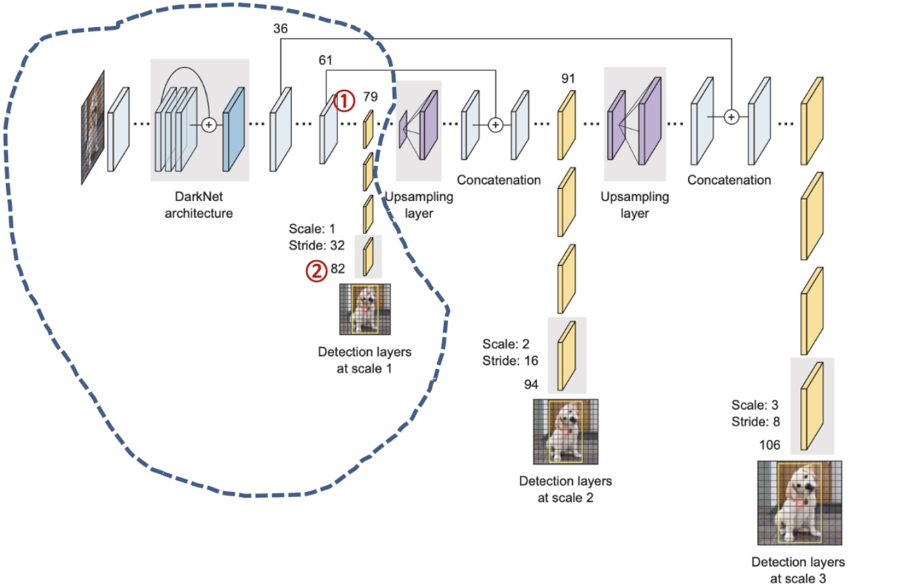

- YOLO는 사물 탐지와 클래스 분류를 모두 수행하는 단일 신경망
- 신경망의 구조는 GoogLeNet(인셉션)의 특징 추출기 부분을 참고함
- darknet-53을 채용함
  - 이미지넷 데이터셋을 학습한 53층 구조의 신경망
- darknet-53에 사물탐지를 보조하는 53개 층을 덧붙여 106층에 달하는 전결합 합성곱 구조가 만들어짐
- YOLOv2에 비해 처리 속도가 오래걸리지만, 속도를 희생한 이상의 정확도 향상이 있었음