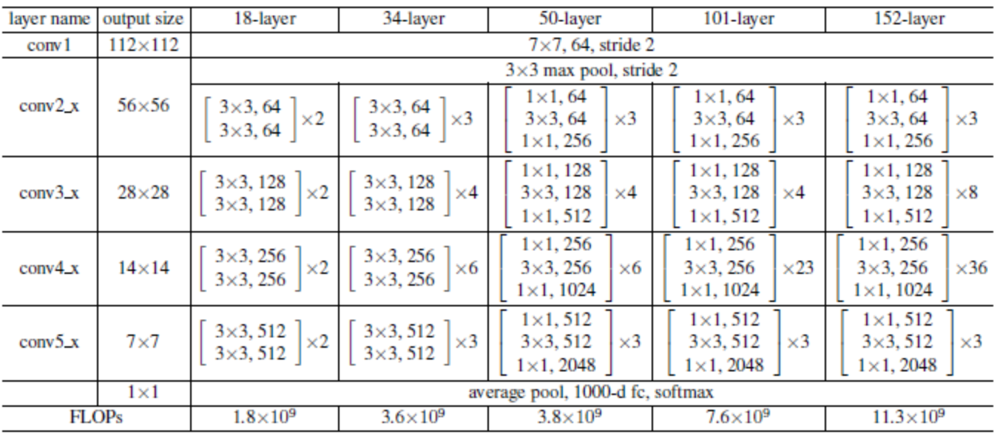
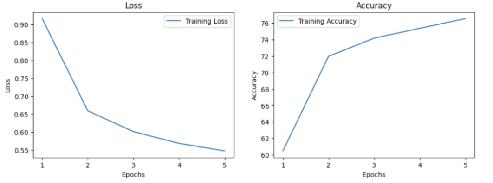
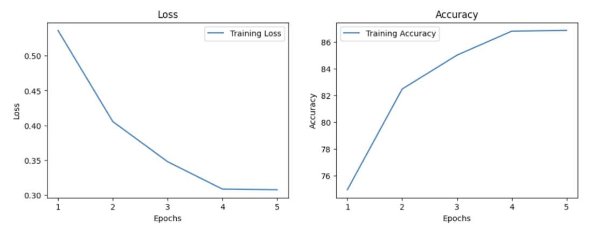

# 인공지능 Term Project 1
[kaggle competitions](https://www.kaggle.com/competitions/2023-ai-tp1/overview)
- 센서를 이용한 환자 활동 상태 예측
- CWT 변환된 센서 데이터를 이용해 환자의 다음 상태를 예측하는 문제
- 사전 학습된 ResNet18 모델을 전이 학습하여 진행

### ResNet18



[PyTorch ResNet18 Docs](https://pytorch.org/vision/main/models/generated/torchvision.models.resnet18.html)

[ResNet18](https://hnsuk.tistory.com/31)

- 총 18개의 층으로 이뤄진 ResNet
- 224 * 224 * 3 이미지를 입력으로 받음

### CWT(Continuous Wavelet Transform) 변환
[Continuous Wavelet Transform](https://en.wikipedia.org/wiki/Continuous_wavelet_transform)

- 시간-주파수 분석을 위한 변환
- Wavelet이라는 작은 파동을 사용하여 신호와의 유사도를 측정
- 신호에서의 미세한 변화를 탐지하는데 매우 유용함

## 전처리 방법
1. x, y, z 축의 가속도 정보가 CWT 변환되어 1D 형태 (,6400)로 제공됨
2. CWT 변환 당시의 shape인 2D 형태 (50,128)로 변환 
3. x, y, z 축의 정보를 3채널로 이용해 CWT 영상으로 [concat](https://pytorch.org/docs/stable/generated/torch.stack.html) (3,50,128)
4. ResNet18의 입력값인 (224,224)로 변환 - [Bilinear Interpolation](https://pytorch.org/docs/stable/generated/torch.nn.functional.interpolate.html) 사용

### 코드

```python
# dataset을 load 후, 2d로 바꾼 뒤 tensor로 반환
def load_and_process_data(file_path):
    data = pd.read_csv(file_path).values
    data = data.reshape(-1, 50, 128)
    return torch.tensor(data, dtype=torch.float32)
```

```python
import torch.nn.functional as F

# x, y, z 데이터를 합쳐 3차원 데이터 변환, 224 * 224로 리사이즈하여 반환
def load_data(base_dir, data_type, split):
    tensors = []
    for axis in ['x', 'y', 'z']:
        file_name = f"{data_type}_{axis}_{split}_CWT.csv"
        file_path = os.path.join(base_dir, file_name)
        tensors.append(load_and_process_data(file_path))
    train_X = torch.stack((tensors[0], tensors[1], tensors[2]), 1)
    train_X = F.interpolate(train_X, size=(224, 224), mode='bilinear')
    return train_X
```

## Transfer Learning - Freezing vs Fine-Tuning
- FC Layer를 제외한 모든 Layer Freezing 후 학습



- 모든 Layer Fine-Tuning



### Fine-Tuning 방법이 성능이 더 높은 이유 분석
- PyTorch에서 pretrained된 ResNet18이 사용한 데이터셋은 ImageNet
- 본 문제에서 분류해야 하는 데이터셋은 CWT 변환 영상
- CWT 변환 영상과 ImageNet의 영상은 본질적으로 차이가 있음
  - ImageNet 영상은 현실의 객체를 담고 있음
  - CWT 변환 영상은 주파수 정보 등 추상적인 내용을 담고 있음
- Freezing 방법은 새로 학습해야 하는 데이터가 Pretraining 한 데이터와 유사할 때 유용함
  - 충분한 양의 데이터로 가중치가 학습되어 있음
  - 크게 변동을 주지 않는 선에서 학습
- Fine-Tuning 방법은 새로 학습해야 하는 데이터가 기존 학습한 데이터와 다를 때 유용함
  - 전체 가중치를 새로운 데이터에 맞게 수정
- 따라서 새로 분류해야 하는 데이터셋이 pretraining한 데이터셋과 다른 본 문제에서는 Fine-Tuning 방법이 더 효과적임