# 운영체제 스터디 1주차
## Chapter 1-2. Introduction & O/S structures

### 튜링 머신과 현대 컴퓨터

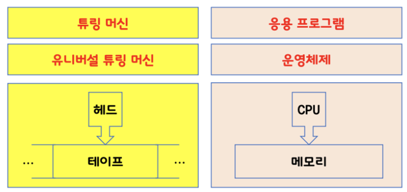

[On The Turing Completeness of PowerPoint (SIGBOVIK)](https://youtu.be/uNjxe8ShM-8?feature=shared)

### 폰 노이만 구조

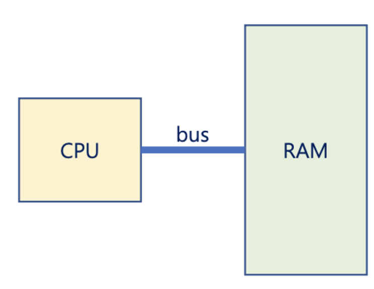

- bus란?

### 운영체제란?

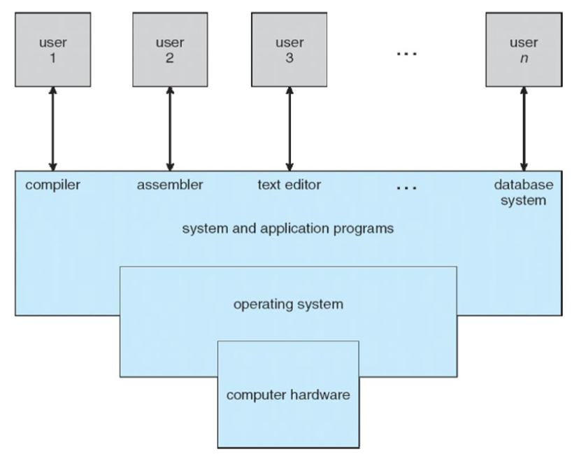

- 컴퓨터의 하드웨어를 관리하기 위한 소프트웨어
- 애플리케이션 프로그램의 구성요소를 제공
- **os vs kernel ?**

### bootstrap

- 컴퓨터가 커지면 실행되는 최초의 프로그램
- OS를 메모리에 로드하는 역할

### Interrupts

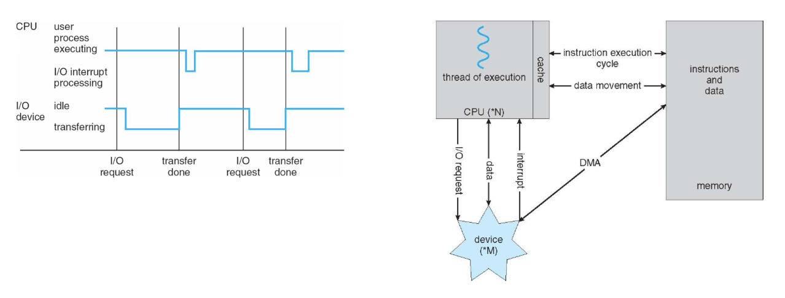

- Multiprocessing: concurrency vs pallelelism

### 유저 모드와 커널 모드?

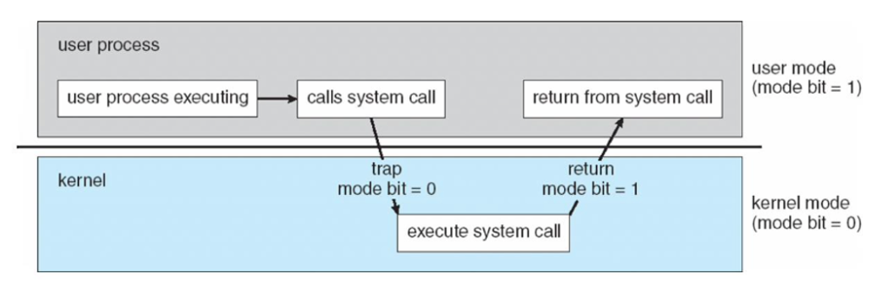

- Operation Mode: **user mode** and **kernel mode**
    
    [뱅가드가 무엇인가요?](https://support-valorant.riotgames.com/hc/ko/articles/360046160933-뱅가드가-무엇인가요-)
    

### Virtualization

- VMM: Virtual Machine Manager
    
    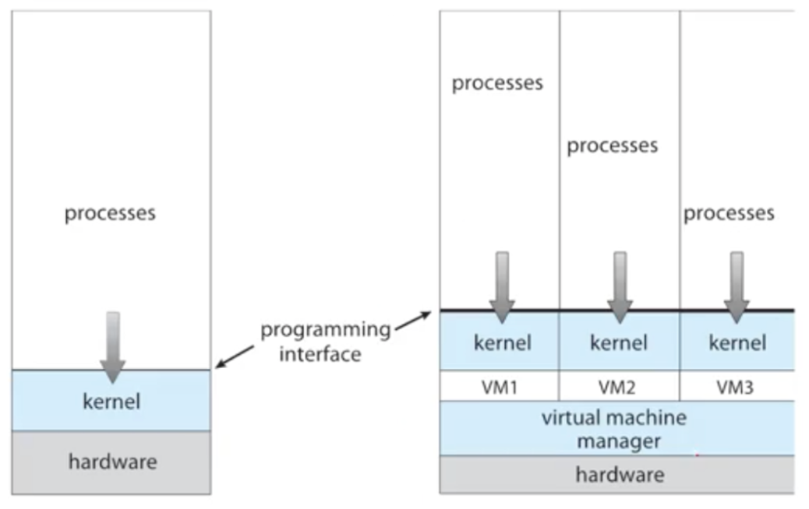
    
    - VMM은 정확히 어디에 위치할까?

### System Call

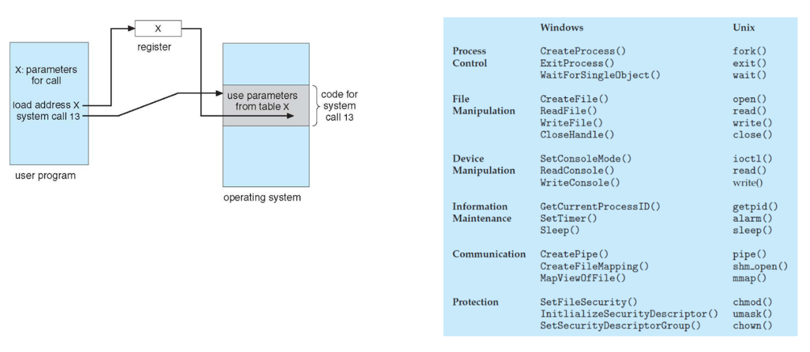

- **register: 명령어 캐시?**

- CLI vs GUI, Touch-UI: 사용자 인터페이스
- System Call: 응용 프로그램이 커널을 사용하기 위한 인터페이스 = OS의 API
- System Call은 라이브러리 형태로 제공됨

## Chapter 3. Processes (Part 1)

- process: 실행 중인 프로그램
    - OS의 작업의 단위
    - HDD에 있는 program을 memory에 올린 상태
- process의 layout
    - **Text, Data, Heap, Stack**
    - `size ./a.out`

### process의 state

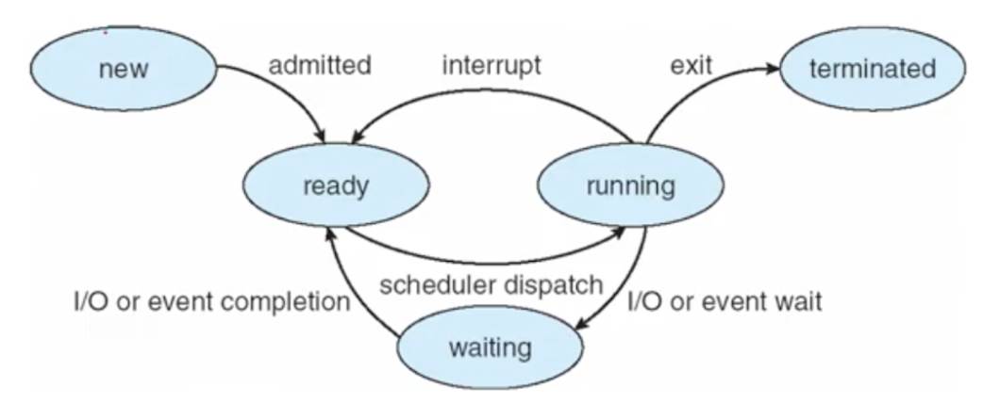

- New: process가 생성된 상태 (fork)
- Running: 명령어가 실행된 상태
- Waiting: 일이 끝날 때까지 대기하는 상태 (I/O 작업)
- Ready: 일이 끝나 실행되기 위해 ready queue에서 대기하고 있는 상태
- Terminated: 모든 작업을 끝낸 상태

### PCB (Process Control Block) or TCB (Task Control Block)

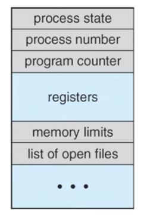

- 각 프로세스가 가져야 할 정보를 저장해 둔 구조체
    - Process state
    - **Program counter (PC): PC에 적혀있는 위치의 메모리에서 명령을 가져옴**
    - **CPU registers? (PC + registers = context)**
    - CPU-scheduling information
    - Memory-management information 등..
- PCB들을 운영체제가 관리해줘야 함
- 운영체제의 가장 중요한 역할: Multitasking, Multiprocessing
    - 목적: 동시에 여러 개의 프로세스를 시키기 위함 = concurrenty(parallel와는 다름)
    - CPU 사용률을 최대한으로 올리기 위함
    - Time-shareing

### Scheduling Queues

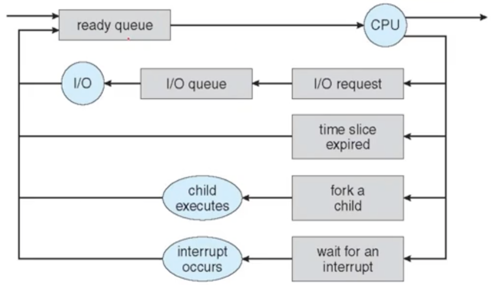

- ready queue: 프로세스가 CPU에 의해 실행되기 위해 기다리는 queue
- wait queue
- linked list로 구현됨

### Context Switch

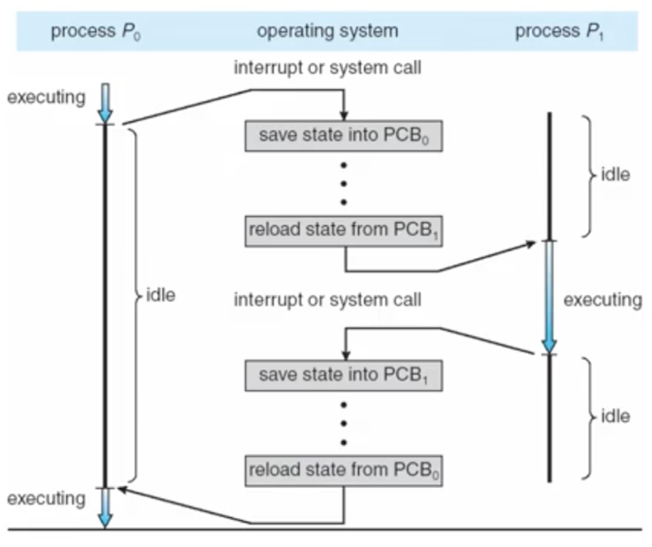

- Context: PCB 정보
- CPU core를 다른 process에게 넘겨주는 것
- 현재 프로세스의 PCB를 저장 → 새로 획득할 PCB를 복원

### Process 생성

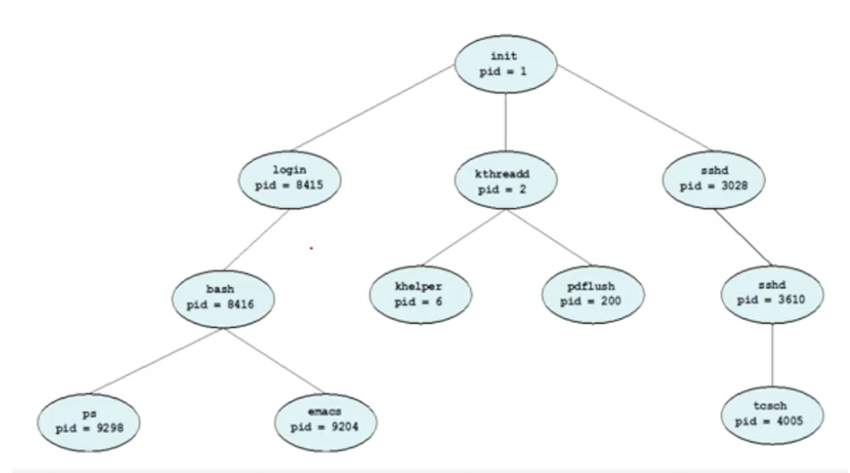

- fork()를 이용해 만들음
- parent process, child process
- 실행하는 두가지 방법
    - 부모, 자식이 동시에 실행
    - 자식 프로세스가 종료될 때까지 대기
- 주소공간의 두가지 방법?
    - Parent process의 공간을 복제하는 방법 = fork
    - 새로운 프로그램을 로딩 = exec
- Process 종료
    - 마지막 문장 실행
    - exit() system call 호출

### Zombie process, Orphan process

- zombie process: 부모 프로세스가 종료되진 않았는데 wait를 호출하지 않고 따로 돌아가는 중인 프로세스
- orphan process: 부모 프로세스가 wait를 호출하지 않고 종료된 뒤 남은 프로세스

## Chapter 3. Processes (Part 2)

- 자식 프로세스는 부모 프로세스의 adress space를 그대로 복사함
    - 주소 영역의 어디까지 복사할까?
    - 부모 프로세스는 wait() 시스템 콜을 이용해 대기할 수 있음
        - wait queue에 들어가 자식 프로세스가 종료될 때까지 기다림
        - 자식 프로세스가 종료되면 부모 프로세스에 interrupt를 걸음
        - interrupt란?
- fork를 했을 때 parent가 항상 먼저 나오는가? → 보장할 수 없음 (context switch??)