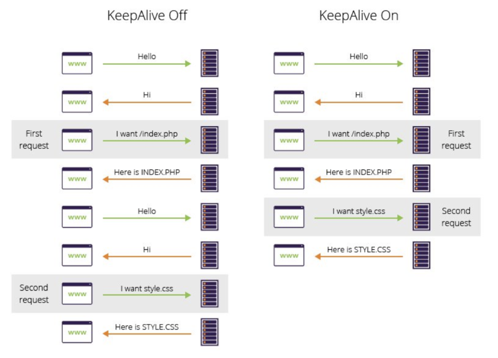
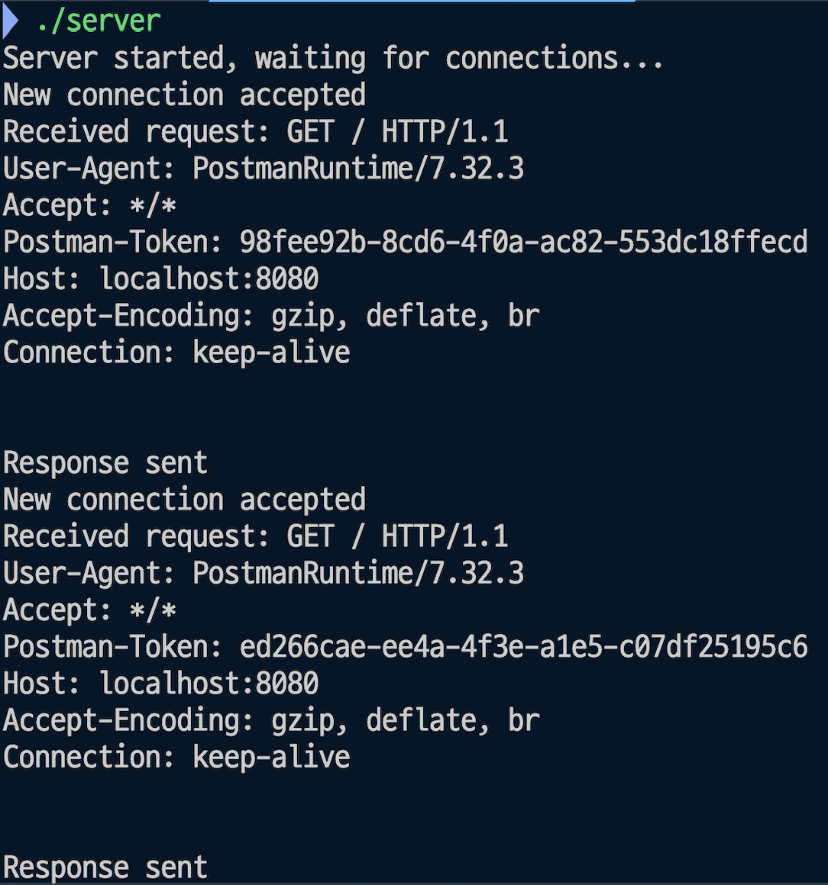
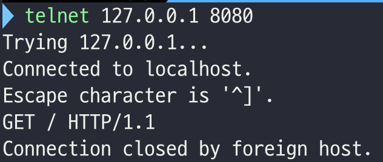

# Webserv 프로젝트
## 진척 사항
### 완료
- kqueue 서버 오류 수정
- 현재 매 요청마다 새로운 커넥션을 생성하고 닫음 -> 커넥션 유지하도록 변경해야 함
  - Connection: keep-alive 헤더 공부
  - telnet으로 실습

### TODO
- 커넥션 닫기 기능 구현
- setsockopt 함수 공부
- OCCF 맞추기
- 클래스 구조 개선

## kevent의 마지막 인자
```c++
struct kevent _changeEvent;
EV_SET(&_changeEvent, socket, EVFILT_READ, EV_ADD | EV_ENABLE, 0, 0, (void*)(intptr_t)socket);
```
- `(void*)(intptr_t)socket`를 사용하지 않으면 요청이 종료되지 않는다.
- 내일 알아보자..

## Connection: keep-alive
**참고 자료**

[keep alive란?](https://etloveguitar.tistory.com/137)

[RFC 7230, Sec 6.3, Sec 6.3.1]

### 학습: persistent connection



- `HTTP 1.0`에서는 위 이미지처럼 매번 새로운 연결을 맺었고, 속도에 문제가 있었다.
  - TCP가 처음 연결될 때 `3-way-handshake`를 한다.
  - `3way handshake`는 시간적 비용이 많이 드는 작업인데, 이를 매 요청마다 하니 엄청나게 느렸던 것이다.
  - 이를 `non-persistent connection`이라고 부른다.
- `HTTP 1.1`은 `HTTP 1.0`의 문제를 해결하기 위해 `persistent connection`을 도입했다.
  - 서버와 클라이언트가 처음 TCP 연결을 할 때만 `3-way-handshake`를 진행하고, 연결을 중단하지 않는다.
  - `HTTP 1.0`에서 비공식적으로 `persistent connection`을 도입하려는 시도가 있었지만, `HTTP 1.1`에서 공식화되었다.

### 학습: Connection: keep-alive

- `Connection: keep-alive` 헤더는 `HTTP 1.0`에서 비공식적으로 도입되었다.
  - `HTTP 1.0`은 기본적으로 `non-persistent connection`이었다.
  - `persistent connection`을 구현하기 위해 `Connection: keep-alive` 헤더를 사용하였다.
  - `Connection: keep-alive` 헤더가 있을 경우 TCP 연결을 종료하지 않는다.
- `HTTP 1.1`에서는 `persistent connection`이 표준으로 채택되었다.
  - `persistent connection`을 하기 위해 `Connection: keep-alive` 헤더를 사용할 필요가 없다.
  - TCP 연결을 종료하고 싶을 경우에만 `Connection: close` 헤더를 사용한다.

### 결론

- HTTP 1.1에서는 기본적으로 persistent connection이다.
- 커넥션을 닫고 싶은 경우 `Connection: close` 헤더를 사용한다.

## 커넥션 종료 오류 수정

### 문제 상황




- 웹서버를 개발하는 중 예상치 않게 커넥션이 종료되는 상황이 발생하였다.
- telnet을 사용하여 요청을 보내 디버깅을 했다.
  - 요청을 적는 도중 서버로부터 커넥션이 끊겼다.
  - 서버가 클라이언트의 요청을 전부 기다리지 않고 커넥션을 종료한다.

### 요청 읽기 파트 수정

**기존 코드**

```c++
void ConnectionHandler::readRequest(void) {
  char buffer[BUFFER_SIZE];

  ssize_t bytesRead = read(_socket_fd, buffer, sizeof(buffer) - 1);

  if (bytesRead < 0 && errno != EWOULDBLOCK) {
    perror("read");
    close(_socket_fd);
  } else if (bytesRead == 0) { // 클라이언트가 연결을 종료했음
    close(_socket_fd);
    std::cout << "Client: connection close" << std::endl;
  } else if (bytesRead > 0) {
    buffer[bytesRead] = '\0';
    std::cout << "Received request: " << buffer << std::endl;
    sendResponse();
  }
}
```

- `readRequest()`는 `kqueue`에서 읽기 가능 이벤트가 감지되면 호출되는 함수이다.
  - 이벤트가 발생한 소켓에서 `read()`를 한 뒤, 요청을 보낸다.

- 클라이언트에서 요청을 나눠서 보내는 경우(ex: telnet), 요청을 전부 받지 않은 채 응답을 보내게 된다.
- RFC 표준에 맞게 `\r\n\r\n`이 들어올 때까지 요청을 계속 읽도록 수정하였다.
  - 이벤트가 들어올 때마다 `read()`하여 `_request`라는 `std::string` 변수에 저장하였다.
  - `_request` 변수에 `\r\n\r\n`이 들어왔을 경우 읽기를 중단하고 응답을 보낸다.

**수정 코드**

```c++
void Connection::readRequest(void) {
  char buffer[BUFFER_SIZE];
  bool requestComplete = false;

  while (!requestComplete) {
    memset(buffer, 0, BUFFER_SIZE);
    ssize_t bytesRead = read(_socketFd, buffer, sizeof(buffer) - 1);

    if (bytesRead < 0) {
      // EWOULDBLOCK 오류가 아닌 경우에만 오류 처리
      if (errno != EWOULDBLOCK) {
        perror("read");
        close(_socketFd);
        return;
      }
      break;
    } else if (bytesRead == 0) {
      // 클라이언트가 연결을 종료했음
      close(_socketFd);
      std::cout << "Client: connection closed" << std::endl;
      return;
    } else {
      buffer[bytesRead] = '\0';
      _request.append(buffer);

      // 요청의 끝 확인 (\r\n\r\n)
      if (_request.find("\r\n\r\n") != std::string::npos) {
        requestComplete = true;
      }
    }
  }

  if (requestComplete) {
    std::cout << "Server: received request\n"
              << "-------------\n"
              << _request << "\n-------------" << std::endl;
    sendResponse();
    _request.clear();
  }
}
```

### 문제 해결: 소멸자 수정

- 요청 읽기 파트를 수정했음에도 오류가 지속적으로 발생했다.

```c++
Connection::~Connection(void) {
  if (_socketFd != -1) {
    close(_socketFd);
  }
}
```

- 원인은 `Connection` 객체의 소멸자에 있는 `close()`였다.
  - `Connection` 객체를 동적할당하지 않고 값 형태로 관리하고 있었다.
  - 값이 복사되는 과정에서 내부적으로 소멸자가 호출되어 소켓이 닫히게 된 것이다.

```c++
void ConnectionHandler::addConnection(int fd) {
  Connection connection(fd);
  connections[fd] = connection; // rvalue 소멸자 호출
}

void ConnectionHandler::event(int fd) {
  Connection& connection = connections[fd];
  connection.handleRequest();
}
```

- 해결을 위해서는 `Connection` 객체를 참조나 동적할당으로 관리해야 한다.
  - 동적할당의 경우 동적할당하는데 소모되는 비용, 포인터를 관리하는 비용을 고려해야 한다.
  - 참조의 경우 이번과 같은 문제가 발생할 수 있다.
