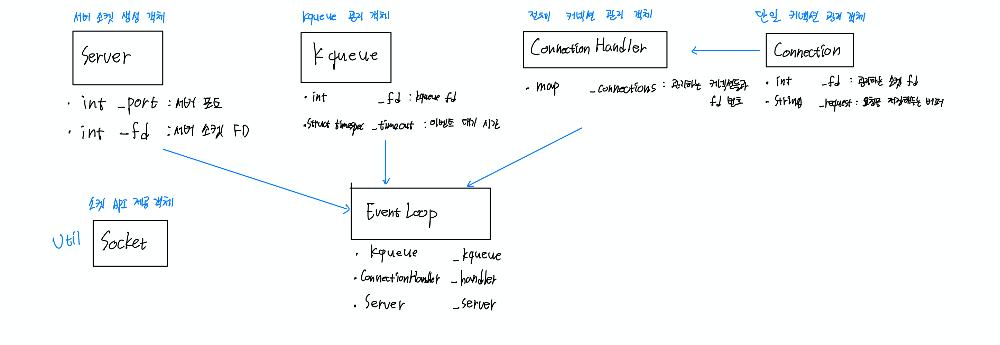
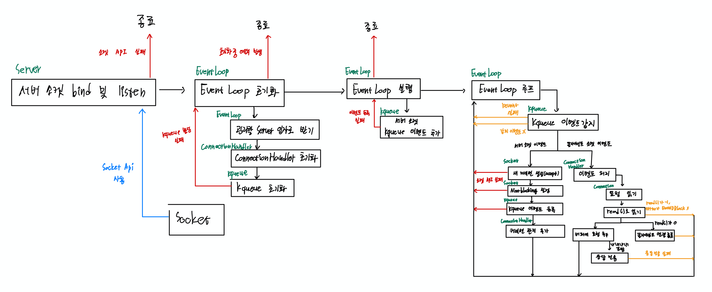

# Webserv 프로젝트
## 진척 사항
### 완료
- [X] Server 클래스 리팩토링 (RAII 패턴)
- [X] 플로우차트 그리기

### TODO
- [ ] 예외처리 흐름 파악하기
  - [ ] ConnectionHandler 클래스 예외처리 추가
  - [ ] Socket 클래스 예외처리
- [ ] 커넥션 타임아웃 구현
- [ ] 헤더 정리
- [ ] setsockopt 함수 공부
- [ ] OCCF 맞추기
- [ ] 브라우저 요청 확인

## RAII 디자인패턴 (Resource Acquisition Is Initialization)

**참고 자료**

[영감을 주는 코딩 패턴들 - RAII](https://velog.io/@pjc0247/%EC%98%81%EA%B0%90%EC%9D%84-%EC%A3%BC%EB%8A%94-%EC%BD%94%EB%94%A9-%ED%8C%A8%ED%84%B4%EB%93%A4-RAII)

- 내일 공부해보자..
