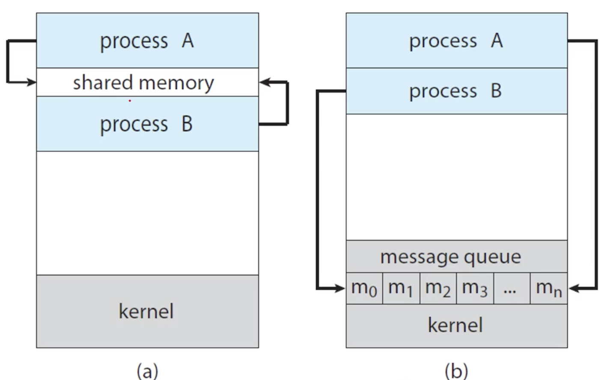
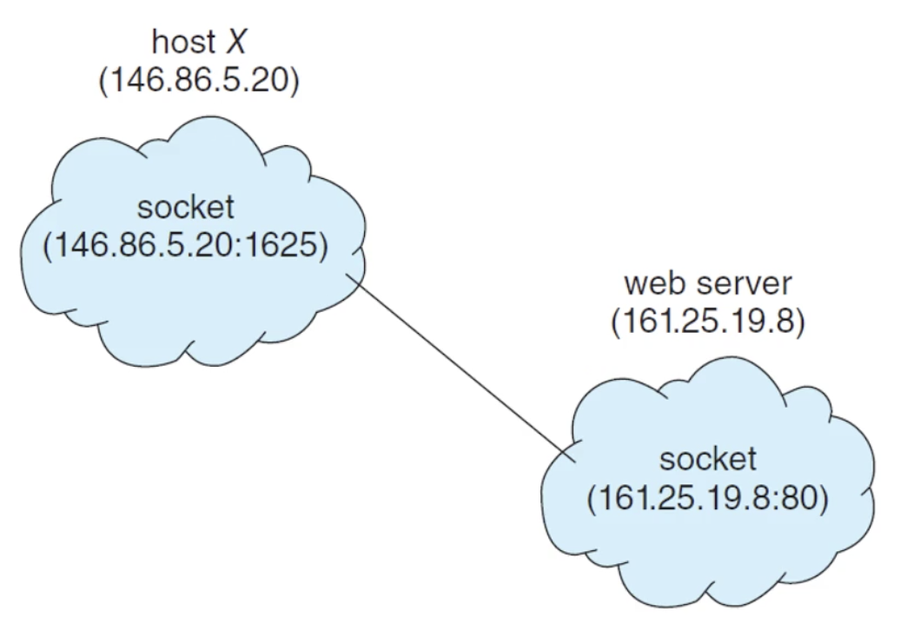

# 05. 프로세스간 통신: Chapter 3. Processes (Part 3)
## concurrently의 뜻

1. independent process: 각자 할일을 하는 두 프로세스
    - 공유하는 데이터가 없음
    - 주고 받을 메시지도 없음
2. cooperating process: 
    - 다른 프로세스와 영향을 주거나 받는 상황
    - 어떤 프로세스가 데이터를 공유하거나 메시지를 주고 받을 때 → IPC 문제 발생

## IPC: Inter-Process Communication

- 다른 프로세스와 데이터를 주고 받기 위한 방법

### 모델

- 공유 메모리를 이용해 데이터를 주고 받기
- 메시지를 주고 받기



- (a) 공유 메모리: shared memory 영역에 데이터를 쓰고 읽는 방식
- (b) 메시지 전송: 운영체제의 message queue를 이용하여 데이터를 주고 받는 방식

## Producer-Consumer Problem (생산자-소비자 문제)

- 생산자는 정보를 생성하고, 소비자는 정보를 소비하는 모델
  - 컴파일러가 어셈블리 코드를 생산하면, 어셈블러가 기계어를 생산한다.
  - 브라우저가 HTML 파일을 요청하면, 웹서버는 해당 파일을 제공한다.

### 두 개의 프로세스 관점

- 생산자와 소비자가 concurrently하게 돌아감
  - 서로 CPU를 컨텍스트 스위치를 통해 사용함
- 버퍼를 이용한 방식
  - 생산자는 버퍼에다가 전송하고 싶은 것을 채운다.
    - 버퍼가 가득 차면 기다려야 한다.
  - 소비자는 버퍼에서 데이터를 읽는다.
    - 버퍼가 비어있으면 기다려야 한다.

## shared memory
  - 생산자와 소비자가 공유하고 있는 영역
  - 지금까지 다른 프로세스는 다른 메모리 영역을 가지고 있었다.
  - 프로세스가 다른 프로세스의 영역에 침범하는 것은 허용되지 않는다. (사적인 영역)
  - 두 프로세스가 함께 사용할 수 있도록 OS가 제공하는 영역이 shared memory

### shared memory 방식의 문제점

- 메모리 영역을 공유하려면 그 방식을 프로그래머들이 다 구현해야 한다.
  - 적은 프로세스인 경우는 문제가 없지만, 수 많은 프로세스들이 있는 경우는 복잡하다.
- Message-Passing 방식의 등장
  - OS가 프로세스 간의 통신을 위한 방식을 제공

## Message Passing 방식

- send(message), receive(message) 두가지 시스템콜만을 사용함
  - 구체적인 구현이나 동작 방법은 OS에게 맡김
- 프로세스가 통신하기 위해서는 위 두개의 시스템콜만 있으면 된다.
- 다양한 방식이 있음
  - direct하게 보낼지, indirect하게 보낼지
  - synchronous하게 보낼지, asynchronous하게 보낼지
  - 자동으로 보낼지, 명시적으로 버퍼링할지

### direct 방식

- 상대방을 명시적으로 정해 메시지를 보냄
- send(P, message), receive(Q, message)와 같이 상대방을 명시함
- direct 방식을 사용한 경우 커뮤니케이션 링크가 자동으로 생성됨
  - 이 링크는 두 프로세스 사이에 하나만 성립하게 됨

### indirect 방식

- 중간의 매개체를 이용해 메시지를 전달 (mailbox, port)
- 매개체는 메시지를 보내는 저장소, 메시지를 받는 저장소 역할을 함
- send(A, message), receive(A, message)
  - 상대방을 명시하는 것이 아니라 매개체(mailbox, port)를 명시함
- 두 개의 프로세스가 매개체를 공유할 때만 링크가 생김
  - 공유하는 프로세스가 여러개가 돼도 문제가 없다.
- OS 입장에서 제공할 기능
  - 새로운 mailbox를 만들어 준다.
  - mailbox를 통해 send, receive할 수 있도록 한다.
  - mailbox를 삭제할 수 있도록 한다.

## blocking, non-blocking, synchronous, asynchronous

- Blocking send: 데이터가 도착할 때까지 기다리고 있는 것
- Non-blocking send: 메시지를 보내고 다른 일을 하는 것
- Blocking receive: 데이터를 받을 때까지 기다리고 있는 것
- Non-blocking receive: 데이터를 받거나, 빈 메시지를 받고 다른 일을 하는 것

# 06. 프로세스간 통신의 실제: Chapter 3. Processes (Part 4)

## UNIX의 IPC 방법

- Shared Memory: POSIX Shared Memory
- Message Passing: Pipes

### POSIX Shared Memory

- 파일을 memory 영역에 생성 (memory-mapped files)
- shm_open(), ftruncate(), mmap() 함수를 사용
- 사용자가 일일이 지정해줘야 하기 때문에 불편하다.

### Pipes


- UNIX 시스템의 초창기 IPC 방법
- unidirectional함 (단방향)
- 구현의 편의상 parent-child 관계를 가져야 함
  - Ordinary pipes
- 파이프는 네트워크에서 사용하지 않음
  - 네트워크 상에서 사용하는 파이프 = 소켓
- Named pipe: parent-child 관계가 없이도 사용할 수 있는 파이프

## 다른 컴퓨터와 통신하는 방법

### Sockets



- 원격 통신을 위한 endpoint
  - IP address로 컴퓨터를 특정
  - port로 pipe를 특정
  - IP address + port = socket
- 자바가 소켓 인터페이스를 굉장히 쉽게 제공한다.

### RPCs (Remote Procedure Calls)
****
- 원격에 있는 프로시저를 호출한다.
  - 정의를 하나하나 하는 것이 아닌, 원격에 있는 함수를 호출하는 것
  - IPC의 확장 개념
- 자바에서는 RMI라고 구현함
- RPC 시스템
  - 클라이언트에서 stub을 제공한다.
  - marshals 파라미터를 보내고 marshals 객체를 받으면 된다.

# 운영체제 질문 정리

- [X] os와 kernel의 차이가 정확히 무엇일까?
- [ ] concurrency와 pallelelism의 차이는 무엇일까?
- [ ] VMM은 OS위에 존재하는 프로그램일까? 아니면 OS와 같은 단에 위치하는 프로그램일까?
- [ ] register는 뭘까?
- [ ] Text, Data, Heap, Stack 영역이 각각 담당하는 건 뭘까?
- [ ] Interrupt가 정확히 뭘까?
- [ ] User mode vs Kernel mode

## OS vs Kernel

**학습 자료**

[운영체제와 커널이란?](https://goodmilktea.tistory.com/23)


### 운영체제란?

- 컴퓨터 시스템의 자원들을 효율적으로 관리하는 프로그램이다.
- 사용자가 컴퓨터를 편리하게 사용할 수 있는 환경을 제공하는 여러 프로그램의 모임
- 컴퓨터 소프트웨어와 컴퓨터 하드웨어 간의 인터페이스로서 동작하는 시스템 소프트웨어
  - 이를 통해 다른 응용프로그램들이 유용한 작업을 할 수 있도록 환경을 제공해준다.

### 커널이란?

- 운영체제 자체도 소프트웨어이므로 컴퓨터의 전원이 켜짐과 동시에 메모리에 올라가야 한다.
- 다만 운영체제처럼 규모가 큰 프로그램이 모두 메모리에 올라간다면 메모리 공간의 낭비가 심하다.
  - 운영체제 중 항상 필요한 부분만을 컴퓨터 전원이 켜짐과 동시에 메모리에 올려놓는다.
  - 나머지 부분은 필요할 때 메모리에 올려서 사용하게 된다.
- 커널은 메모리에 상주하는 부분으로 운영체제의 핵심적인 부분을 뜻한다.
  - 프로세스 관리, 메모리 관리, 하드웨어와의 통신 등을 담당한다.
  - 넓은 의미의 운영체제는 커널뿐 아니라 각종 시스템을 위한 유틸리티들을 광범위하게 포함하는 개념이다.

**학습 자료**

[Difference between Operating System and Kernel](https://www.geeksforgeeks.org/difference-between-operating-system-and-kernel/)

### Operating System

- 유저와 컴퓨터 사이의 인터페이스를 제공해주는 시스템 프로그램이다.
- 컴퓨터가 켜질 때 가장 먼저 실행하는 프로그램이 OS이다.

### Kernel

- 커널은 OS에서 핵심적인 부분이다.
- 커널 또한 시스템 프로그램이다.
  - 사용자 명령어를 기계어로 바꾸는 OS의 한 부분이다.

### OS와 Kernel의 차이

| Operating System | Kernel |
|------------------|--------|
| OS는 시스템 소프트웨어이다. | 커널은 OS의 한 부분인 시스템 소프트웨어이다. |
| OS는 유저와 하드웨어 사이의 인터페이스를 제공한다. | 커널은 애플리케이션과 하드웨어 사이의 인터페이스를 제공한다. |
| 보호 및 보안 기능 또한 제공한다. | 주 목적은 메모리 관리, 디스크 관리, 프로세스 관리, 작업 관리이다. |
| OS는 커널, 장치 드라이버, 시스템 라이브러리, 유틸리티와 같은 시스템 수준 구성 요소를 포함하는 완전한 소프트웨어 패키지이다. | 반면, 커널은 CPU, 메모리, I/O 장치와 같은 시스템 자원을 관리하는 OS의 핵심 부분이다. |
| OS는 사용자에게 GUI, 명령줄 인터페이스, 파일 시스템과 같은 상위 수준의 인터페이스를 제공한다. | 커널은 메모리 관리, 프로세스 관리, 장치 관리와 같은 저수준 서비스를 OS의 다른 부분에 제공한다. |
| OS는 많은 수의 구성 요소를 포함하는 더 복잡한 시스템이다. | 커널은 OS의 비교적 작고 단순한 구성 요소이다. |
| OS는 다양한 하드웨어 플랫폼에서 사용할 수 있는 보다 범용적인 인터페이스를 제공한다. | 커널은 특정 하드웨어 플랫폼이나 애플리케이션에 맞게 커스터마이징되는 경우가 많다. |
| OS는 다양한 하드웨어 플랫폼에서 이식할 수 있도록 설계되었다. | 커널은 플랫폼에 따라 다르다. |
| 모든 시스템을 실행하려면 OS가 필요하다. | 모든 OS를 실행하려면 커널이 필요합니다. |
| 컴퓨터 부팅 시 가장 먼저 로드되는 프로그램이다. | 운영체제가 로드될 때 가장 먼저 로드되는 프로그램이다. |

### 커널이 하는 일

- 프로세스 관리: 프로세스 스케줄링, 프로세스 생성 및 종료, 동기화 및 통신
- 메모리 관리: 메모리 할당 및 해제, 가상 메모리 관리, 페이지 교체 알고리즘
- 장치 관리: 장치 드라이버 인터페이스, I/O 요청 처리, 버퍼링 및 캐싱
- 파일 시스템 관리: 파일 생성 및 삭제, 디스크 관리, 접근 권한 관리
- 네트워크 관리: 네트워크 통신, 프로토콜 스택 관리
- 시스템 호출 인터페이스: API 제공, 사용자와 커널 모드 전환


# Webserv 프로젝트
## 진척 사항
### 완료

### TODO
- [ ] request 메시지 구조 분석
  - [ ] RFC 해당 부분 정리하기
- [ ] 전체 구조 설계 시작하기
- [ ] nginx config 공식 문서 정리

# RFC 7230

## 3. Message Format

```text
     HTTP-message   = start-line
                      *( header-field CRLF )
                      CRLF
                      [ message-body ]
```

- [start-line], [0 or 여러 헤더 필드], [헤더의 끝을 나타내는 빈 줄], [선택적 message-body]로 구성된다.

### HTTP 메시지를 분석하는 방법
  1. start-line을 읽는다.
  2. 각 헤더 필드를 빈 행(CRLF)까지 해시 테이블로 읽는다.
  3. 분석된 데이터를 사용하여 메시지 본문이 필요한지 여부를 확인한다.
  4. 메시지 본문이 표시된 경우, 메시지 본문 길이와 동일한 양의 octet이 읽히거나 연결이 닫힐 때까지 스트림으로 읽는다.

### octet 구문 분석

- **수신자는 반드시 HTTP 메시지를 US_ASCII의 상위 집합인 인코딩에서 octet으로 구문 분석해야 한다. (MUST)**
  - 특정 인코딩에 관계 없이 유니코드 문자의 스트림으로 구문 분석하면 보안 취약성이 발생한다.
  - 문자열 기반 분석기는 개별 필드 분석이 끝난 후, 메시지에서 요소를 추출한 후에만 안전하게 사용할 수 있다.
- US_ASCII 인코딩의 상위 집합: US_ASCII를 포함하면서 추가 문자를 지원하는 인코딩 (UTF-8d은 US_ASCII의 상위 집합이다.)
- Octet으로 구문 분석: Octet은 8비트의 데이터 단위. (= unsigned char)

### 점진적 처리

- HTTP 메시지는 스트림으로 구문 분석될 수 있다.
  - 이를 통해 메시지를 점진적으로 처리하거나 다운스트림으로 전달할 수 있다.
- 다만 수신자는 부분적 메시지의 점진적 전달에 의존해서는 안된다.
  - 모든 구현에서 이 방식이 보장되는 것은 아니라는 의미.
  - 수신자는 메시지의 일부분만 도착했을 때 전체 메시지의 나머지 부분이 곧바로 이어서 도착할 것이라고 기대해서는 안된다.
- 스트림으로 구문 분석: HTTP 메시지 데이터가 도착하는 대로 순차적으로 읽고 분석된다는 것
  - 전체 메시지를 한 번에 처리하는 대신, 메시지의 일부분을 받을 때마다 점진적으로 처리
- 점진적 처리 및 전달: 데이터가 도착함에 따라 부분적으로 처리하는 것
  - 메시지의 일부분이 준비되는 대로 다른 시스템이나 네트워크 노드로 전송하는 것
- 다운스트림: 네트워크에서 데이터가 소스에서 수신자 쪽으로 가는 경로
  - 서버에서 클라이언트로 데이터를 전송하는 경우, 클라이언트는 서버에 대해 다운스트림에 위치함

### start-line 공백 처리

- 발신자는 start-line과 첫 번째 헤더 필드 사이에 공백을 보내면 안된다. (MUST)
- start-line과 첫 번째 헤더 필드 사이의 공백을 수신하는 메시지를 유효하지 않은 것으로 거부하거나, 메시지를 더 이상 처리하지 않고 각 공백이 지정된 줄을 소비해야 한다.(MUST)
  - 공백이 오는 모든 후속 줄과 함께, 올바르게 형성된 헤더 필드가 수신되거나 헤더 부문이 끝날 때까지, 전체 라인을 무시한다.
  - 유효하지 않은 것으로 거부하거나 공백을 무시하고 소비하면 된다.
- 요청에 이러한 공백이 있으면 보안 취약성이 발생할 수 있다.
- 마찬가지로 응답에 이런 공백이 있으면 일부 클라이언트가 무시하거나 구문 분석을 중지할 수 있다.

## 3.1 Start Line

### HTTP 메시지의 유형
- HTTP 메시지는 클라이언트에서 서버로 요청하거나 서버에서 클라이언트로 응답하는 것 중 하나이다.
  - 요청의 경우 start-line, 응답의 경우 status-line
  - 메시지 본문의 길이를 결정하기 위한 알고리즘(Section 3.3)만 다르다.
- 이론적으로 클라이언트는 요청을 수신할 수 있고 서버는 응답을 수신할 수 있다.
  - 실제로는 서버가 요청만 예상하고, 클라이언트는 응답만을 예상하도록 구현된다.

```text
     start-line     = request-line / status-line
```

## 3.1.1 Request Line

```text
     request-line   = method SP request-target SP HTTP-version CRLF
```

- request-line은 [method 공백 request-target 공백 HTTP-version CRLF]로 이뤄져있다.

### method

- method 토큰은 대상 리소스를 실행하기 위한 요청 메서드를 표시한다.
  - **요청 메서드는 대소문자를 구분한다.**

```text
     method         = token
```

- 요청 메서드는 RFC7431의 Section 4에서 확인할 수 있다.

### request-target

- request-target은 Section 5.3에 정의된 대로 요청을 적용할 대상 리소스를 식별한다.
- **세 구성 요소에는 공백이 허용되지 않는다.**
  - 일반적으로 수신자는 공백을 분할하여 request-line을 구성 요소 부분으로 분할한다. (Sec 3.5 참조)
  - 일부 사용자 에이전트가 공백을 제대로 인코딩하거나 제외하지 못하여 허용되지 않는 문자가 발생할 수 있다.

- **유효하지 않은 request-line의 수신자는 400(Bad Request) 오류 또는 301 (Moved Parmanently)로 응답하고 request-target은 적절히 인코딩되어야 한다.(SHOULD)**
  - **유효하지 않은 request-line은 요청 체인을 따라 보안 필터를 우회하도록 의도적으로 조작될 수 있으므로, 수신자는 리다이렉트 없이 요청을 자동 수정하고 처리해서는 안된다.(SHOULD NOT)**

- HTTP는 Sec 2.5에서 설명한 것처럼 request-line의 길이에 대해 미리 정의된 제한을 두지 않는다.
  - **구현한 것보다 더 긴 메서드를 수신한 서버는 501(Not Implemented) 상태 코드로 응답해야 한다.(SHOULD)**
- **파싱하려는 URI보다 긴 요청 대상을 수신한 서버는 414(URI Too Long)상태 코드로 응답해야 한다.(MUST)**
  - ([RFC7231] 6.5.12 절 참조)
- **모든 HTTP 발신자와 수신자는 최소 8000 octet 길이의 request-line을 지원하는 것을 권장한다.(RECOMMENDED)**

## 3.2 Header Fields

