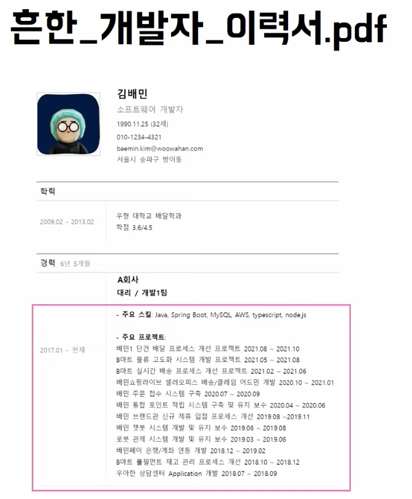
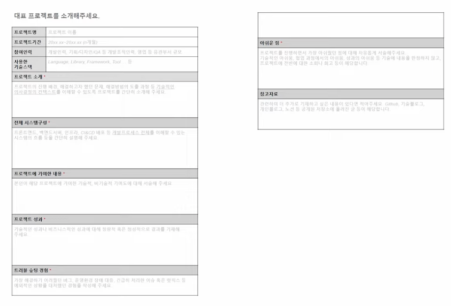
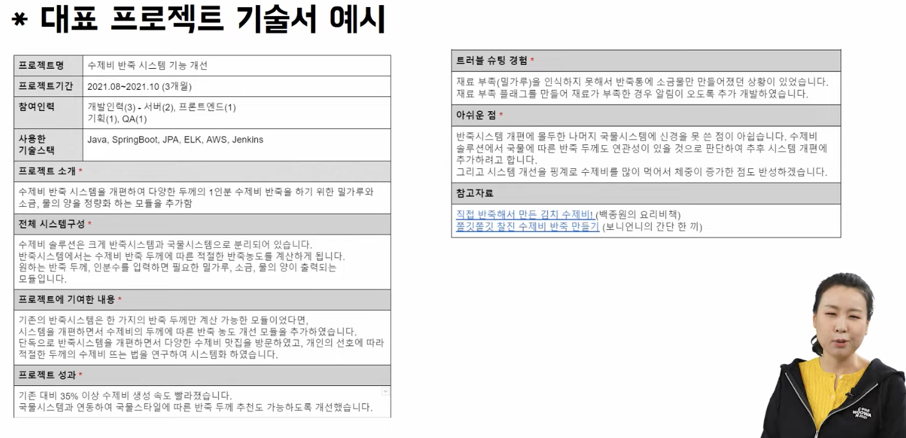
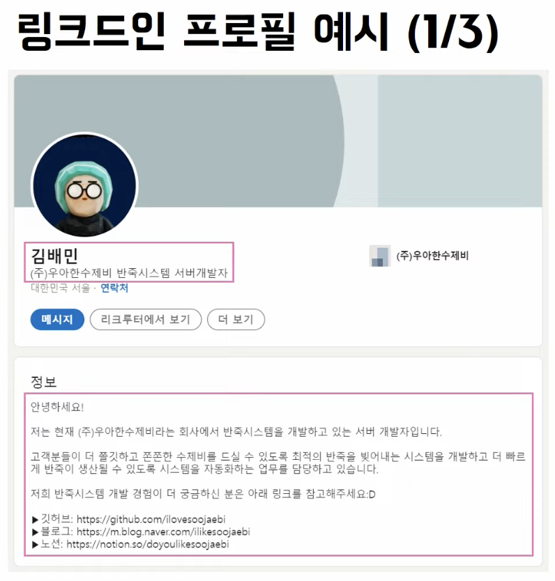
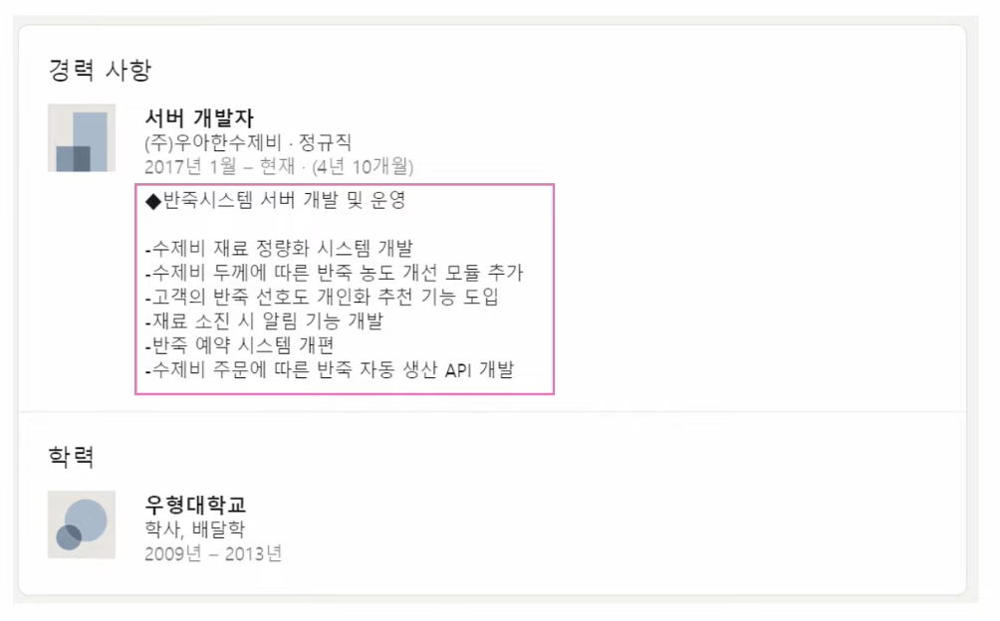
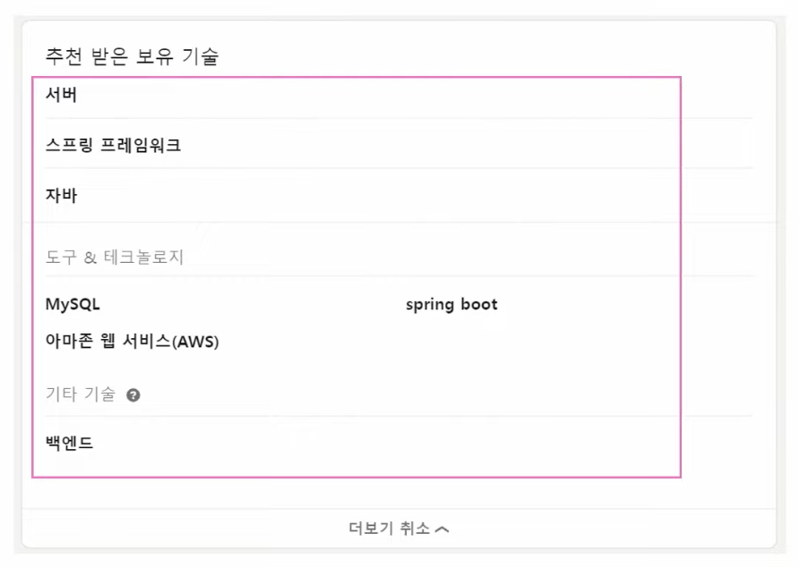
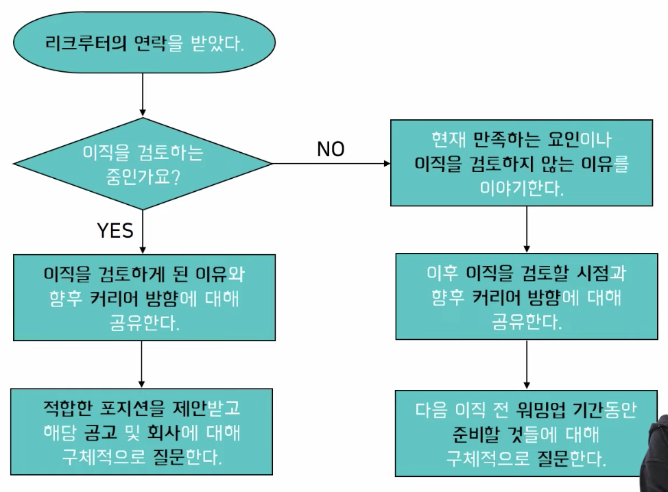

# 개발자 퍼스널 브랜딩

**참고 자료**
[개발자 퍼스널 브랜딩, 그런데 이제 리크루터 활용을 곁들인!](https://youtu.be/_yRmR5tsT3E?feature=shared)

## 이력서 잘 쓰는 법

### 커리어 정리의 시작, 이력서

- 이력서는 어떻게 써야 할까?
- 무슨 내용이 들어가야 할까?
- 양식이 있을까?

### 예시 이력서

- 10명 중 5명이 위와 같은 형식으로 작성한다.
- 프로젝트에 대해 제목만 적어둔 것이 문제
  - 지원자 개인이 어떤 역량을 가지고 있는지 알 수 없음
  - 프로젝트에 대한 자세한 내용을 작성하는 것이 중요

### 개발자 이력서 필수 내용

- 프로젝트 정보
  - 프로젝트 이름, 기간, 프로젝트 진행 배경 등 소개
  - 길게 작성하지 않아도 됨
  - 프로젝트를 모르는 사람이 봐도 감을 잡을 수 있을 정도로만 작성하기
- 프로젝트 별 기술 스택
  - 프로젝트마다 사용한 기술 스택을 구분하여 적기 
  - 구분하여 적어주는 것이 중요 -> 참고가 될 수 있음
- 본인이 기여한 부분
  - 본인이 그 프로젝트에서 어떤 업무를 담당했는지
  - 어떤 기여를 했는지
  - 내가 어떤 역할을 담당했는지 정의하는 것이 중요
  - ex) 수제비 반죽 시스템 개발 -> 수제비 반죽 시스템에서 반죽 농도를 계산하는 기능 개발
- 성과, 개선한 점
  - 프로젝트를 하면서 어떤 성과가 났는지 정량적으로 적기
  - 정량적으로 작성하기 힘들면 정성적으로라도 작성하기
- 모든 프로젝트에 대해 다 적어야 한다.
  - 어떤 프로젝트를 했는지 나열하기 보다는 내가 어떤 역량을 가지고 있는지 적는 것이 중요

## 개발자 이력서 더 잘 쓰고 싶다면...

### 이력서 외적으로 어필하기

- 이력서만으로 본인 어필하기 힘든 경우가 있을 수 있음
  - 본인 업무에 신 기술을 적용하지 못하는 경우
- 업무 외적으로 개인적으로 공부하고 있는 내용이나 프로젝트를 보여주기
- 개인 기술블로그, github를 공유하기
  - 비공개 상태로 공유하지 않았는지 반드시 확인하기
  - 공개하기 부끄러운 정도라면, 충분히 잘 쌓인 다음에 공유하기

### 대표 프로젝트 기술서

- 나를 가장 잘 보여줄 수 있는 프로젝트를 선정하여 기술하는 기술서
  - 가장 긴 기간동안 수행한 프로젝트
  - 가장 많은 사람이 참여한 대규모 프로젝트
  - 소규모 프로젝트지만 나를 가장 많이 성장시킨 프로젝트
- 프로젝트 정보
- 프로젝트 소개
- 본인이 기여한 내용과 성과
  - 가장 중요한 부분
  - 본인이 자랑하고 싶은 내용을 많이 담기

## 링크드인으로 가자!

### 링크드인 프로필 작성하기

- 잘 쓴 이력서를 링크드인에 게시하기
- 직무명, 재직사 별 업무내용, 보유기술

## 리크루터 활용하기

- 링크드인을 통해 리크루터의 요청이 올 수 있음
- 질문하면 좋을 것들
  - 회사 위치, 조직 상황, 채용 배경, 업무 내용, 보상수준, 근로환경, 복지
  - 공고로는 확인할 수 없는 것들을 물어보기
- 리크루터와 함께 이력서를 만들기
- 면접 단계
  - 면접 전 준비할 사항 (회사의 핵심가치, 비전, 채용 배경)
  - 주의해야 될 부분이 있는지 확인
  - 면접 정보/팁 얻기 (면접관 수, 면접 유형)
