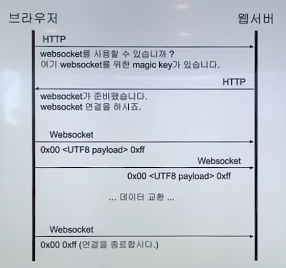
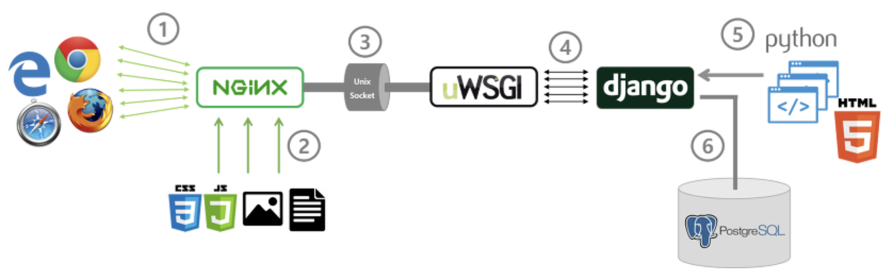
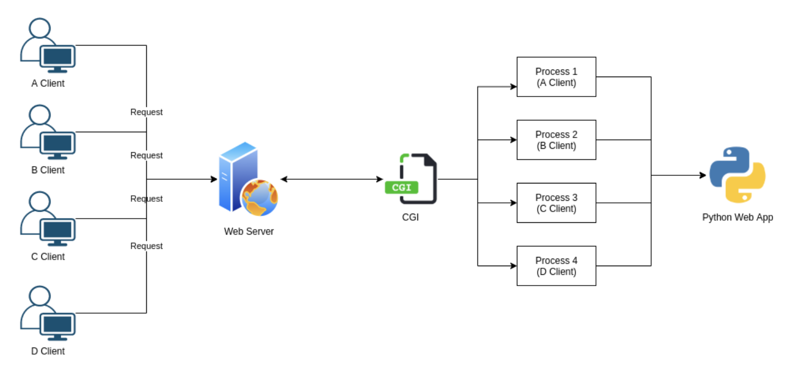
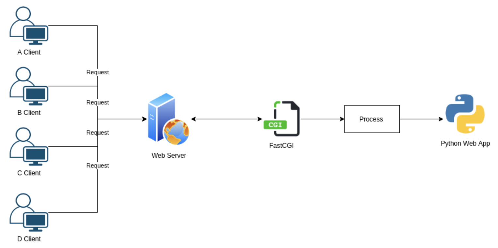
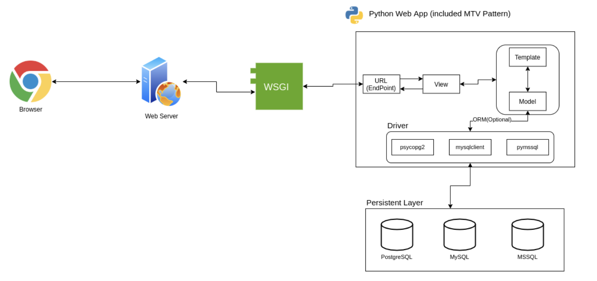
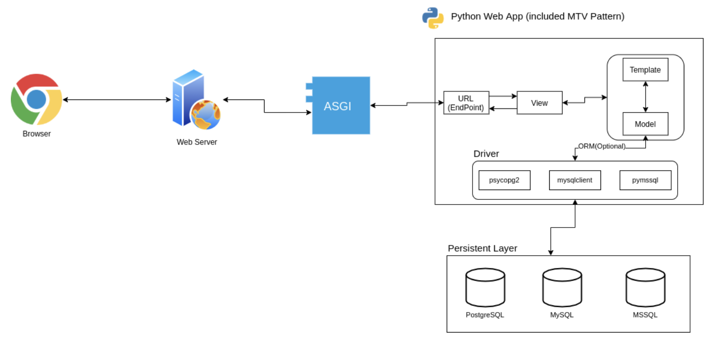

# 웹 소켓

자료: [[10분 테코톡] 🧲코일의 Web Socket](https://youtu.be/MPQHvwPxDUw?feature=shared)

## 웹 소켓의 특징

- 양방향 통신 (Full-Duplex)
  - 데이터 송수신을 동시에 처리할 수 있는 통신 방법
  - 클라이언트와 서버가 서로에게 원할 때 데이터를 주고 받을 수 있다.
  - 통상적인 Http 통신은 Client가 요청을 보내는 경우에만 Server가 응답하는 단방향 통신

- 실시간 네트워킹 (Real Time-Networking)
  - 웹 환경에서 연속된 데이터를 빠르게 노출
  - Ex) 채팅, 주식, 비디오 데이터
  - 여러 단말기에 빠르게 데이터를 교환

## 웹 소켓 이전의 비슷한 기술

- Http Polling
  - 서버에게 일정 주기로 요청 송신
  - 실시간성이 떨어짐
- Http Streming
  - 서버에 요청을 보낸 뒤 끊기지 않은 연결 상태에서 끊임없이 데이터 수신
  - 클라이언트가 서버로 보내는 데이터 송신이 어렵다.
- 모든 방법이 HTTP를 통해 통신함
  - Request, Response 둘 다 Header가 불필요하게 크다는 단점이 있음

## 웹 소켓의 동작 방법

- http, https를 통해 hand-shaking이 필요함
  - GET 메서드를 사용해 요청
  - Upgrde 필드: 현재 클라이언트, 서버, 전송 프로토콜 연결에서 다른 프로토콜로 업그레이드 또는 변경을 하기 위해 사용됨
  - Connection 필드도 upgrade로 지정
  - Sec-WebSocket-Key 필드: 연결 수립을 위한 키
- 101 Switching Protocols로 응답
  - 웹 소켓으로 업그레이드 됐다는 것
  - Sec-WebSocket-Accept 필드: 클라이언트로부터 받은 Sec-WebSocket-Key 필드를 사용하여 계산된 값.
    - 이 계산 결과가 클라이언트가 예상하는 바와 다르면 연결 수립이 실패함
    - 신원 인증에 필요
- ws(80), wss(443) 프로토콜로 바뀜
  - Message라는 단위로 바뀜
    - 여러 frame이 모여서 구성하는 하나의 논리적 메시지 단위
  - frame: communication에서 가장 작은 데이터, 작은 헤더 + payload로 구성됨
  - 웹 소켓 통신에 사용되는 데이터는 UTF8 인코딩
  - Ex) 0x00 (보내고 싶은 데이터) 0xff
- Close frame을 주고 받으며 연결 종료

## 웹 소켓 프로토콜 특징

- 최초 접속에서만 http 프로토콜 위에서 handshaking을 하기 때문에 http header를 사용한다.
- 웹 소켓을 위한 별도의 포트는 없으며, http의 기존 포트 (80, 443)을 사용한다.
- 프레임으로 구성된 메시지라는 논리적 단위로 송수신
- 메시지에 포함될 수 있는 교환 가능한 메시지는 텍스트와 바이너리

## 웹 소켓 한계

- 웹 소켓은 HTML5에 구현된 기술
- Socket.io, SockJS: HTML5  이전의 기술로 구현된 서비스에서 웹 소켓처럼 사용할 수 있도록 도와주는 기술
  - Javascript를 이용하여 브라우저 종류에 상관 없이 실시간 웹을 구현
- 브라우저와 웹 서버의 종류와 버전을 파악하여 가장 적합한 기술을 사용하는 방식

- 웹 소켓은 문자열들을 주고 받을 수 있을 뿐, 그 이상의 일은 하지 않는다.
- 주고 받은 문자열의 해독은 온전히 애플리케이션에 맡기게 됨
- HTTP는 형식을 정해두었기 때문에 모두가 약속을 따르기만 하면 해석할 수 있다.
  - 하지만 웹 소켓은 형식이 정해져 있지 않기에 애플리케이션에서 쉽게 해석하기 어렵다.
  - 그렇기 때문에 sub-protocol을 사용하여 주고 받는 메시지의 형태를 미리 약속하는 경우가 많다.

# Django WSGI vs ASGI

자료: [Django WSGI, ASGI, 배포 - python cgi, wsgi, asgi](https://velog.io/@qlgks1/Django-WSGI-ASGI-%EB%B0%B0%ED%8F%AC-python)

## 들어가기

- Django에만 국한되는 것이 아니라, python에서 백엔드를 구성할 때 애플리케이션을 연결하는 방법
  - 스프링에서는 완성된 웹 서비스를 Tomcat 등의 WAS로 배포를 한다.
  - python에서는 WAS를 제공하지 않고 run-time 환경에서 돌아간다.
  - 어떻게 웹 서버와 python 애플리케이션을 연결할 수 있을까?

### python은 WAS를 제공하지 않고 run-time 환경에서 돌아간다?

- python 자체가 WAS(Web application Server) 기능을 내장하고 있지 않다는 뜻
  - python은 기본적으로 스크립트나 애플리케이션을 실행하는 런타임 환경을 제공함
  - 웹 애플리케이션을 개발할 때는 웹 서버 기능을 해줄 프레임워크나 라이브러리를 사용해야 함

- Flask나 Django 같은 웹 프레임워크를 사용하여 웹 애플리케이션을 개발함
  - 웹 프레임워크에서 사용되는 내장 웹 서버는 개발 목적으로만 사용됨
  - 생산 환경에서는 WSGI(Web Server Gateway Interface)를 통해 Python 애플리케이션과 웹 서버를 연결함

- WSGI는 python 애플리케이션과 웹 서버 사이의 표준 인터페이스 (cgi와 비슷)
  - WSGI를 통해 Apache, Nginx와 같은 웹 서버와 python 애플리케이션을 연결할 수 있음
  - Gunicorn, uWSGI와 같은 WSGI 호환 서버를 사용하여 애플리케이션을 실행하고 웹 서버에 연결

- 결론: python 자체는 웹 서버 기능이 없기 때문에 WSGI 호환 서버를 사용하여 웹 서버와 Python 애플리케이션을 연결한다.
  - 웹 서버는 HTTP 요청을 해석해 WSGI에게 전달하고, Python 애플리케이션은 이를 받아 처리한다.

### 웹 서버를 사용하지 않는 환경에서는 WSGI가 필요 없을까?

- WSGI는 HTTP 요청과 응답을 Python 애플리케이션과 웹 서버 사이에서 중계하는 역할
  - 웹 서버를 사용하지 않는다 = HTTP 요청을 처리하지 않는다와 같은 의미
  - 따라서 WSGI도 필요하지 않게 됨

- 하지만 WSGI를 확장하여 웹 서버의 기능까지 하는 서버도 있음
  - Gunicorn, uWSGI는 HTTP 요청을 직접 받아 처리하고 응답할 수 있음
  - WSGI + HTTP 서버의 기능을 하도록 확장된 서버

### WSGI와 WAS의 차이

- WSGI: Web Server Gateway Interface
  - Python 웹 애플리케이션과 웹 서버 사이의 표준 인터페이스
  - 요청을 받고 응답을 반환하는 규약만을 제공함

- WAS: Web Appliction Server
  - 웹 서버 기능을 포함하면서도 데이터베이스 연결, 트랜잭션 관리 등 기능을 제공
  - 웹 애플리케이션을 실행하고 관리하는데 필요한 풀스택 환경을 제공

- 차이점
  - WSGI는 python 애플리케이션과 웹 서버 간의 인터페이스 규약에 초점을 맞춤
  - WAS는 애플리케이션을 실행하고, 관리하는 등 더 넓은 범위의 소프트웨어
  - WSGI는 규약이고 이를 구현하는 서버에 의존하게 됨
  - WAS는 실제 웹 애플리케이션의 실행과 관리를 담당하는 소프트웨어

## 1. Common Gateway Interface (CGI)

### CGI란

- 웹 서버에서 사용자 프로그램을 동작시키기 위한 규약
- 서버 프로그램에서 다른 프로그램을 불러내고, 그 처리 결과를 클라이언트에 송신하는 방법
  - 이 때 외부 프로그램과의 연계법을 정한 것이 CGI이다.
- CGI는 환경변수나 표준 입출력을 다룰 수 있는 프로그램 언어라면 이용하는 것이 가능함
  - 펄, 파이썬, 루비 등

### python에서 CGI

- 기본적으로 웹 서버 자체는 정적인 페이지 밖에 보여주지 못함
- 동적인 페이지는 웹 애플리케이션(장고, 플라스크 등으로 작성된 프로그램)의 도움으로 보게 됨
  - 이 때문에 웹 서버와 웹 애플리케이션은 서로 소통할 수 있어야 한다.
  - 여기서 소통하는 방법을 정해둔 규약이 CGI

- 하지만 CGI는 매 요청에 대해 프로세스를 생성(fork)하게 됨
  - 오버헤드가 심해져 성능 저하의 원인이 됨

### python FastCGI

- CGI의 단점을 보완하기 위해 등장한 것이 FastCGI
- 몇 번의 요청이 들어와도 하나의 프로세스만을 가지고 처리하게 됨
  - CGI에 비해 오버헤드가 훨씬 많이 감소함
- Java의 Tomcat도 Web Server + FastCGI를 채택한 형태
  - Tomcat은 WAS이다.
- Python에서는 이러한 WAS가 별도로 존재하지 않는다.
  - CGI, FastCGI 등을 이용해 원하는 WAS 형태를 만들어 사용해야 한다.
  - 이렇게 등장한 것이 python만의 게이트웨이 인터페이스

## 2. Python WSGI, ASGI

### WSGI

- Web Server Gateway Interface
- CGI와 동일하게 웹 서버와 애플리케이션 중간에 위치한다.
- WSGI는 웹 애플리케이션을 호출할 때 요청(request) 헤더 정보를 환경 변수로 전달함
  - 이때 콜백 함수도 함께 전달하며, 웹 애플리케이션이 요청을 처리한 뒤 콜백 함수로 응답함
- 웹 서버가 애플리케이션의 코드를 직접 읽을 수 없으므로, 미들웨어가 코드를 읽어서 반환하는 형식이라고 이해하기

### Django의 WSGI

- 장고의 내장 서버는 WSGI의 기능을 자체적으로 포함하고 있음
  - `python manage.py runserver`
- WSGI 서버는 `프로젝트명/config/wsgi.py` 경로에 있는 파일을 통해 장고 애플리케이션을 호출함

### ASGI

- Asynchronous Server Gataway Interface
- 파이썬에서는 비동기 처리를 지원함
  - 하지만 WSGI는 동기 함수 처리만을 지원하여 여러 작업을 동시에 처리하는 것에 한계가 있음
  - Django 3.0부터 ASGI 인터페이스를 적용하여 비동기 처리를 지원하게 됨

- WSGI와 운영 아키텍처는 비슷하지만 ASGI는 요청을 기본적으로 비동기로 처리함
  - WSGI에서는 지원하지 않던 WebSocket 프로토콜과 HTTP 2.0을 지원함
- ASGI는 C++로 작성되어 매우 빠른 속도를 제공함
  - libuv를 사용하여 비동기 처리를 하므로 Node.js와 같은 비동기 처리 속도를 누릴 수 있음

### Django의 ASGI

- asgi.py 파일에서 수정
