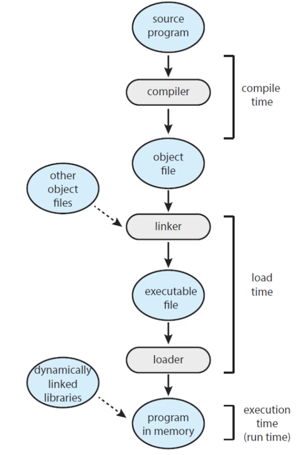
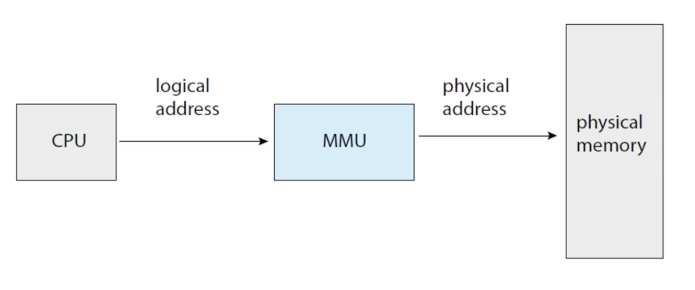
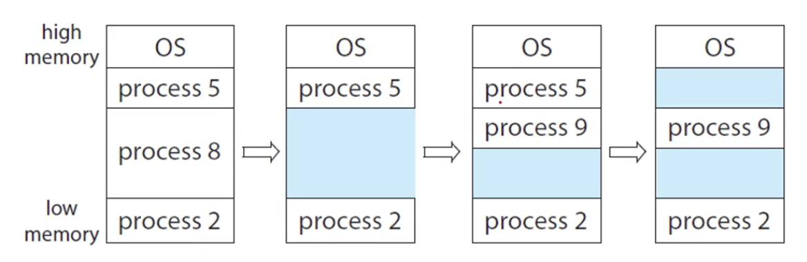
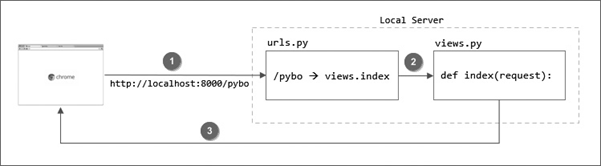

# 운영체제 스터디
# 주메모리의 관리

## Background

### 프로세스와 메모리

- process: 실행중인 프로그램
  - 즉, 메인 메모리에 로드된 상태

- memory: 큰 byte 배열
  - 각 메모리는 주소를 가지고 있음
  - CPU는 명령어를 가져오기 위해 pc에 있는 주소를 사용한다.

### Memory space

- 메모리 주소 공간

- base register, limit register
  - 두개의 레지스터를 가지고 합법적인 주소 접근을 허가해줘야 한다.
  - base register와 limit register 사이에 위치해있는지 확인한다.
  - 이를 벗어나면 segmentation fault가 뜸

- base register 보다 작거나 base + limit 보다 큰 메모리에 접근하는 경우 쫓아냄

### Address Binding

- 프로그램의 변수가 사용하는 주소는 컴파일러가 알아서 지정해준다.
  - 우리는 변수가 메모리의 몇 번지에 위치하는지 알 수 없다.

- 프로그램은 디스크에 있을 때는 바이너리 파일에 불과하다.
  - 메모리에 올라가고 나서야 프로그램으로써 동작할 수 있다.

- 프로그램의 00000000 위치는 전부 다르다.
  - 컴파일러가 매번 다르게 바인드 해줌

- linker와 loader가 바인드 해줌



### Logical vs Physical Address Space

- logical address: CPU가 사용하고 있는 주소
  - physical address와는 관계가 없다

- logical address space: 논리 주소의 모임
- physical address space: 물리 주소의 모임

### MMU (Memory Management Unit)



- logical address를 MMU를 거치면 physical address로 바꿔줌
  - 주소 변환기 느낌
- 하드웨어 장치
- relocation register: MMU의 base register 역할

### Dynamic Loading

- 프로그램을 실행할 때 파일 전체를 전부 로딩해야 할까?
- dynamic loading: 메모리 주소 공간에 전부 로딩하지 않고 필요할 때마다 로딩

### Dynamic Linking

- DLLs: Dynamicically Linked Libraries
  - 프로그램이 실행되는 도중에 linking 되는 것

- static linking
  - loader가 바이너리 프로그램 코드를 linking 하는 것
- dynamic linking
  - linking을 실행 시간까지 연기하는 것
  - 실행 시간에 linking을 진행함

- shared library: DLL을 사용하는 라이브러리
  - 윈도우는 .dll, 리눅스는 .so 파일

## Contiguous Memory Allocation

### Contiguous Memory Allocation

- 연속 메모리 할당
- 프로세스에게 메모리 할당해주는 방식
- 가장 간단한 방식: 유저 프로세스를 통째로 로딩하는 것
  - 그러나 메모리에 여러개의 프로세스가 할당되어 있어야 함

- 어떤 세션에 통째로 올리기 때문에 연속적임
  - 통째로 올리기 때문에 쉬움

### Memory Allocation



- Variable-Partitation
  - 어떤 프로세스를 어떻게 할당할 것인가의 문제

- hole: 사용 가능한 메모리가 중간 중간에 위치해 있는 상태

### Dynamic Storage Allocation

- size가 n인 메모리를 free holes에 어떻게 할당시킬 것인가?

- First-Fit: 일단 넣을 수 있는 공간에 넣는 것
- Best-Fit: 들어갈 수 있는 가장 작은 공간에 넣는 것
- Worst-Fit: 들어갈 수 있는 가장 큰 공간에 넣는 것

### Fragmentation

- 단편화 문제
- hole이 작고 많이 배치되어 있는 경우 -> 큰 메모리가 필요한 경우 할당해 줄 수 없음

- external fragmentation(외부 단편화)
  - 조그마한 구멍이 많이 남게 됨
  - Contiguous Memory Allocation에서 발생

- internal fragmentation(내부 단편화)
  - 메모리를 똑같은 크기로 미리 쪼개두자
  - 쪼개둔 메모리 안에서 메모리가 남는 것
  - paging에서 발생

### Segmentation

- Contiguous Memory Allocation: 통째로 메모리를 옮기자
- Paging: 똑같은 크기로 쪼개서 메모리를 옮기자
- 둘의 중간에 위치한 방법이 Segmentation
  - 메모리를 타입별로 크기를 다르게 쪼개서 사용

# 점프 투 파이선

## 05-3 패키지

- 패키지(packages): 관련있는 모듈의 집합
- 패키지는 파이썬 모듈을 계층적(디렉터리 구조)으로 관리할 수 있게 해 준다.

- 파이썬 패키지는 디렉터리와 파이썬 모듈로 이뤄진다.

```text
game/
    __init__.py
    sound/
        __init__.py
        echo.py
        wav.py
    graphic/
        __init__.py
        screen.py
        render.py
    play/
        __init__.py
        run.py
        test.py
```

- 패키지 구조로 모듈을 만들면 다른 모듈과 이름이 겹치더라도 더 안전하게 사용할 수 있다.

### __init__.py의 용도

- `__init__.py` 파일은 해당 디렉터리가 패키지의 일부임을 알려주는 역할을 한다.
  - 이 파일이 없다면 패키지로 인식되지 않는다.
- 패키지 관련 설정이나 초기화 코드를 포함할 수 있다.

### 패키지 변수 및 함수 정의

- 패키지 수준에서 변수와 함수를 정의할 수 있다.
- `패키지명.변수` 같은 식으로 사용이 가능하다.

### 패키지 내 모듈을 미리 import

- `__init__.py` 파일에 패키지 내의 다른 모듈을 미리 import하여 패키지를 사용하는 코드에서 간편하게 접근할 수 있게 한다.
- `from .패키지명 import 함수명` 에서 .은 현재 디렉터리를 의미

### 패키지 초기화

- `__init__.py` 파일에 패키지를 처음 불러올 때 실행되어야 하는 코드를 작성할 수 있다.
- 데이터베이스 연결, 설정 파일 로드와 같은 작업을 수행할 수 있다.
- 초기화 코드는 한 번 실행된 후에는 다시 import를 수행하더라도 실행되지 않는다.
  - 프로그램 실행 중 처음으로 임포트될 때만 실행된다.

### __all__

- 특정 디렉토리의 모듈을 *을 이용하여 import 할 때는 `__all__` 변수를 설정해야 한다.
- import 할 수 있는 모듈 정의

```python
__all__ = ['echo']
```

- 다만 from에 해당하는 부분이 모듈인 경우 import *을 사용하면 __all__과 상관없이 import 된다.
- 오직 from의 마지막 항목이 디렉터리인 경우 __all__에 정의된 모듈만 import 된다.


## 05-4 예외 처리

### try-except 문

- 오류가 발생한 경우 except문 안에 코드가 수행됨

### try-finally 문

- try문 수행 도중 예외 발생 여부와 상관없이 항상 수행됨
- 보통 사용한 리소스를 close 할 때 많이 사용됨

### try-else 문

```python
try:
    ...
except [발생오류 [as 오류변수]]:
    ...
else:  # 오류가 없을 경우에만 수행
    ...

```

- try 문 수행 중 오류가 발생하면 except 절, 오류가 발생하지 않으면 else 절이 수행된다.

### 오류 일부러 발생시키기

- raise 문을 사용해 오류를 발생시킨다.
  - ex) raise NotImplementedError

### 예외 만들기

- 파이썬 내장 클래스 Exception 클래스를 상속받아 만들 수 있다.
- __str__ 메서드를 구현해 오류 메시지를 정의할 수 있다.

# 점프 투 장고

## 2-01 URL과 뷰



### urls.py

```python
from django.contrib import admin
from django.urls import path

from pybo import views

urlpatterns = [
    path('admin/', admin.site.urls),
    path('pybo/', views.index),
]
```

- 장고의 urls.py 파일은 페이지 요청이 발생하면 가장 먼저 호출되는 파일이다.
  - URL과 뷰 함수 간의 매핑을 정의한다.
  - 뷰 함수는 views.py 파일에 정의된 함수를 말한다.

- URL 매핑시 항상 끝에 슬래시를 붙이자.
  - 장고가 URL을 정규화하기 때문

### views.py

```python
from django.http import HttpResponse

def index(request):
    return HttpResponse("안녕하세요 pybo에 오신 것을 환영합니다.")
```

- urls.py에서 매핑된 함수가 호출된다.

### URL 분리

- urls.py에 앱에 관련된 새로운 URL을 추가할 때마다 수정하는 경우가 발생한다.
- urls.py는 앱이 아닌 프로젝트 성격의 파일이므로 프로젝트 성격의 URL 매핑만 추가되어야 한다.

```python
from django.contrib import admin
from django.urls import path, include

urlpatterns = [
    path('admin/', admin.site.urls),
    path('pybo/', include('pybo.urls')),
]
```

- pybo/ -> pybo/urls.py 파일의 매핑 정보를 읽어서 처리하라는 의미
  - 매핑 책임을 넘기는 것

- `path('', views.index)`: 넘어온 url을 그대로 사용
