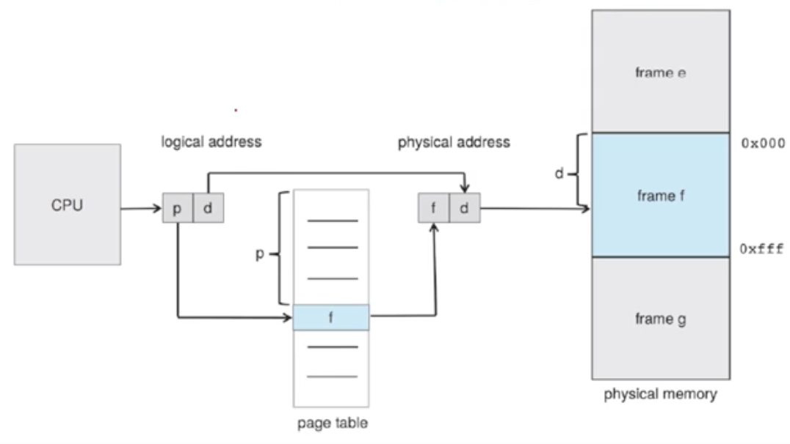

# 운영체제 스터디
# 페이징과 스와핑

## Paging

- 메모리를 할당해주는 가장 편한 방법은 한번에 할당하는 것
  - 하지만 덩치가 클수록 문제가 많이 발생한다.

- 페이징은 메모리를 연속적이지 않게 쪼개서 관리하는 것
  - external fragmentation이 거의 발생하지 않음

### 가장 기본적인 페이징

- 고정된 크기의 physical 메모리를 쪼갠다. -> frames
- logical 메모리를 같은 크기로 쪼갠다. -> pages

- logical 메모리를 같은 위치의 physical 메모리에 매핑시킬 필요가 없어짐
  - 실제 물리적인 주소와의 매핑은 운영체제가 알아서 함

- 실제 물리적인 메모리 주소 대신 page number(p), page offset (d)를 이용해 표현이 가능해짐

### page number



- CPU가 logical 주소를 만들면 physical 주소로 변환됨
- 페이지 번호에 해당하는 페이지 프레임의 오프셋을 가지고 주소를 찾을 수 있다.

- 프레임 크기를 정하는 것도 중요함
  - 하드웨어에 따라 정의됨
  - 반드시 2의 배수로 해야됨

### Hardware Support

- page table도 context switch의 대상이 된다.
- 메모리를 많이 사용하는 프로세스는 page table의 크기도 매우 크다.
  - 관리하기 어려움

### PTBR (page-table base register)

- page table을 가리키는 레지스터
- context switch가 빨라짐
- memory 접근을 두번 해야하기 때문에 접근 속도가 느려짐
  - 페이지 테이블 목록 -> 실제 메모리

### Translation Look-aside Buffer (TLB)

- page table로 찾는 것이 비용이 많이 들기 때문에 캐시를 둔다.
- 아주 작고 빠른 하드웨어 캐시 메모리를 사용
- 히트가 되면 바로 접근하여 빠른 속도를 제공
  - TLB hit: TLB에 페이지 번호가 있는 경우
  - TLB miss: TLB에 페이지 번호가 없는 경우

### Memory Protection with Paging

- 각 프레임 별로 valid-invalid bit를 두어 확인
  - bit가 valid로 세팅되어 있으면 legal하다고 판단
  - bit가 invalid로 세팅되어 있으면 illegal하다고 판단

### Shared Pages

- 페이징을 통해 공통의 코드를 공유하기 좋다.
- libc의 예시
  - 모든 프로세스가 각자 libc를 가지고 있다면 매우 비효율적일 것이다.
  - reentrant code로 설정함 -> 실행 중에 변경될 일이 없는 코드

- 물리적인 주소에는 딱 하나만 할당되어 있음
  - 논리적 주소만 복사함
  - 읽기 작업만 하기 때문에 동시성 문제가 발생하지 않음

## Page Table 구조

- Hierarchical Paging
  - page table의 page table을 만들음
- Hashed Page Tables
  - 해시 함수를 통해 hash table을 사용해 탐색
  - 가상 page 번호를 관리
- Inverted Page Tables
  - pid와 페이지 번호를 함께 저장
  - 페이저 번호 자체가 너무 클 때 사용

## Swapping

- physical 메모리보다 큰 메모리가 필요한 프로그램도 실행시킬 수 있다.
  - 프로그램 전체가 다 로딩될 필요가 없기 때문
- 멀티 프로그래밍 할 수 있는 프로세스 수가 늘어남
- 메모리에 access할 때만 들어와라

### Standard Swapping

- 프로세스 전체를 swap out 시키고 swap in 시키는 것

### Swapping with Paging

- page 단위로 swap out, swap in을 하는 것
- 오늘날 swapping을 paging이라고 부름
  - page in, page out이라고 부름
- 가상 메모리에서 큰 위력을 발휘함

---

# 점프 투 장고
# 2-02 모델

- 장고는 model을 이용하여 데이터베이스를 처리한다.
- 보통 데이터베이스에 데이터를 저장하고 조회하기 위해서 SQL 쿼리를 이용한다.
  - 장고의 모델을 사용하면 SQL 쿼리 없이 데이터를 쉽게 처리할 수 있다.

## 장고 앱 migrate

- 데이터베이스가 필요한 앱들은 migrate가 필요하다.

```python
DATABASES = {
    'default': {
        'ENGINE': 'django.db.backends.sqlite3',
        'NAME': BASE_DIR / 'db.sqlite3',
    }
}
```

- 데이터베이스 엔진과 데이터베이스 파일 위치를 정의해둔 부분
  - BASE_DIR은 프로젝트 디렉터리를 의미

- `python manage.py migrate` 명령어를 사용하면 해당 앱들이 사용하는 테이블들이 생성됨

### SQLite

- 개발용이나 소규모 프로젝트에서 사용되는 가벼운 파일 기반 데이터베이스
- 개발시에는 SQLite를 사용하여 빠르게 개발하고 실제 운영은 DB로 사용하는 것이 일반적

### ORM(Object Relational Mapping)

- 데이터베이스를 사용하는 프로그램들은 쿼리문을 사용해야함
  - 잘못된 쿼리는 시스템의 성능을 저하 시킬 수 있는 문제가 있음

- ORM을 사용하면 데이터베이스의 테이블을 모델화하여 사용함
  - 개발자별로 일관된 쿼리문이 만들어지고 쿼리를 잘못 작성할 가능성도 낮아짐
  - 데이터베이스의 종류가 변경되더라도 프로그램을 수정할 필요가 없어짐

## 모델 작성하기

### models.py

- CharField: 글자수 길이 제한
- TextField: 글자수 제한이 필요없는 텍스트
- DateTimeField: 날짜와 시간에 관계된 속성
- ForeignKey: 다른 모델과 연결
  - `ondelete=models.CASCADE`: 연결된 질문이 삭제될 경우 함께 삭제됨

### 테이블 생성하기

```python
(... 생략 ...)
INSTALLED_APPS = [
    'pybo.apps.PyboConfig',
    'django.contrib.admin',
    'django.contrib.auth',
    (... 생략 ...)
]
(... 생략 ...)
```

- 새로 만드는 앱을 settings.py의 INSTALLED_APPS에 추가해줘야 한다.
  - pybo/apps.py 파일에 있는 클래스명을 추가해주면 됨

### makemigrations

- 모델이 신규로 생성되거나 변경되면 `makemigrations` 명령을 먼저 수행해야 한다.
  - 명령을 수행해도 실제 테이블이 생성되진 않는다.
  - 테이블 작업을 수행하기 위한 작업 파일을 생성하는 명령어이기 때문

### sqlmigrate

- `python manage.py sqlmigrate pybo 0001`
  - 실제 어떤 쿼리문이 실행되는지 미리 확인해볼 수 있음

## 모델 사용하기

```python
class Question(models.Model):
    subject = models.CharField(max_length=200)
    content = models.TextField()
    create_date = models.DateTimeField()

    def __str__(self):
        return self.subject
```

- 장고 셸 실행: `python manage.py shell`

- 데이터 생성
  - `q = Question(subject='pybo가 무엇인가요?', content='pybo에 대해서 알고 싶습니다.', create_date=timezone.now())`
- 데이터 저장: `q.save()`
- id 확인: `q.id`
- 데이터 조회: `Question.objects.all()`
- 조건 조회: `Question.objects.filter(id=1)`
  - 문자열 포함 데이터 조회: `Question.objects.filter(subject__contains='장고')`
- 역방향 접근: `연결모델명_set`

# 2-03 장고 관리자

- 관리자 계정 생성: `python manage.py createsuperuser`

## 모델 관리

- docs: https://docs.djangoproject.com/ko/5.0/ref/contrib/admin/

- 모델을 관리자에게 등록

```python
from django.contrib import admin
from .models import Question

admin.site.register(Question)
```

- 등록한 모델은 /admin 페이지에서 데이터 추가가 가능함

- 모델 검색 기능 추가

```python
class QuestionAdmin(admin.ModelAdmin):
    search_fields = ['subject']

admin.site.register(Question, QuestionAdmin)
```

# 트센 웹소켓
# 1. channels만으로 ASGI 서버를 띄울 수는 없는 걸까?

[django channels& websocket](https://velog.io/@tasha_han_1234/django-channels-기본)

[Django Channel Tutorial Part 1](https://hyun-am-coding.tistory.com/entry/Django-Channel-Tutorial-Part-1)

- channels에 대한 블로그를 보면 daphne 같은 asgi 서버 없이 서버를 띄우고 있음
- 난 안돼!

[Django Asgi not launching?help pls](https://www.reddit.com/r/django/comments/163a8pn/django_asgi_not_launchinghelp_pls/?rdt=46205)

- channels 4.0.0을 사용하는 외국인 아저씨도 같은 문제를 겪음
- 다들 daphne을 깔고 하란다.

[Installation — Channels 4.0.0 documentation](https://channels.readthedocs.io/en/latest/installation.html#installation)

- 공식 설치 가이드에도 daphne이 포함된 설치버전을 권장하고 있음

### 궁금증

- channels와 daphne의 차이는 뭘까
    - GPT가 Daphne는 Django Channels의 공식 ASGI 서버라고 한다.
- daphne 같은 ASGI 서버를 사용하지 않고 성공한 사람은 대체 뭐지?

# 2. ws 프로토콜 기본 구현

```python
import json
from channels.generic.websocket import WebsocketConsumer

class GameConsumer(WebsocketConsumer):
    def connect(self):
        self.accept()

        self.send(
            text_data=json.dumps(
                {"type": "connection_established", "message": "You are now connected!"}
            )
        )

    def receive(self, text_data=None, bytes_data=None):
        text_data_json = json.loads(text_data)
        message = text_data_json["message"]
        print("Message:", message)
```

- 간단한 메시지만 주고 받을 수 있음
    - json 포멧을 사용하여 통신

### todo

- 서로 다른 클라이언트는 어떻게 식별하는가?
- websocket 앱 외부에서 사용할 수 있는 인터페이스 제작
    - 어떤 인터페이스가 필요할까

## 2-1. 서로 다른 클라이언트 식별하기

### 클라이언트 그룹을 만들어 한 번에 메시지 전송하기

- **Channel Layer**를 사용하면 특정 그룹에 있는 클라이언트들에게 일괄적으로 메시지를 보낼 수 있다.
    - 한 매치는 두 개의 클라이언트가 같은 메시지를 받아야 한다. → 여기에 응용할 수 있을 듯
    - 같은 토너먼트에 속한 클라이언트들이 같은 메시지를 받는 경우도 있을까?
    - 그렇다면 하나의 클라이언트가 두 개의 그룹(매치, 토너먼트)에 속할 수도 있는가?

### 클라이언트 식별 정보 저장

- 내일 생각해보자..
