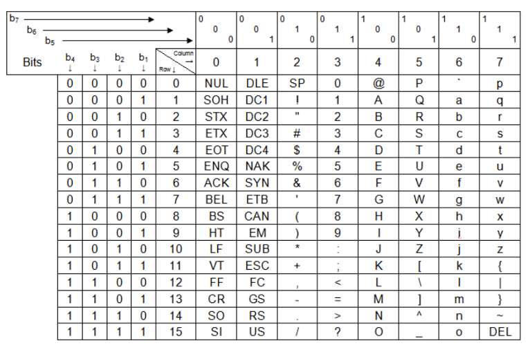

# 컴퓨터 구조

- 퀴즈, 과제: week 3, week 7

# Data representation

## 데이터란?

- Data: 정보, 사실
  - discrete fact
  - concept of value

- 값: 숫자, 날짜, 문장, 색깔, 이미지, 소리 등
  - 값은 추상적임
  - 같은 값임에도 표현할 수 있는 방법은 여러가지 (12, Twelve, XII, 1100)

## 컴퓨터는 데이터를 어떻게 표현할까?

- digital computer는 binary를 사용
  - true, false라는 두 가지 상태만을 가짐
  - 기존 voltage 이하인 경우 0, 이상인 경우 1로 판단

- 1000001이라는 sequence가 있을 때 컴퓨터는 어떻게 인식할까?
  - 해석 방식에 따라 다름
    - 10진수로 해석 -> 65
    - ASCII로 해석 -> 'A'
    - 이외에 표현하고 싶은 값

## 컴퓨터 메모리

- 데이터는 컴퓨터 메모리에 저장된 후 사용됨
- 메모리는 bit가 엄청 많이 모여있는 보드
- 컴퓨터가 저장하는 값
  - 주소, 위치
  - 값, 상태

## Bits, Nibbles, Bytes

- Bit: 가장 작은 단위 (1, 0)
- Nibble: 4bits
- Byte: 8bits, 2nibbles

- 현대 컴퓨터에서는 Byte를 기본 단위로 사용함
  - bit와 nibble은 대부분에 경우 표현하기 너무 작음

## A Word of Memory

https://ko.wikipedia.org/wiki/%EC%9B%8C%EB%93%9C_(%EC%BB%B4%ED%93%A8%ED%8C%85)

- word: CPU가 내부적으로 사용하는 bit의 수
  - 한번에 사용하는 bit 수가 늘어날수록 속도가 빨라짐
- 최근에는 대부분 32나 64 bits를 사용

## Characters

- character: 쓸 수 있는 기호
  - 영어는 1개의 byte로 표현이 가능
  - 다른 언어는 2bytes 이상이 있어야 표현이 가능
- byte는 8bit의 순서 (0~255)
- 해당 문자를 어떻게 사용할지는 프로그래머의 몫

## ASCII 문자 코드



- ASCII: the American Standard Code for Information Interchange
- 비트 스트림이 주어졌을 때 8bit씩 해석
- 아스키코드: 컴퓨터가 문자를 저장하기 위해 사용하는 표
  - 해당 코드에 해당하는 문자를 출력하기 위한 비트 스트림을 반환
  - 화질이 좋다 -> 표현하는데 사용하는 픽셀 수가 많다 -> 용량이 많이 필요함

### 다른 문자 코드

- 아스키코드는 영어 외에 다른 언어를 표현하기는 어려움
- 다른 언어를 위해 EBCDIC, BAUDOT, BCD 등의 표현 방식이 있음

## Unicode

- 더 많은 언어를 표현하기 위해 정의된 코드들
  - 한글도 유니코드에 정의되어 있음

# 코딩애플 HTML&CSS

## clear: both;

- float로 뜬 div 박스 뒤에 붙이고 싶을 때 사용
- float	뒤에 임시 div 박스를 하나 만들고 거기에 속성으로 주기
  - margin이 제대로 안 먹히는 문제가 있기 때문

## nav

- div 대신 사용하는 태그 -> 의미를 주기 위함, div와 역할 동일
- 시맨틱 태그
- section, footer도 마찬가지

## CSS selector

```css
.navbar li {

}
```
- navbar 클래스 안에 있는 모든 li

```css
.navbar > li {

}
```

- navbar 클래스 안에 있는 첫번째 자식 li

## background-image

- 배경화면으로 이미지를 넣고 싶을 때 사용
- url 안에 이미지 경로를 넣으면 됨

### background-size

- cover: 배경이 잘려도 좋으니 크기를 전부 채우도록 하기
- contain: 배경이 잘리지 않고 이미지가 제대로 보이게 하기

## margin collapse 현상

- 두 박스의 테두리가 겹치는 경우 margin도 합쳐지는 현상
  - 위쪽 아래쪽 상관 없이 발생
- 안쪽 박스에 margin을 주어도 바깥쪽 박스에 margin을 둔 것 같이 보임
- 테두리를 안 붙게하면 사라짐
  - ex) padding: 1px;