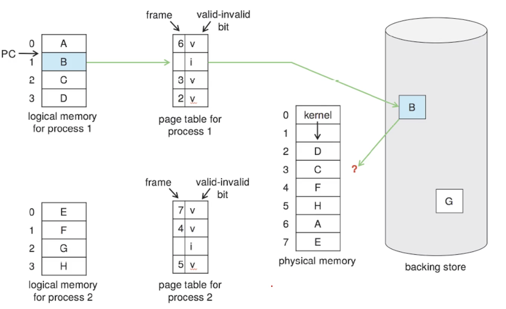

# 오브젝트 책 읽기 스터디
# 3장 - 역할, 책임, 협력

## 0. 서론

### 2장에서 살펴본 내용

- 클래스, 추상 클래스, 인터페이스를 조합해서 객체지향 프로그램을 구조화하는 방법
- 상속을 이용해 다형성을 구현하는 기법
- 다형성은 지연 바인딩이라는 매커니즘을 통해 구현됨
- 상속은 코드를 재사용할 수 있는 가장 널리 알려진 방법이지만 캡슐화 측면에서는 합성이 더 좋은 방법
- 유연한 객체지향 프로그램을 위해서는 컴파일 시간 의존성과 실행 시간 의존성이 달라야 함

- 객체지향 패러다임의 핵심은 **역할(role)**, **책임(responsibility)**, **협력(collaboration)**
- 협력을 위해 어떤 역할과 책임이 필요한지 고민하지 않은 채 구현에 초점을 맞추는 것은 변경하기 어려운 코드를 만든다.
- 역할, 책임, 협력이 제자리를 찾지 못한다면 응집도와 중복 제거를 한다 해도 설계가 꼬일 수 있다.

## 1. 협력

- 협력: 객체들이 애플리케이션의 기능을 구현하기 위해 수행하는 상호작용
- 책임: 객체가 협력에 참여하기 위해 수행하는 로직
- 역할: 객체들이 협력 안에서 수행하는 책임들이 모여 구성된 것

### 협력

- 객체는 고립되지 않고 다른 객체와 협력하는 사회적인 존재
- 객체 사이의 협력은 하나의 객체가 다른 객체에게 도움을 요청할 때 시작됨
- **메시지 전송(message sending)** 객체 사이의 협력을 위해 사용할 수 있는 유일한 커뮤니케이션 수단
- 메시지를 수신한 객체는 **메서드**를 실행해 요청에 응답

- 객체의 자율성을 보장하기 위해서는 필요한 정보와 행동을 **캡슐화** 등을 이용해 같은 객체 안에 모아놓아야 한다.
  - 객체 자신이 알고 있는 정보를 가지고 직접 행동을 해야한다.
  - 자신이 할 수 없는 일은 다른 객체에게 위임한다.

### 협력이 설계를 위한 문맥을 결정한다.

- 객체: 상태와 행동을 함께 캡슐화하는 실행 단위
- 객체의 행동을 결정하는 것은 객체가 참여하고 있는 협력이다.
  - 협력이 바뀌면 객체가 제공해야 하는 행동 역시 바뀌어야 한다.
  - 협력은 객체가 필요한 이유와 객체가 수행하는 행동의 동기를 제공한다.

- 객체의 행동을 결정하는 것이 협력이라면 객체의 상태를 결정하는 것은 행동이다.
  - 객체의 상태는 그 객체가 행동을 수행하는데 필요한 정보가 무엇인지로 결정된다.

- 상태는 객체가 행동하는 데 필요한 정보에 의해 결정된다.
- 행동은 협력 안에서 객체가 처리할 메시지로 결정된다.
- 따라서 협력은 객체를 설계하는 데 필요한 일종의 **문맥(context)**을 제공한다.

## 2. 책임

### 책임이란 무엇인가

- 협력에 참여하기 위해 객체가 수행하는 행동을 **책임** 이라고 부른다.
  - 객체가 유지해야 하는 정보와 수행할 수 있는 행동에 대해 개략적으로 서술한 것

### 책임의 종류

- 무엇을 할 수 있는가(doing)
  - 객체를 생성하거나 계산을 수행하는 등의 스스로 하는 것
  - 다른 객체의 행동을 시작시키는 것
  - 다른 객체의 활동을 제어하고 조절하는 것
- 무엇을 알고 있는가(knowing)
  - 사적인 정보에 대해 아는 것
  - 관련된 객체에 관해 아는 것
  - 자신이 유도하거나 계산할 수 있는 것에 관해 아는 것

- 일반적으로 책임과 메시지의 크기는 다르다.
  - 책임은 객체가 수행할 수 있는 행동을 종합적이고 간략하게 서술한다.
  - 따라서 책임은 메시지보다 추상적이고 개념적으로도 더 크다.
  - 처음에는 단순한 책임이라고 생각했던 것이 여러 개의 메시지로 분리될 수 있다.
  - 하나의 객체가 수행할 수 있다고 생각한 책임이 여러 객체들이 협력해야만 하는 커다란 책임으로 자란다.

- 책임의 관점에서 아는 것과 하는 것은 밀접하게 연관되어 있다.
  - 객체는 자신이 맡은 책임을 수행하는 데 필요한 정보를 알고 있을 책임이 있다.
  - 객체는 자신이 할 수 없는 작업을 도와줄 객체를 알고 있을 책임이 있다.

- 적절한 책임을 적절한 객체에게 할당해야만 단순하고 유연한 설계가 가능하다.

### CRC 카드

- 후보(Candidate), 책임(Responsibility), 협력자(Collaborator)의 첫 글자를 따서 만들어짐
- 하나의 CRC 카드는 협력에 참여하는 하나의 후보를 표현한다.
  - 후보는 역할, 객체, 클래스 어떤 것이라도 될 수 있다.
- 선이 없는 면에는 후보의 목적을 기술한다.
  - 목적은 후보가 외부에 제공해야 하는 서비스를 하나의 문장으로 표현한다.
- 선이 있는 다른 면에는 후보 이름을 적는다.
  - 하단 좌측에는 목적을 세분화해서 무엇을 알고 무엇을 해야하는지에 대한 책임을 차례대로 적는다.
  - 하단 우측에는 책임을 수행하면서 함께 협력할 협력자들을 나열한다.
  - 협력자는 후보가 자신의 책임을 완수하기 위해 정보나 기능을 요청할 대상 후보를 의미한다.

### 책임 할당

- 책임을 수행하는데 필요한 정보를 가장 잘 알고 있는 전문가에게 책임을 할당하자
  - **Information Expert(정보 전문가)** 패턴
- 응집도와 결합도 관점에서 정보 전문가가 아닌 다른 객체에게 책임을 할당하는 경우도 있다.
  - 그러나 기본적인 전략은 책임을 수행할 정보 전문가를 찾는 것이다.

### 책임 주도 설계

- **책임 주도 설계(Responsibility-Driven Design, RDD)**
  - 책임을 찾고 책임을 수행할 적절한 객체를 찾아 책임을 할당하는 방식으로 협력을 설계
- 책임 주도 설계 방법의 과정
	1. 시스템이 사용자에게 제공해야 하는 기능인 시스템 책임을 파악한다.
	2. 시스템 책임을 더 작은 책임으로 분할한다.
	3. 분할된 책임을 수행할 수 있는 적절한 객체 또는 역할을 찾아 책임을 할당한다.
	4. 객체가 책임을 수행하는 도중 다른 객체의 도움이 필요할 경우 이를 책임질 적절한 객체 또는 역할을 찾는다.
	5. 해당 객체 또는 역할에게 책임을 할당함으로써 두 객체가 협력하게 한다.

### 메시지가 객체를 결정한다.

- 메시지가 객체를 선택해야 하는 이유
  - 객체가 **최소한의 인터페이스(minimal interface)** 를 가질 수 있게 된다.
  - 객체가 충분히 **추상적인 인터페이스(abstract interface)** 를 가질 수 있게 된다.

### 행동이 상태를 결정한다.

- 객체를 객체답게 만드는 것은 객체의 상태가 아니라 객체가 다른 객체에게 제공하는 행동이다.
  - 객체가 협력에 적합한지를 결정하는 것은 그 객체의 상태가 아니라 행동이다.

- 객체의 상태에 초점을 맞춘 설계를 하면 내부 구현이 퍼블릭 인터페이스에 노출된다.
  - 내부 구현이 변경되면 퍼블릭 인터페이스도 함께 변경된다.
  - 객체 내부 구현에 초점을 맞춘 설계 방법: **데이터-주도 설계(Data-Driven Design)**

- 상태는 단지 객체가 행동을 정상적으로 수행하기 위해 필요한 재료일 뿐이다.

- 협력이 객체의 행동을 결정하고 행동이 상태를 결정한다. 행동이 바로 객체의 책임이다.

## 3. 역할

### 역할과 협력

- 역할: 객체가 어떤 특정한 협력 안에서 수행하는 책임의 집합

- 협력을 모델링할 때는 특정한 객체가 아니라 역할에게 책임을 할당한다고 생각하자.
  - 객체를 한 번 더 추상화한 느낌

### 유연하고 재사용 가능한 협력

- 역할이 없어도 객체만으로 충분히 헙력을 설계할 수 있지 않을까? 역할은 왜 필요할까?
  - 역할을 통해 유연하고 재사용 가능한 협력을 얻을 수 있다.

- 한 메시지에 응답할 수 있는 대표자를 사용하면 두 협력을 하나로 통합할 수 있다.
  - 대표자는 협력 안에서 다른 종류의 객체를 교대로 바꿔 끼울 수 있는 일종의 슬롯이다.
  - 이 슬롯을 **역할** 이라고 부른다.

- 역할은 구체적인 객체를 포괄하는 **추상화** 이다.

- 역할을 구현하는 가장 일반적인 방법은 **추상 클래스** 와 **인터페이스** 를 사용하는 것이다.
  - 동일한 책임을 수행하는 다양한 종류의 클래스들을 협력에 참여시킬 수 있는 확장 포인트가 된다.

### 객체 대 역할

- 한 종류의 객체만 협력에 참여하는 상황에서 역할이라는 개념을 고려하는 것이 유용한가? 오히려 복잡성만 높일 수 있지 않은가?
	- 협력에 적합한 책임을 수행하는 대상이 한 종류면 간단하게 객체, 여러 종류라면 역할이라고 부르면 된다.

- 역할은 협력 안에서 각자의 위치를 가지는 객체들에 대한 별칭으로 볼 수 있다.
  - 역할에 적합한 객체가 선택되고, 객체는 클래스를 이용해 구현되고 생성된다.

- 역할과 객체를 직관적으로 분류하는 것은 어렵다.
  - 단순하게 객체로 시작하고 반복적으로 책임과 협력을 정제해가면서 필요한 순간에 역할을 분리하자.

- 다양한 객체들이 협력에 참여한다는 것이 확실하면 역할로 시작하자.
- 불확실하다면 구체적인 객체로 시작하자.

- 역할의 가장 큰 장점은 설계의 구성 요소를 추상화할 수 있다는 것

### 역할과 추상화

- 역할은 추상화를 제공한다.
  - 추상화를 사용하면 세부 사항에 상관 없이 상위 수준의 정책을 쉽고 간단하게 표현할 수 있다.
  - 추상화를 사용하면 설계를 유연하게 만들 수 있다.

### 배우와 배역

- 동일한 배역을 여러 명의 배우들이 연기할 수 있다.
- 배우들은 하나 이상의 연극에 참여해서 다양한 역할을 연기한다.

- 협력은 연극과 동일하고 코드는 극본과 동일하다.
  - 같은 코드 안에서 서로 다른 객체가 참여하는 것이 역할

- 역할은 객체의 페르소나다.
  - 객체 역시 여러 협력에 참여하면서 다양한 역할을 수행할 수 있다.
  - 협력마다 객체는 한 가지 역할을 담당하게 된다.

# 컴퓨터 구조 및 운영체제

## Mathematical Notation

- Numeral / Digit: 양을 표현하기 위한 하나의 문자
  - 스위치는 2가지를 표현할 수 있음 (0, 1)
  - 일반적인 수학은 10가지를 표현할 수 있음 (0 ~ 9)

- Number system
  - ex) 로마 시스템은 아라비아 시스템과 다름
    - MCMXIII = 1913

- Positional number system
  - 위치에 따라 다른 숫자를 표기하는 방법

## Number Systems

- 대부분의 나라는 10을 base로 한다. (10진법)
  - 10가지 문자만 알면 되기 때문에 편리함

## Bases

- 컴퓨터는 기본적으로 2진수를 사용함
  - 10진수의 경우 10의 제곱을 사용
  - 2진수는 2의 제곱을 사용한다.

### Binary Number System

- 컴퓨터 메모리(스위치 박스)는 2진수를 표현할 수 있다.
- 2개의 스위치가 있다면 4가지 숫자를 표현할 수 있다.

### Decimal to Binary Conversion

- 38.6875(10)를 2진수로 바꾸려면?
  - 38을 먼저하고 .6875는 나중에
- 정수부: 모든 숫자를 2로 나누고 나머지가 2진수 숫자
- 소수부: 2를 곱하고 정수 부분이 2진수 숫자

### Octal Number System

- 8진수는 0~7까지 표현할 수 있음
- 3자리의 2진수 모음으로 하나의 8진수를 표현할 수 있음

### Hexdecimal Number System

- 16진수는 각 자리를 하나의 nibble로 표현할 수 있다.
  - 4bits는 하나의 nibble이다.
- 4자리의 2진수를 모아 하나의 16진수로 표현할 수 있다.

## Negative Integer

- 컴퓨터에서 음의 정수를 어떻게 표현할 수 있을까?
  - 여러 가지 방법이 존재함

### Excess Notation

- 실제 수에서 excess notation만큼 더해 저장하는 방법
  - 저장된 수 = 실제 수 + excess notaion
  - 실제 수 = 저장된 수 - excess notation

- 0이 2진수에서 0으로 표현되지 않는다는 점이 단점
- Excess notation은 실수를 저장하는데 사용됨

### Sign Magnitude

- 하나의 부호 비트를 두어 양수와 음수를 표현하도록 함
  - 직관적임
- +0과 -0 모두가 존재함
- 표현할 수 있는 수가 하나 적음

### One's Complement

- 양수의 경우 아무것도 하지 않고, 음수의 경우 비트를 반전시킴
- 덧셈과 뺄셈이 간단함
- 하지만 0이 2가지 있고, 표현할 수 있는 수가 하나 적음

# 운영체제 스터디
# 가상 메모리와 디맨드 페이징: Chapter 10. Virtual Memory (Part 1)

## Virtual Memory

- 프로세스 전체를 메모리에 올리지 않아도 프로세스를 돌릴 수 있는 것
  - 메모리보다 큰 프로세스를 돌릴 수 있음
- 실제 메모리와 가상 메모리를 분리할 수 있는 주요 로직
  - 현대 컴퓨터에서 없어서는 안되는 기능

- 엄청 큰 가상 메모리를 두고 필요할 때마다 실제 메모리에 할당하는 것

### Virtual Address Space

- logical한 프로세스 메모리 구조
  - 0으로 시작함
- 가상의 연속적인 메모리에 프로그램을 작성한다고 생각하면 매우 편리해짐
- 파일과 메모리의 공유도 쉬워짐
  - 페이지를 공유함으로써 가능

## Demand Paging

- 실행 가능한 프로그램이 어떻게 동작할까?
- secondary storage(HDD, SSD)에서 memory로 옮김
  - physical 메모리로 전체 다 옮기는 방법 (잘 사용하지 않음)
  - demand paging을 사용
    - page가 필요하다고 요청할 때만 올리자
    - 보통 가상 메모리 시스템에서 사용됨
- demand paging은 유용하지만 고려해야할 사항이 많음

### Demang Paging의 기본 개념

- 프로세스가 실행 중일 때
  - 몇몇 페이지는 메모리에, 몇몇 페이지는 secondary storage에 있음
  - 하드웨어에서 이를 판단해줘야함
- valid-invalid bit로 판단함
  - valid: 페이지는 메모리에서 유효하다.
  - invalid: 유효하지 않은 페이지거나 secondary storage에 있음

### page Fault

- 아직 로딩되지 않은 page에 접근하려고 할 때 처리 방법
  - internal table을 확인하고 valid인지 invalid인지 확인한다.
  - page fault라면 page를 로드해줘야 함
  - 페이지를 로드하기 위해 비어있는 frame을 찾는다.
  - secondary storage에서 페이지를 로딩해옴
  - valid하다고 바꿈
  - 작업을 마저 실행

### Pure Demand Paging

- 요청을 하지 않으면 절대로 페이지를 가져오지 않는다.
- 프로그램이 시작할 때도 아무 페이지를 로드하지 않는다.
  - 오직 page falut로 인해 요청이 발생할 때만 로드한다
- 성능이 좋지 않다.

### Locality of Reference

- 페이지 요청은 국부성이 있다.
  - 요청되기 시작한 부근에 다시 요청이 들어옴
  - 배열 같이 연속해서 요청이 들어오는 경우 미리 페이지를 로딩해둔다.
- for루프, 함수호출 같이 많이 실행되는 특정 영역이 존재함
  - 데이터의 국부성 때문에 page fault를 많이 생각하지 않아도 됨

### Hardware Support to Demand Paging

- Page table
- Secondary memory (swap space)
  - 페이지를 swap in, swap out하기 위한 영역

### Instruction Restart

- page fault가 나왔을 때 restart?
  - page fault가 일어나면 trap이 일어남 -> wait queue로 보냄
  - page in이 끝나면 ready queue로 재진입
  - 나가고 재진입하는 동안 page table을 관리해야 함

- instruction을 fetch할 때 page fault가 발생한 경우
  - instruction을 다시 가져와야함

### Free Frame List

- 사용할 수 있는 프레임의 리스트
- stack이나 heap segment를 가지고 관리

### Performance of Demand Paging

- 메모리 접근을 할 때 효과적인 접근 시간?
  - EAT: Effactive Access Time
- page fault를 발생하면 이를 처리하는 시간이 발생
  - trap -> wait queue -> ready queue까지 많은 시간이 걸림
- 대부분의 시간은 page를 읽어들이는데 걸린다

## Copy-on-Write

- 공유 페이지가 있고 읽기만 할 때 그 페이지는 나눌 필요가 없다.
  - write를 할 때만 복사를 진행하여 영역을 나누자

# 페이지 교체 알고리즘: Chapter 10. Virtual Memory (Part 2)

## Page Replacement

- 페이지를 할당하려고 할 때 free frame이 없는 경우
  - 이미 사용 중인 메모리를 교체해야 함
- 버퍼를 엄청나게 크게 줘서 갑자기 많은 페이지가 필요한 경우

- free frame이 없는 경우 하나를 비워주는 것을 Page Replacement라고 함
- swap space에서 메모리를 가져오고 이전 페이지는 없다고 체크함(invalid)

# 스토리지와 입출력: Chapter 11-15. Storage Management