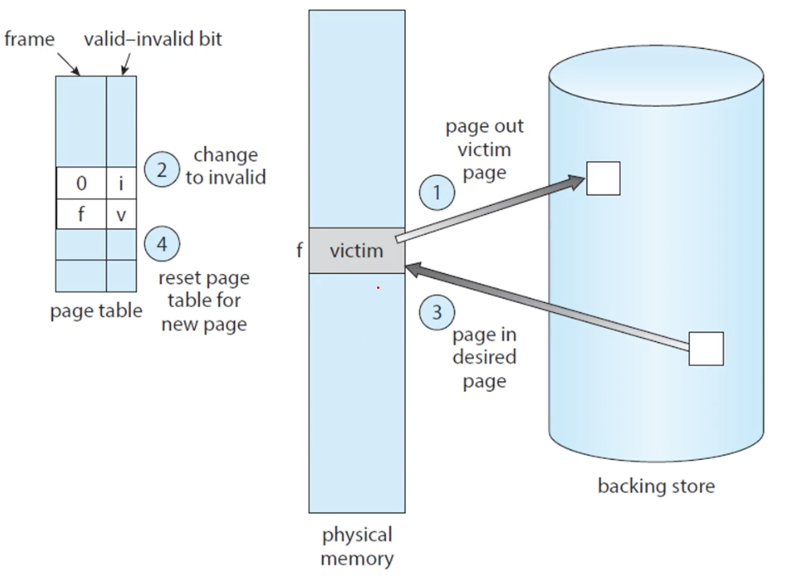

# 페이지 교체 알고리즘: Chapter 10. Virtual Memory (Part 2)

## Page Replacement

- 페이지를 할당하려고 할 때 free frame이 없는 경우
  - 이미 사용 중인 메모리를 교체해야 함
- 버퍼를 엄청나게 크게 줘서 갑자기 많은 페이지가 필요한 경우

- free frame이 없는 경우 하나를 비워주는 것을 Page Replacement라고 함
- swap space에서 메모리를 가져오고 이전 페이지는 없다고 체크함(invalid)

1. secondary storage에 로딩할 프레임의 위치를 찾기
2. free frame을 찾는다
   1. 없다면 page replacement 알고리즘을 사용해 victim을 찾기
   2. victim을 교체
3. free frame에 페이지 로딩

### demand paging에서 해결해야할 문제

- page-replacement algorithm
  - secondary storage에 IO하는 것은 비용이 많이 들음
  - demand paging의 효율을 올리면 성능이 많이 올라감

- page fault의 개수를 최소화할 수 있는 알고리즘을 찾자

### FIFO Page Replacement

- 가장 오래된 page를 교체하자
- 가장 간단하고 구현하기도 쉬움
- Belady's Anomaly
  - frame의 개수를 증가시켜줬는데도 page fault가 줄어들지 않음

### Optimal Page Replacement

- page-fault rate가 가장 낮은 알고리즘
  - Belady's Anomaly를 일으키지 않음

- 가장 쓸 일이 없을 것 같은 페이지를 버리면 된다.
  - 대신 미래를 알고 있어야 함

### LRU Page Replacement

- Least Recently Used: 가장 오래 사용되지 않은 페이지를 제거하자
- OPT에 가장 가깝지만, 이를 구현하기 어려움
-	Counter implementation
	- 참고할 때마다 count를 기록
- Stack implementation
  - stack 가장 아래에 있는 페이지가 오래된 페이지

- reference bit: 처음에 0으로 비트를 초기화

### Second-Chance Algorithm

- FIFO 알고리즘을 쓰되, 기회를 한 번 주는 것
  - 처음에는 reference bit를 1로 만들고 다시 선택되면 그 때 victim으로 선정
- LRU를 흉내내는 것

## Allocation of Frames

- 2개의 프로세스가 한정된 프레임이 있는 경우 어떻게 배정할 것인가?
- Equal vs Proportional
  - 모두 같은 프레임 주기
  - 프로세스의 크기가 많을 수록 더 많은 프레임 주기
- Global vs Local

## Thrashing

- page in과 out을 한다고 너무 바빠서 다른 일을 못하는 상황
- page-falut 비율이 너무 높은 경우

### Working-Set Model

- 페이지 조회는 locality가 있다는 것을 전제로 함
- working-set을 지정해 그 안에 있는 페이지만 로딩
- working-set에 포함이 안되는 페이지를 victim으로 선정

# 스토리지와 입출력: Chapter 11-15. Storage Management

## Mass-Storage

- 비휘발성 메모리, secondary storage
- HDD, NVM(SSD, NAND) 등

### HDD Scheduling

- seek time을 최소화
  - 읽고 쓰고자하는 특정 섹터에 가는 시간
- disk bandwidth
  - 한 번에 전송할 수 있는 대역폭을 늘려줘야 함

### Boot Block

- Rom: 전원이 들어왔을 때 구동시키기 위한 프로그램(bootsstrap)이 저장되어 있는 곳
- RAID
  - 데이터 읽기와 쓰기의 bandwidth를 늘리기 위해 parallel하게 작업함
  - redundant information을 추가해 데이터를 복구할 수 있도록 함

## I/O System

- 컴퓨터가 하는 일의 대부분은 I/O 작업임
- Bus를 통해 CPU가 디바이스에게 명령을 내림

### Memory-Mapped I/O

- I/O 주소에 어떤 디바이스가 달려있는지 적어둠
- 메모리 영역에 input, output을 주어 디바이스를 작업함

### Three types of I/O

- polling: or busy-waiting
  - 상태 레지스터를 계속해서 확인하는 것
- interrupt
  - interrupt-request line이라는 하드웨어 선이 있음
  - 이 선에 신호가 오면 CPU가 interrput를 감지함
  - interrupt vector table에 종류를 넣어놓고 그에 맞게 행동함
- DMA: Direct Memory Access
  - 하드웨어로 바로 가는 것

### Blocking I/O vs Non-blocking I/O

- Blocking I/O: thread가 suspended됨
  - running queue에서 waiting queue로 감
- Non-blocking I/O
  - waiting queue로 가서 기다리지 않는다
- Asynchronous system call
  - 실행을 계속해 나가는 것

- non-blocking read: 즉시 읽고 반환함
- asynchronous read: 요청만 하고 자기 할 일을 하러 감 

## File System

- logical 하게 storage에 데이터를 읽고 쓰는 것
  - 애플리케이션이 파일을 쉽게 읽고 쓸 수 있게 해줌
- 파일과 디렉터리
