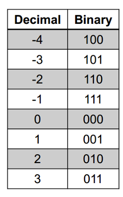
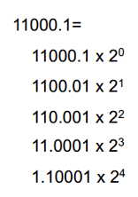
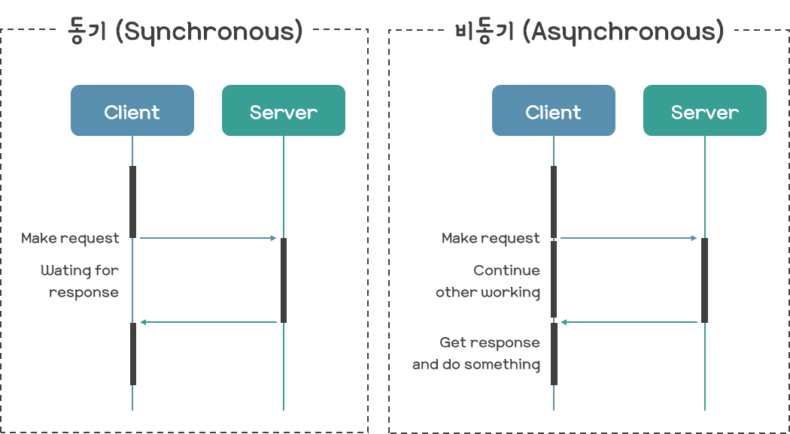
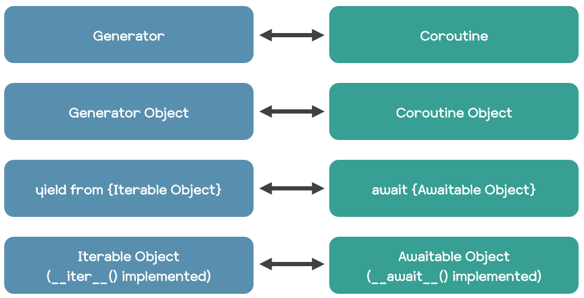

# CAOS

## Two's Complement



- 0이 단 하나
- sign bit가 존재
- 양수를 음수로 바꾸기 위한 작업이 필요 없음

## Two's Complement 해석하기

- sign이 0인 경우: 그대로 10진수로 변환
- sign이 1인 경우
  - 모든 비트를 반전 -> 1 더하기 -> 10진수로 변환 -> - 붙이기

### Overflow

- 두 양수를 더했을 때 음수가 나오는 경우 -> 최상위 비트가 1이면 오류
- 두 음수를 더했을 때 양수가 나오는 경우 -> 최상위 비트가 0이면 오류

## Real Number



- 실수는 매우 크거나 매우 작음
- 이를 표현할 방법이 필요

### Scientific Notation

- 10진법에서는 점을 옮겨 표현하는 방법을 사용함
- 2진법에서도 동일하게 표현이 가능

### Floating Point

- Scientific Notation은 세 부분으로 분류할 수 있음
  - 유효숫자, power, base
- 소수점은 유효 자리수를 기준으로 움직임
- 덧셈, 뺄셈은 power를 맞추고 진행
- 곱셈은 power끼리 더하고 유효숫자를 곱한다.
- 나눗셈은 power끼리 빼고 유효숫자를 나눈다.

# 파이썬 비동기 프로그래밍

자료: https://it-eldorado.tistory.com/159?category=749661

## 서론

- 파이썬은 동기 방식으로 동작하도록 설계된 언어이다.
  - 자바스크립트는 태생이 비동기 방식으로 동작하도록 설계된 것과는 다름
- 따라서 파이썬이 제공하는 대부분의 내장 API는 동기 방식이다.

- 이후 asyncio와 async, await 키워드가 추가되며 비동기 프로그래밍을 쉽게 할 수 있게 되었다.

## 코루틴과 제너레이터, async/await 키워드

- 코루틴(Coroutine)
  - 특정 시점에 자신의 실행과 관련된 상태를 어딘가에 저장한 뒤 실행을 중단
  - 이후에 그 상태를 복원하여 실행을 재개할 수 있는 서브 루틴
- 서브 루틴(Subroutine)
  - 일반적으로 우리가 알고 있는 함수를 의미

- 코루틴은 함수 중에서도 조금 특별한 함수다.

### 파이썬은 코루틴과 서브 루틴을 어떻게 구현했을까?

```python
# Subroutine (Synchronous Function)
def subroutine():
    print('subroutine')

# Coroutine (Asynchronous Function)
async def coroutine():
    print('coroutine')
```

- 코루틴과 서브 루틴 정의하기
  - def만 있으면 서브 루틴
  - async를 앞에 붙이면 코루틴

- 코루틴은 비동기 함수라고도 한다.

### 비동기란?



- 비동기(Asynchronous)
  - 쉽게 말해서 어떤 작업이 완료되기를 기다리지 않고, 그 시간동안 다른 작업을 하는 것

- 일반적인 파이썬 프로그램은 동기 함수로만 이뤄져 있음
  - 항상 어떤 작업이 완료되기를 기다린 후 그 다음 작업을 진행한다.
- 하지만 파이썬에서도 코루틴을 이용하면 비동기 코드를 작성할 수 있다.
  - 코루틴을 비동기 함수라고 부르는 이유

### 코루틴은 제네레이터다?

- 파이썬에서 코루틴은 제네이터를 기반으로 구현된다.
  - 즉, 파이썬에서 코루틴은 곧 제네레이터이다.
- 제네레이터가 yield 키워드를 breakpoint 삼아 실행이 중단 및 재개되는 특징이 있기 때문
  - python 3.5 이전에는 코루틴을 제네레이터를 사용하여 직접 구현했다.
- async 키워드는 제네레이터를 좀 더 쉽게 작성할 수 있도록 돕는 문법적 설탕이다.

### 제네레이터의 실행 및 중단 (yield 키워드)

1. Caller는 제네레이터를 호출하여 제네레이터 객체(gen)을 얻는다.
  - next(gen)이나 gen.send(값)을 호출하여 해당 제네레이터를 실행한다.
2. 실행된 제네레이터는 yield 키워드를 마주치는 순간 자신의 실행과 관련된 상태를 저장한 뒤 실행을 중단하고 Caller에게 yield 키워드 뒤에 오는 값을 넘겨준다.
  - 실행과 관련된 상태: 스택, 실행 위치 등
3. 제어를 다시 넘겨받은 Caller가 동일한 방법으로 해당 제네레이터를 호출한다.
4. 해당 제네레이터는 아까 실행이 중단되었던 부분부터 다시 실행을 시작한다.
5. 아까 실행이 중단되었던 부분인 yield 키워드 구문의 자리에는 send() 메서드의 인자값이 채워진다.

- yield 키워드는 제네레이터가 Caller에게 값을 넘겨주는 것
- gen.send(값)은 Caller가 제네레이터에게 값을 넘겨주는 것

- yield 키워드를 모두 소진한 제네레이터를 실행하는 경우 StopIteration 예외가 발생한다.
  - 예외 객체의 value 필드에는 해당 제네레이터의 반환 값이 저장되어 있다.

### 코루틴 객체

```python
async def coroutine():
    print('coroutine')

coroutine()
# 출력 : <coroutine object async_func at 0x015A9540>
# 주의 : 'coroutine'이 출력되지는 않음(코루틴이 실행되진 않음).
```

- 제네레이터를 호출하면 제네레이터 객체(Generator Object)가 생성되어 반환되는 것처럼, 코루틴을 호출하면 이와 유사한 코루틴 객체(Coroutine Object)가 생성되어 반환된다.

- 코루틴 객체는 자바스크립트의 프로미스(Promise) 객체와 비슷해보인다.
  - 하지만 파이썬의 코루틴 객체는 프로미스 객체와 조금 다르다.
- 자바스크립트에서 비동기 함수를 호출하면 실제 그 비동기 함수의 코드가 실행되며 프로미스 객체가 반환된다.
- 파이썬에서는 코루틴을 호출해도 코루틴 객체만 반환될 뿐 그 코루틴의 코드가 실행되지는 않는다.

- 오히려 태스크 객체(Task Object)가 프로미스 객체와 매우 유사하다.

### await 키워드

- 파이썬 3.5 이전에는 코루틴이 또 다른 코루틴을 실행할 수 있도록 yield from 키워드를 사용했다.
- await 키워드도 async 키워드와 마찬가지로 yield from 구문을 좀 더 쉽게 작성할 수 있도록 돕는 문법적 설탕이다.
  - 기존에는 yield from 키워드 뒤에 제네레이터를 두는 식
  - 이제는 await 키워드 뒤에 코루틴 객체를 두면 됨

- await 키워드 뒤에는 코루틴 객체 뿐만 아니라 __await__() 메서드가 구현된 Awaitable 객체라면 뭐든 올 수 있다.
  - __await__() 메서드를 호출하여 제네레이터 객체를 얻고 해당 제네레이터를 실행하는 방식으로 동작한다.

### 제네레이터의 중첩 (yield from 키워드)

- 제네레이터가 또 다른 제네레이터를 실행하는 것도 가능하다.
  - yield from 키워드 뒤에 또 다른 제네레이터 객체를 두면 됨
- yield from은 현재 제네레이터의 실행을 중단하고 해당 제네레이터를 실행하라는 것
  - 실행된 제네레이터가 어떠한 값을 yield하면 Caller에 해당하는 제네레이터가 그 값을 받아 yield 하는 효과를 보임
  - 어떤 값을 return하면 Caller에 해당하는 제네레이터에서 실행이 중단되었던 부분에 위치한 yield from 키워드 구문 자리에 그 값이 채워진다.

- yield from 키워드 뒤에는 __iter__() 메서드가 구현된 Iterable 객체라면 무엇이든지 올 수 있다.
  - 이 경우 __iter__() 메서드를 호출하여 이터레이터 객체를 얻고 이를 통해 값을 하나 씩 받는 방식으로 동작한다.


