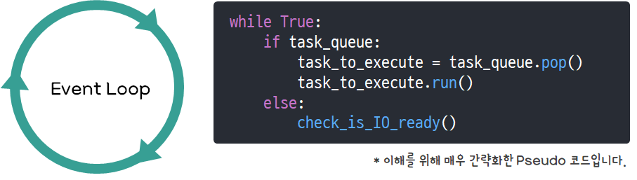

# 파이썬 비동기 프로그래밍

자료: https://it-eldorado.tistory.com/159?category=749661

# 2. 퓨처 객체와 태스크 객체


- 퓨처 객체와 태스크 객체는 코루틴 객체와 마찬가지로 await 키워드 뒤에 올 수 있는 Awaitable 객체다.
  - asyncio 기반의 비동기 프로그래밍에서 핵심적인 역할을 수행한다.

## 2-1. 퓨처 객체(Future Object)

- 퓨처 객체는 어떠한 작업의 실행 상태 및 결과를 저장하는 객체이다.
  - 실행 상태: 해당 작업이 진행 중인지, 취소되었는지, 종료되었는지를 표현
  - 실행 결과: 해당 작업의 결과 값 또는 그 작업을 진행하면서 발생한 예외 객체

- 퓨처 객체는 PENDING, CANCELLED, FINISHED의 세 가지 상태 중 하나를 가진다.
  - CANCELLED, FINISHED가 작업의 완료 상태이다.
  - 예외가 발생한 경우에도 FINISHED 상태가 된다.

- add_done_callback()
  - 이 메서드를 호출하면 해당 퓨처 객체가 완료(Done)될 때 호출될 함수를 등록할 수 있다.
  - 이후 이벤트 루프의 동작 원리에서 매우 중요함

- 퓨처 객체 vs 프로미스 객체
  - 두 객체는 모두 어떠한 작업의 실행 상태 및 결과를 저장한다.
  - 그러나 퓨처 객체는 그 작업의 실행을 개시하는 역할을 수행하지 않는다.

## 2-2. 태스크 객체 (Task Object)

- 태스크(Task)는 퓨처(Future)를 상속하는 클래스이다.
  - 태스크 객체는 기본적으로 퓨처 객체의 기능을 전부 가지고 있다.
  - 따라서 퓨처 객체처럼 어떠한 작업의 실행 상태 및 결과를 저장한다.

- 태스크 객체는 퓨처 객체와 다르게 작업의 실행을 개시하는 역할도 수행한다.
  - 이를 위해 코루틴 객체가 필요하다.

- 태스크 객체는 생성될 때 코루틴 객체를 넘겨받아 _coro 필드에 저장한다.
- 태스크 객체는 코루틴 객체를 가지고 있는 특별한 종류의 퓨처 객체라고 볼 수 있다.

- 태스크 객체를 생성하려면 asyncio.run() 혹은 asyncio.crreate_task() 함수를 호출할 때 인자로 코루틴 객체를 넘겨줘야 한다.
  - 코루틴 객체와 달리 코루틴을 호출한다고 해서 생성 및 반환되지 않는다.

### 태스크 객체의 동작

- 태스크 객체는 생성되는 즉시 현재의 쓰레드에 설정되어 있는 이벤트 루프에게 자신의 __step() 메서드를 호출해줄 것을 요청한다.
  - 이를 '코루틴이 태스크로서 실행되도록 이벤트 루프에 예약을 건다'라고 표현한다.
  - __step()은 자신의 코루틴 객체를 이용하여 해당 코루틴을 실행하는 메서드이다.

1. asyncio.run() 함수 혹은 asyncio.create_task() 함수를 호출
2. 함수의 인자로 코루틴 객체를 넘어준다.
3. 그 코루틴 객체로 태스크 객체가 생성된다.
4. 해당 코루틴이 태스크로서 실행되도록 예약된다.

### 코루틴 체인

- 태스크 객체의 __step() 메서드가 호출되면 코루틴의 실행이 개시된다.
- 처음 실행된 코루틴은 await 키워드를 이용하여 또 다른 코루틴을 부를 수 있다.
  - 그 코루틴은 또 다시 다른 코루틴을 부를 수 있다.
- 이를 코루틴 체인(Coroutine Chain)이라고 부른다.

- 하나의 태스크 객체는 현재의 태스크에 속하는 코루틴 체인의 실행을 관장하는 역할을 맡는다.

1. 연쇄 과정으로 코루틴을 호출하다 보면 Sleep 혹은 I/O 관련 코루틴(asyncio.sleep() 등)을 await 하는 코드를 마주칠 수 있다.
2. 태스크 객체는 이러한 상황을 감지하면 자신의 실행을 중단하고 이벤트 루프에게 제어를 넘긴다.
3. 이벤트 루프는 자신에게 실행을 예약해둔 태스크들 중 우선순위가 높은 것을 적절히 선택하여 이를 실행시킨다.
4. 시간이 흘러 아까 실행이 중단되었던 태스크가 다시 실행할 수 있는 상태가 되면 이 태스크는 다시 이벤트 루프에게 실행을 예약해둔다.
5. 언젠가 이벤트 루프에 의해 다시 선택을 받아 실행할 수 있게 된다.

# 3. 이벤트 루프의 실행 흐름 (동작 원리)

- 코루틴을 호출하여 코루틴 객체가 생성 및 반환된다고 하여 해당 코루틴이 바로 실행되지는 않는다.
- 파이썬에서 코루틴을 실행하는 방법으로 다음 세가지가 있다.
	- await 키워드
	- asyncio.run() 함수
	- asyncio.create_task() 함수

- await 키워드는 코루틴 내에서만 사용할 수 있기에 처음 코루틴을 실행하는 용도로는 사용할 수 없다.
- 최초에 한 번 코루틴이 실행되고 나면, 그 코루틴부터 시작해 await 키워드를 이용해 다른 코루틴을 호출할 수는 있다.
- asyncio.run() 과 asyncio.create_task()는 코루틴 체인으로 들어가는 일종의 엔트리 포인트이다.
  - 코루틴 바깥에서 처음으로 코루틴을 실행시킬 수 있음

## asyncio.run()

- asyncio.run() 함수는 현재의 쓰레드에 새 이벤트 루프를 설정한다.
  - 해당 이벤트 루프는 인자로 넘어오는 코루틴 객체에 해당하는 코루틴을 태스크로 예약하여 실행한다.
  - 해당 태스크의 실행이 완료되면 이벤트 루프를 닫는다.
- 이 함수는 3.7 버전 이상에서만 사용할 수 있기 때문에 그 전에는 아래 코드처럼 사용했다.
  - 래핑 함수보다 날 것에 가깝기 때문에 설명하기 좋음

```python
loop = asyncio.get_event_loop()
loop.run_until_complete(first_coroutine())
loop.close()
```


### loop = asyncio.get_event_loop()

- 현재 쓰레드에 설정된 이벤트 루프를 가져오는 함수
	- 설정된 이벤트 루프가 없다면, 이벤트 루프를 새로 생성하여 이를 현재 쓰레드에 설정한 뒤 해당 이벤트 루프를 반환
	- 코루틴의 실행을 위해 이벤트 루프를 준비하는 과정



- 이벤트 루프란?
  - 무한 루프를 돌며 매 루프마다 작업(=태스크)을 하나씩 실행시키는 로직
  - 작업: 앞에 나왔던 태스크 객체에 대응하는 태스크(Task)
	- 태스크: 하나의 코루틴에서 출발하는 하나의 실행 흐름

###  loop.run_until_complete(first_coroutine())

- 앞서 생성한 이벤트 루프 객체를 이용하여 실제 이벤트 루프를 실행시키는 함수

### 1. 태스크의 실행 (코루틴 체인의 형성)

1. 인자로 넘어오는 코루틴 객체를 이용해 태스크 객체를 생성한다.
2. 그 과정에서 해당 태스크 객체가 나타내는 태스크의 실행이 이벤트 루프에 의해 즉시 예약된다.
3. 처음에는 실행이 예약된 다른 태스크가 없기 때문에, 이벤트 루프는 이 태스크를 바로 실행한다.
  - 태스크의 실행: 태스크 객체의 __step() 메서드를 호출하는 것
4. __step() 메서드는 코루틴 객체(__coro 필드)의 send() 메서드를 호출하여 해당 코루틴을 실행
5.  실행된 코루틴을 시작으로 await 키워드를 마주칠 때마다 연쇄적으로 코루틴을 호출하며 코루틴 체인을 형성

### 2. 코루틴 체인의 종착점 (await {Sleep 또는 I/O 관련 코루틴 객체})

- await 키워드를 통해 코루틴 체인을 형성하며 코루틴을 실행하다 보면, 언젠가 Sleep 혹은 I/O 관련 코루틴(asyncio.sleep() 등)을 await 하는 코드를 만나게 된다.
  - 코루틴 체인의 끝에서 await 없이 return 하는 경우 마주치지 않을 수 있다.
  - 이런 경우 태스크 객체의 __step() 메서드에 StopIteration 예외를 발생시켜 현재 태스크의 실행을 완료시킨다.
- 이러한 종류의 코루틴들은 퓨처 객체를 await 하도록 구현되어 있다.

- I/O 관련 코루틴은 특정 소켓에 대해 데이터를 읽거나 쓰기 위해 해당 소켓의 상태를 검사한다.
- 만약 당장 읽거나 쓸 수 있는 데이터가 있다면 yield 키워드를 사용하여 태스크 객체의 __step() 메서드로까지 제어를 넘긴다.
- 제어권을 받은 태스크 객체는 다시 자신의 실행을 이벤트 루프에게 예약하고 현재 실행은 중단한 뒤 이벤트 루프에게 제어를 넘긴다.
  - 태스크의 실행을 예약한다: 해당 태스크 객체의 __step() 메서드를 이벤트 루프의 콜백 큐에 등록하는 것

- 보통은 당장 읽거나 쓸 수 있는 데이터가 있지 않다.
  - 이럴 경우 select() 함수를 이용하여 해당 소켓을 등록해두고, 해당 소켓에 바인딩된 퓨처 객체를 새로 생성하여 await한다.
    - select() 함수: 유닉스의 select()를 래핑. 특정 소켓들에 대해 데이터를 읽거나 쓸 준비가 될 때까지 기다릴 수 있게 하는 Blocking 함수. 데이터를 읽거나 쓸 준비가 된 소켓들을 반환한다.
  - 퓨처 객체의 __await__() 메서드는 자기 자신(퓨처 객체)을 yield 하도록 구현되어 있다.
  - 해당 퓨처 객체는 코루틴 체인을 따라 태스크 객체의 __step() 메서드로까지 전달된다.

- Sleep 관련 코루틴은 이벤트 루프 자체의 타이머를 이용한다.
  - asyncio.sleep(1)은 퓨처 객체를 하나 생성한 뒤, 이벤트 루프에는 1초 뒤에 해당 퓨처 객체의 결과 값을 업데이트하도록 요청한다. 
  - 그리고 그 퓨처 객체를 await한다.
  - 해당 퓨처 객체는 코루틴 체인을 따라 태스크 객체의 __step() 메서드까지 전달된다.
  
### 3. 태스크 객체의 퓨처 객체 처리

- 태스크 객체는 yield 된 퓨처 객체를 받으면 자신의 __fut_waiter 필드에 저장한다. (바인딩)
- 그리고 퓨처 객체의 add_done_callback() 메서드를 호출하여 해당 퓨처 객체가 완료 상태가 될 때 이벤트 루프에게 실행을 예약할 콜백 함수를 등록한다.
  - 이 때 등록하는 함수는 자기 자신의 __step() 메서드
- 콜백 함수의 실행을 이벤트 루프에게 예약한다는 것은 곧 해당 태스크의 실행을 예약한다는 것과 같은 말이다.

- 이후 태스크 객체는 자신의 실행을 중단하고 제어를 이벤트 루프에게 넘긴다.
  - 그러면 퓨처 객체에 바인딩되어 있는 태스크 객체는 더 이상 이벤트 루프에 의해 실행되지 못함
  - __fut_waiter 필드의 이름에서 볼 수 있듯 어떠한 퓨처 객체를 기다리고 있을 때는 실행하면 안되기 때문
- 제어가 넘어가고 나면 이벤트 루프는 다시 자신에게 실행을 예약해둔 태스크(콜백 함수)들 중 우선순위가 높은 것을 적절히 선택하여 이를 실행시킴
- 이벤트 루프는 이러한 과정을 반복하며 여러 태스크들을 동시적으로(Concurrent, not Parallel) 실행하는 역할을 맡는다.

### 4. 이벤트 루프의 Polling (I/O 소켓 검사)

- 이벤트 루프에 실행을 예약해둔 태스크가 없게 되면, 그 시간을 낭비하지 않고 select() 함수를 이용하여 데이터를 읽거나 쓸 준비가 된 소켓을 계속 찾는다.
- 데이터를 읽거나 쓸 준비가 된 소켓을 찾게 되면, 그 소켓에 바인딩되어 있는 퓨처 객체의 결과 값을 업데이트 해준다.
- 이로 인해 아까 등록해둔 콜백 함수의 실행이 이벤트 루프에서 예약된다.
  - 콜백 함수의 실행을 예약 = 해당 태스크의 실행을 예약

### 5. 태스크 객체의 실행 재개 (__step() 메서드 재실행)

- 태스크의 실행이란 곧 해당 태스크 객체의 __step() 메서드가 호출되는 것을 의미한다.
- __step 메서드는 자기 자신(태스크 객체)과 퓨처 객체의 바인딩을 해제한다
  - 더 이상 기다리는 퓨처 객체가 없음을 나타냄
- 이후 자신의 코루틴 객체에 대해 send() 메서드를 호출함으로써 해당 코루틴의 실행을 재개한다.
- 그러면 해당 퓨처 객체의 __await__() 메서드에서 실행이 중단되었던 부분(자기 자신을 yield 하는 부분)까지 가게 된다.

- __await()__ 메서드로 돌아왔을 때, I/O 관련 코루틴 때문에 기다리고 있었던 거라면 이제는 해당 소켓에 대해 데이터를 읽거나 쓸 준비가 되었다는 것 -> 해당 소켓(자기 자신에게 바인딩되어 있음)에 대해 데이터를 읽거나 쓴 다음 그 값을 return한다.
- Sleep 관련 코루틴 때문이었다면 바로 return 한다.

### 6. 최초 코루틴의 return (태스크 실행의 종료)

- 위 과정을 반복하다 보면 언젠가 태스크가 실행한 최초의 코루틴이 return 해야 하는 시점에 도달한다.
- 이로 인해 해당 태스크 객체의 __step() 메서드에서는 StopIteration 예외가 발생한다.
- 태스크 객체는 예외 객체의 value 필드 값으로 자기 자신의 결과 값을 업데이트하고 자신의 실행을 종료한다.
- 이 태스크는 더 이상 이벤트 루프에 의해 실행이 예약되지 않고 버려진다.

## loop.close()


- 이벤트 루프를 닫는 역할을 수행하는 함수
- 이벤트 루프에 남아 있는 모든 데이터(아직 실행이 종료되지 않은 태스크)들을 제가한다.
  - 실행이 완료되지 않은 태스크가 남아있다면 warning 메시지가 출력된다.

# 4. 태스크 동시 실행: asyncio.create_task() 함수

- asyncio.run() 함수는 기본적으로 하나의 태스크만을 생성하여 실행한다.
- 코루틴 체인 과정에서 추가적인 태스크를 생성하여 실행하지 않았다면, 현재의 태스크가 중단되었을 때 이벤트 루프가 실행시킬 다른 태스크가 없다.

- 동시적인(Concurrent) 실행을 위해서는 asyncio.create_task() 함수를 호출하여 태스크를 추가로 생성해 실행해야 한다.
- 이 함수를 호출할 때 코루틴 객체를 인자로 넘기면, 해당 코루틴 객체를 이용하여 태스크 객체를 생성하고 이를 반환한다.
- 앞에서 보았듯 태스크 객체가 생성되면 해당 태스크 객체가 나타내는 태스크의 실행이 이벤트 루프에 의해 즉시 예약된다.

## asyncio.gather() 함수

- 모든 퓨처 객체(태스크 객체 포함)들이 완료 상태가 될 때까지 기다리는 함수
- 인자로 여러 개의 Awaitable 객체들을 받을 수 있음
  - 만약 코루틴 객체를 받으면 자동으로 태스크 객체로 래핑됨
  - 따라서 사실상 퓨처 객체(태스크 객체 포함)만 넘어간다고 생각해도 된다.

- 모든 퓨처 객체들이 완료 상태가 되면 그 결과 값들을 리스트 형태로 반환한다.
  - 리스트의 순서는 인자로 넘긴 순서와 동일하다.

- 이 함수는 await 키워드 뒤에서 호출될 수 있는 코루틴의 일종이다.

## 예제 코드

```python
import asyncio
import time

async def sleep(sec):
    await asyncio.sleep(sec)
    return sec

async def main():
    sec_list = [1, 2]
    tasks = [asyncio.create_task(sleep(sec)) for sec in sec_list]  # [Task 1 객체, Task 2 객체]
    tasks_results = await asyncio.gather(*tasks)  # [Task 1 객체의 결과 값, Task 2 객체의 결과 값]
    return tasks_results

start = time.time()

loop = asyncio.get_event_loop()
result = loop.run_until_complete(main())
loop.close()

end = time.time()

print('result : {}'.format(result))
print('total time : {0:.2f} sec'.format(end - start))

# 출력 결과
# result : [1, 2]
# total time : 2.00 sec
```

# 5. 동기 함수를 코루틴처럼 쓰기 : loop.run_in_executor() 메서드

- 비동기 프로그래밍의 효과를 보기 위해서는 현재 쓰레드와 무관하게 다른 곳에서 작업이 실행돼야 한다.
  - Sleep: 이벤트 루프가 자체적으로 타이머를 가지고 있음
  - I/O: CPU가 일하는 동안 I/O 장치가 일하면 됨
  - 현재 실행 흐름을 Block 하지 않고 다른 작업을 먼저 할 수 있음

- 파이썬 API의 대부분은 동기 방식으로 동작한다.
  - time.sleep()은 실행 흐름을 Block 하는 함수
  - requests.get(), requests.post()도 실행 흐름을 Block 하는 함수

- run_in_executor() 메서드는 동기 함수를 별도의 쓰레드에서 실행시킨다.
  - 비동기 프로그래밍을 하려면 어떤 작업을 다른 어딘가에 맡겨야 하기 때문
