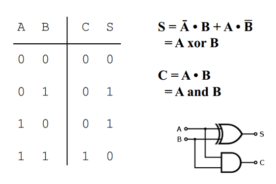
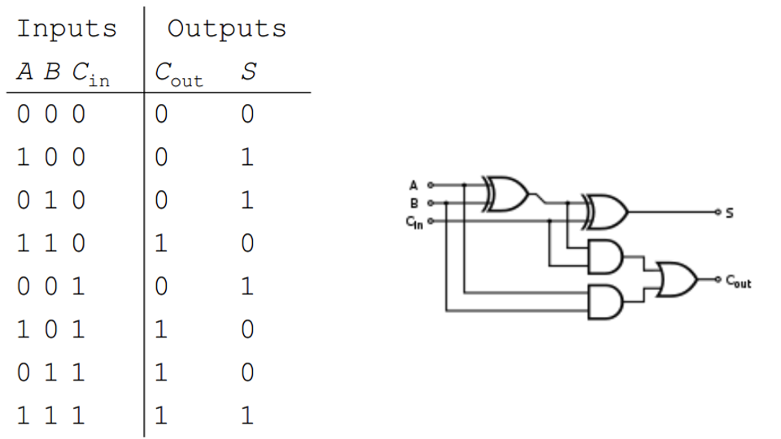
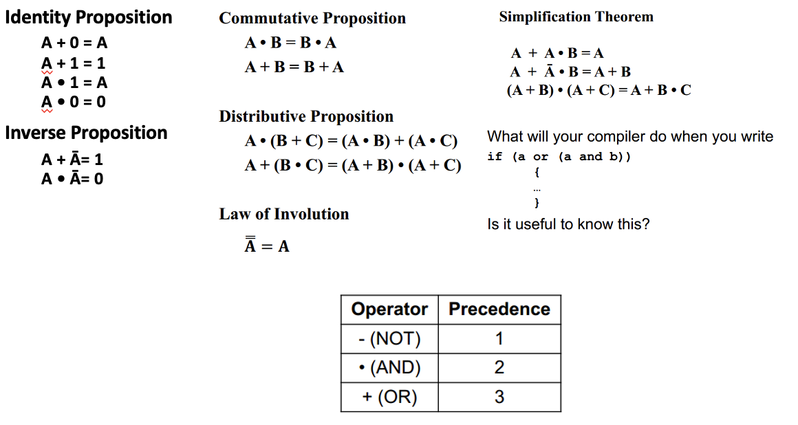
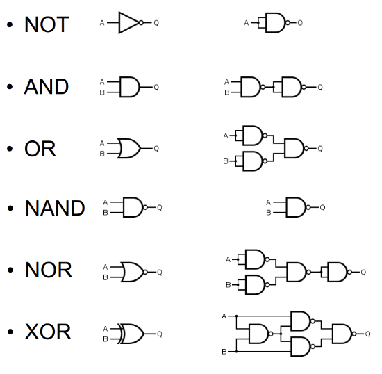
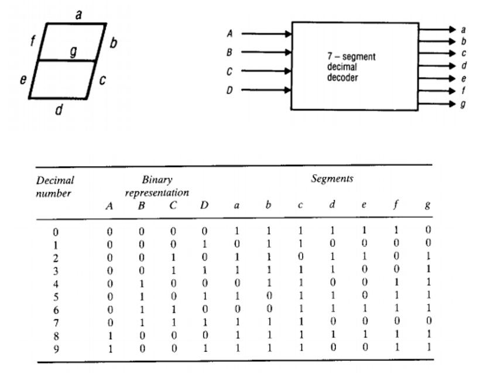

# 운영체제 스터디
# 운영체제의 보안: Chapter 16-17. Security & Protection

## Security & Protection

- Security: 사용자가 데이터나 코드를 사용하기 위해 인증을 해주는 것
- Protection: 권한을 획득해야 데이터에 접근할 수 있도록 보호해주는 것
  - 접근 제어

- 컴퓨터 리소스를 공격하는 것을 막기 위해 암호화를 사용한다.
- Security는 허가받지 않은 접근을 방지한다.

### 보안의 네가지 레벨

- 애플리케이션 보안: security 버그를 막는 것
- OS 보안
- 네트워크 보안
- 물리적 보안: 인가된 사용자만 진입하는 것

## Program Threats

- Malware: 컴퓨터 시스템에 공격을 하는 프로그램
  - 나쁜 행위를 하는 코드를 시스템에 넣음
  - 바이러스, 웜이 퍼져나감

### 네트워크를 통한 공격

- 스니핑, 스푸핑
- Denial of Service: DDoS 공격
- Port Scanning: 방화벽으로 막음

### Standard security attacks

- 통신 중간에서 정체를 위조하여 통신하는 것
- Man in the middle 같은 공격을 막기 위해서는 암호화를 해야됨

## Cryptography

- 암호화: sender가 키를 주고 receiver가 그 키를 이용해 메시지를 읽는 것
- 암호화가 효과적이려면 키를 유추하기 어려워야 함

- 대칭키 방식
	- A가 사용하는 키와 B가 사용하는 키가 같은 것
	- 믿을만한 서드파티를 이용함(인증서 방식)
	- key 교환 과정이 존재하기 때문에 이를 도청당하면 암호화가 깨짐
- 비대칭키 방식
  - 두 개의 키가 다른 것
  - public key, private key
  - 키 교환 과정이 존재하지 않음

### Authentication

- 암호와는 달리 sender의 메시지를 보호하는 것
- 해시 알고리즘
  - 복호화가 불가능함
- 메시지가 변하지 않았다는 것을 보장해줌
- 전자 서명 알고리즘 (Digital Signature Algorithm)
  - 비트코인, 블록체인

## Protection

- 어떤 리소스에 접근할 때 적절한 권한을 가지고 있어야 접근 가능하게 하자
- 유닉스에서는 root, sudo, chmod 등을 활용함
  - permissions

### Access Matrix

- Access Control List를 만들기
  - 접근 정책을 만들어 접근할 수 있는 사용자를 관리하기

### Sandboxing

- 돌아가는 프로세스가 권한을 가지고 있는 것만 할 수 있도록 하기

# 운영체제 3번째 복습 정리

## 캐시 메모리 및 메모리 계층성

- 캐시 메모리는 CPU와 주 메모리 사이에 위치한 작고 속도가 매우 빠른 메모리
- 메모리 계층성에서 캐시는 데이터와 명령어를 임시로 저장
  - CPU가 필요로 하는 정보를 빠르게 제공하여 시스템의 성능을 향상시킴
- 메모리 계층성은 일반적으로 캐시(Cache), 주 메모리(Main Memory), 보조 저장 장치(Secondary Storage)로 구성됨

### 캐시 메모리의 위치

- 캐시 메모리는 CPU 내부 또는 CPU에 매우 가까운 곳에 위치함
- 데이터 접근 시간을 최소화하여 CPU의 처리 속도를 최대화하기 위함

### L1, L2 캐시

- L1 캐시: CPU 코어에 직접 내장되어 있음
  - 가장 빠른 접근 속도를 가짐
  - 크기가 작아 제한적인 양의 데이터만 저장할 수 있음
- L2 캐시: L1 캐시보다는 느리지만 더 큰 용량을 가지고 있음
  - CPU 코어 당 하나 또는 여러 코어가 공유하는 형태로 존재할 수 있음
  - L2 캐시는 L1 캐시에서 미처 처리하지 못한 데이터를 저장하여 처리 속도를 보조함

### 캐시에서의 데이터 관리

- 교체 정책(Replacement Policy)
  - 캐시가 가득 찼을 때 어떤 데이터를 캐시에서 제거할지 결정
  - 대표적으로 LRU(Least Recently Used) 방식이 있음
- 쓰기 정책(Write Policy)
  - 데이터가 캐시에 쓰여질 때 주 메모리와의 동기화 방법을 결정
  - Write-through와 Write-back이 대표적
- 할당 정책(Allocation Policy)
  - 데이터를 캐시에 어떻게 할당할지 결정

### 캐시간의 동기화

- 캐시간 동기화는 coherency 프로토콜을 통해 이뤄짐
  - 다수의 프로세스가 캐시를 공유할 때 모든 캐시가 일관된 데이터를 유지하도록 보장하는 메커니즘
  - MESI(Modified, Exclusive, Shared, Invalid)프로토콜이 사용됨

## 메모리의 연속할당 방식

- 프로세스에 연속된 메모리 공간을 할당하는 방법

- First-fit
  - 가능한 메모리 공간 목록을 처음부터 탐색하여 프로세스가 들어갈 수 있는 첫번째 공간에 할당
  - 검색 시간이 상대적으로 빠르지만, 메모리에 작은 공간들이 많이 생김
- Best-fit
  - 가능한 메모리 공간 전체를 탐색하여 프로세스 크기에 가장 근접한 공간을 할당
  - 이론적으로는 메모리를 가장 효율적으로 사용할 수 있지만, 매우 작은 공간이 많이 생김
  - 전체 목록을 검색해야 하므로 속도가 느릴 수 있음
- Worst-fit
  - 가용 공간 목록 전체를 탐색해 가장 큰 공간에 할당함
  - 남은 공간이 상대적으로 크게 유지되어, 나중에 큰 프로세스 요청이 들어왔을 때 이를 수용할 가능성이 높아짐
  - 매우 큰 공간이 점차 작은 공간으로 나눠져, 시간이 지남에 따라 큰 공간을 찾기 어려워질 수 있음

### Worst-fit 사용 시기

- 시스템에서 크고 다양한 크기의 프로세스 요청이 예상될 경우
- 큰 프로세스 요청을 효과적으로 수용하기 위한 전략이 필요할 경우
- 메모리 사용 패턴이 동적으로 변하고, 크기가 큰 프로세스가 자주 요청되는 환경

### 성능이 가장 좋은 알고리즘

- Best-fit 방식이 가장 효율적으로 사용하는 경향이 있음

## Thrashing

- 시스템에서 메모리가 과도하게 사용되어 페이지 교체가 빈번하게 발생하는 상황
  - 실제 유용한 작업보다 페이지를 교체하는 데 더 많은 시간을 소비
- 시스템 전반적인 성능 저하를 일으킴

### Thrashing 완화 방법

- 스와핑(Swapping)
  - 프로세스의 일부를 메모리에서 스왑 영역으로 이동시키기
  - 메모리 사용량을 줄이고 thrashing을 줄일 수 있음
- 페이지 할당량 증가
  - 프로세스에 더 많은 페이지 할당량을 주어 page fault 빈도를 줄일 수 있음
- 우선 순위 페이지 교체
  - 자주 사용되는 페이지를 메모리에 유지하고, 덜 중요한 페이지를 교체하는 방식으로 작업의 효율성을 높임
- 작업 세트 모델(working set model)
  - 프로세스의 작업 세트(현재 활성화된 페이지 집합)를 관리하여 필요한 페이지만 메모리에 유지

## 가상 메모리

- 가상 메모리는 컴퓨터 시스템의 메모리 관리 기술 중 하나
- 물리 메모리의 크기에 구애받지 않고 프로세스가 더 큰 메모리 공간을 사용할 수 있게 해줌
- 물리메모리와 보조 저장 장치를 함께 사용하여 프로세스에게 물리 메모리보다 훨씬 큰 메모리 공간을 가상으로 제공함
- 가상 메모리 시스템은 물리 메모리에 실제로 존재하는 페이지(메모리의 일부분)와 가상 주소 공간을 매핑하여 작동함

### 가상 메모리가 가능한 이유

- 가상 메모리가 가능한 근본적인 이유는 대부분의 프로그램이 메모리의 전체 영역을 동시에 사용하지 않기 때문
- 프로그램 실행 중 일부 코드와 데이터만 활발히 사용됨
  - 이런 일부 코드의 크기는 물리 메모리보다 훨씬 작음
- 시스템은 가장 자주 사용되는 데이터와 코드를 물리 메모리에 유지하고, 나머지는 보조 기억 장치에 저장하여 물리 메모리보다 큰 가상의 작업 공간을 제공할 수 있음

### Page Fault 처리

- page fault는 프로세스가 접근하려는 페이지가 물리 메모리에 존재하지 않을 경우 발생

1. 인터럽트 발생: 운영체제는 페이지 폴트 인터럽트를 받고 현재 실행 중인 프로세스를 중지함
2. 페이지 결정: 운영체제는 페이지 테이블을 확인하여 요청한 페이지가 디스크 상의 어디에 위치하는지를 확인
3. 물리 메모리 할당: 운영체제는 물리 메모리에서 사용 가능한 프레임(페이지를 저장할 수 있는 공간)을 찾음. 필요하다면 기존 페이지를 디스크로 스왑아웃하여 공간을 확보함
4. 페이지 읽기: 요청된 페이지를 디스크에서 읽어 할당된 물리 메모리(프레임)에 로드
5. 페이지 테이블 업데이트: 페이지 테이블을 업데이트하여 가상 주소와 물리 주소 간의 매핑 정보를 수정함
6. 프로세스 재개: 페이지 폴트를 처리한 후, 원래의 프로세스를 다시 시작함

### 페이지 크기의 Trade-Off

- 페이지 크기를 크게 할 경우
  - 페이지의 크기가 크면 페이지 테이블의 크기가 줄어들고, 내부 단편화는 감소함
  - 페이지 폴트가 발생했을 때 더 많은 메모리를 한 번에 로딩해야 하므로 I/O 부담이 증가함
  - 프로세스의 작업 세트가 페이지 크기보다 작은 경우 불필요한 메모리 사용이 발생함
- 페이지 크기를 작게 할 경우
  - 작은 페이지를 사용하면 디스크 I/O 부담이 감소하고 메모리 사용 효율이 증가함
  - 페이지 테이블의 크기가 증가하고 메모리 사용량도 증가함
  - 외부 단편화 문제가 발생할 수 있음

### 페이지 크기와 페이지 폴트 빈도

- 페이지 크기가 커지면 개별 페이지에 접근할 때 가져오는 정보량이 많아짐
  - 한 번의 페이지 폴트로 해결되는 작업량이 증가
  - 특정 조건에서는 페이지 폴트 빈도가 감소할 수 있음

### 세그멘테이션과 가상 메모리

- 세그멘테이션 방식도 가상 메모리를 사용할 수 있음
- 세그멘테이션은 메모리를 의미 단위(함수, 배열)의 세그먼트로 분할하여 관리하는 방식
- 가상 메모리에 세그멘테이션을 구현하면 각 세그먼트에 대한 가상 주소 공간을 제공
  - 세그먼트의 실제 물리적 위치는 메모리나 디스크 상에 동적으로 할당됨
- 세그멘테이션과 가상 메모리는 서로 베타적인 개념이 아님

## TLB(Translation Lookaside Buffer)

- 가상 메모리 주소를 물리 메모리 주소로 변환할 때 필요한 페이지 테이블 정보를 캐시하는 곳
- TLB는 CPU가 메모리 접근을 할 때 마다 페이지 테이블을 조회하는 대신, 최근에 사용된 주소 변환 정보를 빠르게 제공하여 메모리 접근 시간을 단축시킴

### TLB 사용으로 인한 속도 향상

- TLB를 사용하면 가상 주소를 물리 주소로 변환하는 시간이 대폭 줄어들음
- 페이지 테이블은 메모리에 저장되기 때문에 가상 주소를 물리 주소로 매핑할 때마다 메모리 접근이 필요함
  - 이 과정이 상당한 지연을 발생시킴
- TLB는 자주 사용되는 매핑 정보를 캐시하여 대부분의 주소 변환 요청을 빠르게 처리할 수 있음

### MMU(Memory Management Unit)

- CPU와 메모리 사이에 위치
- 가상 메모리 주소를 물리 메모리 주소로 변환하는 역할
- 시스템의 메모리 접근 권한을 관리하고 유효하지 않은 메모리 접근을 차단

### TLB와 MMU의 위치

- TLB와 MMU는 모두 CPU 내부에 위치하거나 CPU와 매우 가까운 곳에 위치함
- TLB는 주로 MMU 내부 또는 MMU와 가까이 연결된 구조로 설계되어 있음
- 가상 주소를 물리 주소로 변환하는 과정의 지연 시간을 최소화하기 위함

### 멀티 코어 환경에서의 TLB 동기화

- 멀티 코어 프로세스에서는 각 코어가 자체 TLB를 가질 수 있음
  - 이러한 환경이세 TLB 동기화는 중요한 이슈
- 일반적인 방법은 하드웨어 기반의 coherency 매커니즘을 사용하는 것
  - 시스템의 모든 TLB를 일관된 상태로 유지하도록 보장함
  - 페이지 테이블 업데이트 시 관련 TLB 엔트리를 무효화(invalidate)하여 새로운 데이터로 동기화함

### Context Switching 시 TLB의 변화

- Context Switching이 발생하면 운영체제는 CPU에서 실행되는 프로세스를 다른 프로세스로 교체함
  - 이때 현재 프로세스의 상태는 저장되고 새 프로세스의 상태가 복원됨
- TLB 관점에서 보면, 다른 프로세스의 가상 주소 공간으로의 전환은 TLB 내의 주소 변환 정보가 더 이상 유효하지 않음을 의미
- Context Switching 시 TLB를 초기화하여 새 프로세스의 가상 주소 매핑이 정확하게 이뤄지도록 함
- 일부 시스템에서는 TLB에 ASID(Address Space Identifier) 같은 태그를 사용하여 프로세스 간에 TLB 엔트리를 구분
  - 불필요한 초기화를 줄이는 최적화 기법

# CAOS 3-1주차

## Combinatorial Logic

- Combinatorial Logic: 출력이 입력에만 의존하는 논리 회로
  - 출력은 즉시 응답 함
- 실제 회로에서는 지연을 고려해야 함
- CPU의 clock-cycle: clock은 CPU의 동작 단위

### Combinatorial Circuit

- Truth table
  - 입력 신호의 가능한 조합 각각에 대해 각 출력값이 나열된 테이블
- Boolean equations
  - 각 출력 신호는 입력 신호의 부울 함수로 표현됨
  - 복잡한 방정식은 곱의 합(SOP) 또는 합의 곱(POS)로 표현할 수 있음
- Graphical signals
  - 회로를 구현하는데 사용되는 게이트를 연결

### 1-Bit Half Adder

- S: Sum
  - A xor B
- C: carry
  - A and B

### Full Adder

## Boolean Algebra

- NAND 게이트만으로 6개의 게이트를 모두 만들 수 있음

## 7-Segment Decimal Decoder

