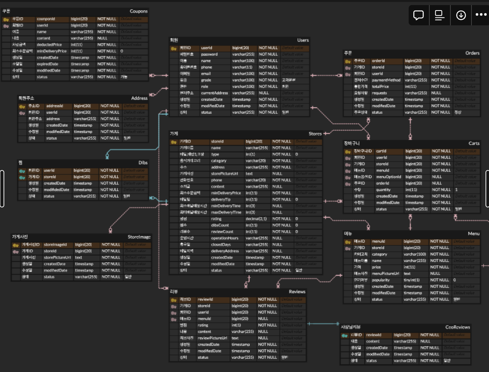
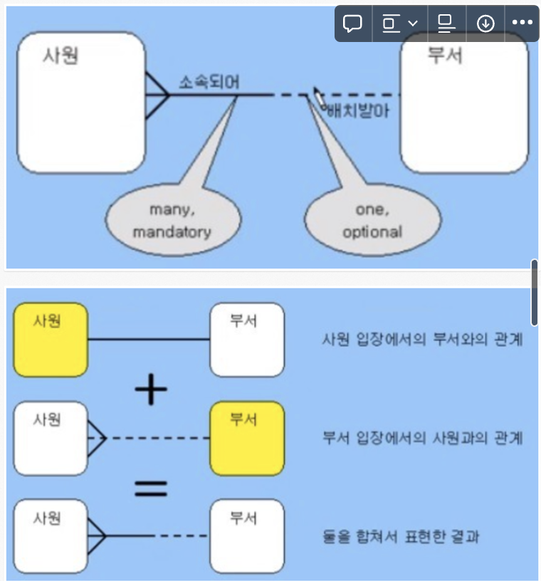
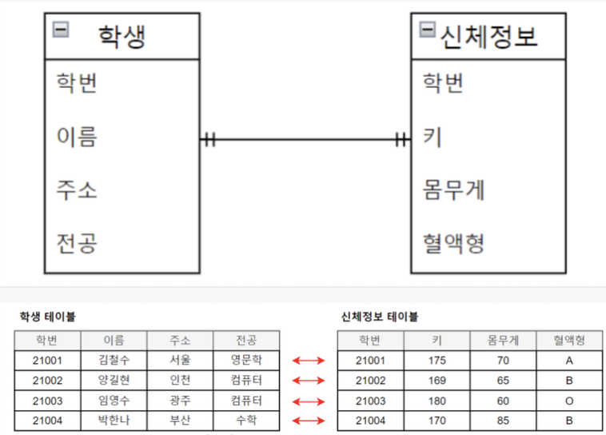
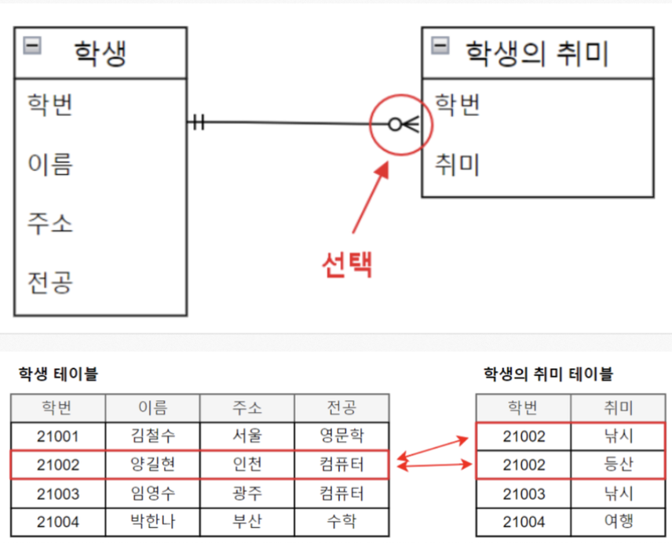
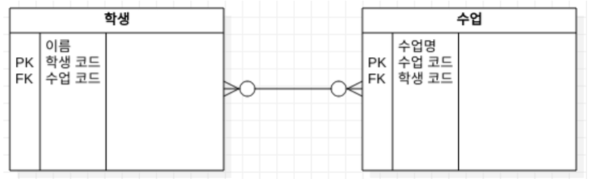

# 운영체제 책읽기 스터디

# 04. 설계 품질과 트레이드 오프

## 0. 서론

- 역할, 책임, 협력 중에서 가장 중요한 것은 '책임'이다.
	- 책임이 적절하게 할당되지 못하면 원활한 협력도 기대하지 못한다.
	- 역할은 책임의 집합아기 때문에 역할 역시 협력과 조화를 이루지 못한다.

- 책임을 할당하는 작업은 응집도와 결합도 같은 설계 품질과 깊이 연관돼 있다.

- 훌륭한 설계란 합리적인 비용 안에서 변경을 수용할 수 있는 구조를 만드는 것이다.
  - 쉽게 변경할 수 있는 설계: 응집도가 높고 서로 느슨하게 결합돼 있는 상황

- 객체의 상태가 아닌 행동에 초점을 맞춰라.

- 책임이 아닌 상태에 중점을 맞춘 설계를 보고 어떤 차이점이 있는지 살펴본다.

## 1. 데이터 중심의 영화 예매 시스템

- 객체지향 설계에서 객체를 분할하는 방법은 두가지
  1. 상태를 분할의 중심축으로 삼기
  2. 책임을 분할의 중심축으로 삼기

- 데이터(상태) 중심 관점: 객체를 독립된 덩어리로 본다.
- 책임 중심 관점: 객체를 협력하는 공동체의 일원으로 본다.

- 책임에 초점을 맞추면 변경에 안정적인 설계를 얻을 수 있다.
  - 객체의 상태는 구현에 속한다.
  - 객체의 책임은 인터페이스에 속한다.

### 데이터를 준비하자

- 데이터 중심 설계: 객체 내부에 저장되는 데이터를 기반으로 시스템을 분할하는 방법
	- 책임 중심 설계는 '책임이 무엇인가'에서 설계를 시작한다.
	- 데이터 중심 설계는 '데이터가 무엇인가'에서 설계를 시작한다.

- '이 객체가 포함해야 하는 데이터는 무엇인가?' 라는 질문을 반복한다면 데이터 중심 설계에 매몰되어 있는 것이다.
  - 객체의 종류를 저장하는 인스턴스 변수와 인스턴스의 종류에 따라 배타적으로 사용되는 인스턴스 변수를 함께 사용하는 것이 그 예시

- **접근자(accessor)**: 내부의 데이터를 반환
- **수정자(mutator)**: 내부의 데이터를 변경

## 2. 설계 트레이드오프

- 좋은 설계의 특징을 판단할 수 있는 기준으로 **캡슐화, 응집도, 결합도**를 사용한다.

### 캡슐화

- 변경될 가능성이 높은 부분은 **구현** 이라고 부른다.
- 상대적으로 안정적인 부분을 **인터페이스** 라고 부른다.

- 캡슐화는 외부에서 알 필요가 없는 부분을 감춤으로써 대상을 단순화하는 추상화의 한 종류다.
- 객체지향 설계의 가장 중요한 원리는 불안정한 구현 세부사항을 안정적인 인터페이스 뒤로 캡슐화하는 것이다.

- 객체 내부에서 변경될 수 있는 모든 것을 캡슐화해야 한다.

- 변경의 관점에서 설계의 품질을 판단하기 위한 척도로 캡슐화를 사용한다.

### 응집도와 결합도

- 응집도: 모듈에 포함된 내부 요소들이 연관되어 있는 정도를 나타낸다.
  - 객체지향에서 응집도는 객체 또는 클래스에 얼마나 관련 높은 책임들을 할당했는지 나타낸다.
- 결합도: 다른 모듈에 대한 의존성을 나타내는 척도
  - 객체지향에서 결합도는 객체 또는 클래스가 협력에 필요한 적절한 수준의 관계만 유지하고 있는지 나타낸다.

- 높은 응집도와 낮은 결합도를 가진 모듈로 구성된 설계가 좋은 설계다.
- 응집도와 결합도는 설계를 변경하기 쉽게 만든다.

- 변경의 관점에서 응집도: **변경이 발생할 때 모듈 내부에서 발생하는 변경의 정도**
  - 하나의 변경을 하기 위해 하나의 모듈 전체가 함께 변경된다면 응집도가 높은 것이다.
  - 하나의 원인에 의해 변경되어야 하는 부분을 한 모듈에 몰아 넣는 것
	- 응집도가 높으면 변경하기 위해 오직 하나의 모듈만 수정하면 된다.

- 변경의 관점에서 결합도: **한 모듈이 변경되기 위해서 다른 모듈의 변경을 요구하는 정도**
   - 하나의 모듈을 수정할 때 얼마나 많은 모듈을 함께 수정해야 하는지에 대한 정도
   - 퍼블릭 인터페이스를 수정했을 때만 다른 모듈에 영향을 미치는 경우는 결합도가 낮다고 볼 수 있다.
   - 다만 변경될 확률이 매우 적은 안정적인 모듈(표준 라이브러리, 프레임워크)에 의존하는 것은 괜찮다.

- 응집도와 결합도를 변경의 관점에서 바라보자.

- 응집도와 결합도를 고려하기 전 먼저 캡슐화를 향상시키자.
  - 캡슐화를 지키면 모듈 안의 응집도는 높아지고 모듈 사이의 결합도는 낮아진다.
  - 캡슐화를 위반하면 모듈 안의 응집도는 낮아지고 모듈 사이의 결합도는 높아진다.

## 3. 데이터 중심의 영화 예매 시스템의 문제점

- 데이터 중심의 설계는 캡슐화를 위반한다.
  - 객체의 내부 구현을 인터페이스의 일부로 만든다.
  - 그렇기에 응집도가 낮고 결합도가 높은 객체들 양산한다.
- 책임 중심의 설계는 객체의 내부 구현을 안정적인 인터페이스 뒤로 캡슐화한다.

### 캡슐화 위반

- 접근자와 수정자 메서드는 객체 내부 상태에 대한 어떤 정보도 캡슐화하지 못한다.
  - getFee와 setFee 메서드는 fee라는 인스턴스 변수가 있다는 것을 퍼블릭 인터페이스에 노골적으로 드러낸다.

- 객체가 사용될 문맥을 추축할 수밖에 없는 경우 개발자는 어떤 상황에서도 객체가 사용될 수 있도록 최대한 많은 접근자 메서드를 추가하게 된다.

- **추측에 의한 설계 전략(design-by-guessing strategy)**: 접근자와 수정자에 과도하게 의존하는 설계 방식
	- 캡슐화 원칙을 위반하는 변경에 취약한 설계로 이어진다.

### 높은 결합도

- 객체 내부의 구현이 객체의 인터페이스에 드러난다는 것은 클라이언트가 구현에 강하게 결합된다는 것을 의미한다.
- getFee 메서드를 사용하는 것은 인스턴스 변수 fee의 가시성을 private에서 public으로 변경하는 것과 거의 동일하다.

- 데이터 중심의 설계는 전체 시스템을 하나의 거대한 의존성 덩어리로 만든다.
  - 어떤 변경이라도 발생하면 시스템 전체가 요동친다.

### 단일 책임 원칙(Single Responsibility Principle, SRP)

- 클래스는 단 한 가지의 변경 이유만 가져야 한다.
- 클래스의 응집도를 높일 수 있는 설계 원칙

- 여기서 사용되는 '책임'은 '변경의 이유'라는 의미로 사용된다.
  - 변경과 관련된 더 큰 개념을 가리킴

## 4. 자율적인 객체를 향해

### 캡슐화를 지켜라

- 캡슐화는 설계의 제1원리다.
- 낮은 응집도와 높은 결합도를 갖게 된 근본적인 원인은 캡슐화의 원칙을 위반했기 때문이다.

- 객체 외부에서는 인터페이스에 정의된 메서드를 통해서만 상태에 접근할 수 있어야 한다.
  - 여기서의 메서드는 접근자나 수정자를 의미하는 것이 아니다.
  - 객체에게 의미 있는 메서드는 객체가 책임져야 하는 무언가를 수행하는 메서드다.

- 속성의 가시성을 private로 설정했다고 해도 접근자와 수정자를 통해 속성을 외부로 제공한다면 캡슐화를 위반한 것이다.

- 캡슐화를 지키지 않으면
  - 코드 중복이 발생할 확률이 높아진다.
  - 변경에 취약하다.

### 스스로 자신의 데이터를 책임지는 객체

- '이 객체가 어떤 데이터를 포함해야 하는가?'라는 질문은 두 개의 개별적인 질문으로 분리해야 한다.
  - 이 객체가 어떤 데이터를 포함해야 하는가?
  - 이 객체가 데이터에 대해 수행해야 하는 오퍼레이션은 무엇인가?

- 위 질문을 하다보면 데이터를 처리하는 데 필요한 메서드를 데이터를 가지고 있는 객체 스스로 구현하게 된다.

## 5. 하지만 여전히 부족하다

### 캡슐화 위반

- 객체 내부에서 로직을 처리하지만 인터페이스의 파라미터로 객체 내부 정보가 노출될 수 있다.
- **파급 효과(repple effect)**: 내부 구현의 변경이 외부로 퍼저나가는 것

- 내부 정책 종류에 따라 메서드를 만들어 두는 것도 내부 정책 정보가 외부로 노출되는 것이다.
  - 정책이 수정되면 인터페이스도 수정되게 됨
  - 내부 구현을 성공적으로 캡슐화하지 못한 사례

### 캡슐화의 진정한 의미

- 캡슐화는 단순히 객체 내부의 데이터를 외부로 감추는 것 이상의 의미를 가진다.
  - 내부 속성을 외부로부터 감추는 것은 '데이터 캡슐화'로 캡슐화의 한 종류다.
- 캡슐화는 변경될 수 있는 어떤 것이든 감추는 것이다.

- 내부 구현의 변경으로 인해 외부의 객체가 영향을 받는다면 캡슐화를 위반한 것이다.
  - 설계에서 무엇이 변하는지 고려하고 변하는 개념을 캡슐화해야 한다.

## 6. 데이터 중심 설계의 문제점

- 데이터 중심의 설계가 변경에 취약한 이유
  1. 데이터 중심의 설계는 너무 이른 시기에 데이터에 관해 결정하도록 강요한다.
  2. 데이터 중심의 설계는 협력이라는 문맥을 고려하지 않고 객체를 고립시킨 채 오퍼레이션을 결정한다.

### 데이터 중심 설계는 객체의 행동보다는 상태에 초점을 맞춘다.

- 데이터는 구현의 일부이다.
  - 데이터를 먼저 생각하는 것은 설계보다 구현을 먼저 시작하는 것

- 데이터 중심 설계는 데이터와 기능을 분리하는 절차적 프로그래밍 방식을 따른다.
  - 접근자와 수정자를 과도하게 추가하고 객체를 사용하는 절차를 분리된 별도의 객체 안에 구현하게 된다.

- 데이터를 먼저 결정하게 되면 데이터에 관한 지식이 객체의 인터페이스에 고스란히 드러나게 된다.

### 데이터 중심 설계는 객체를 고립시킨 채 오퍼레이션을 정의하도록 만든다.

- 올바른 객체지향 설계의 무게 중심은 항상 객체의 내부가 아니라 외부에 맞춰져 있어야 한다.
- 데이터 중심 설계의 초점은 객체 내부로 향한다.
  - 객체의 구현이 이미 결정된 상태에서 다른 객체와의 협력 방법을 고민하게 된다.
  - 이미 구현된 객체의 인터페이스를 억지로 끼워맞출 수밖에 없다.

# OYR 스터디
# ERD

[ERD (Entity-Relationship Diagram)](https://shuu.tistory.com/64)

## ERD란

- 객체- 관계 모델(Entity-Relationship Modeling, E-R Modeling)
- 사물을 개체(Entity)와 개체 간의 관계(Relationship)로 표현하는 데이터 모델링 방식
- 개념적 데이터 모델링 단계에서 사용됨

→ 릴레이션 간의 관계들을 정의하는 것

- Entity(개체)와 Relationship(관계)를 중점적으로 표시하는 데이터베이스 구조를 한 눈에 알아보기 위해 그려놓는 다이어그램
- 개체 관계도라고도 불림
- 요구분석 사항에서 얻은 엔티티와 속성들의 관계를 그림으로 표현한 것

[배달의민족 ERD](https://www.erdcloud.com/d/TzHsgqxPRGzWGzytR)

## ERD 구성 요소

### Entity

- Entity(엔티티)는 정의 가능한 사물 또는 개념을 의미한다.
- 사람이 될 수도 있고 프로필이나 도서 정보와 같은 무형의 정보도 데이터화 가능하다.
- Entity 이름은 단수형이고, 유일하며, 대문자로 크게 표기한다.
- 모든 Entity는 하나 이상의 식별자(UID: Unique Identfier)를 가져야 한다.
    - UID가 없다면 Entity로 볼 수 없다.
- UID는 Entity의 각 Occureence를 식별하기 위해 사용되는 Attribute나 Relationship의 조합을 말한다.

### Attribute

- Attribute(속성)는 Entity를 구성하고 있는 구성 요소이다.
- Attribute이름은 소문자로 작게 표기하며 Entity 이름과 Attribute 이름이 중복되면 안된다.
- #은 UID, *은 필수, o은 선택 Attribute를 의미한다.
- 자신의 속성이 아니면서 Relation을 위해 자신의 Attribute로 표기해서는 안된다.

### Relationship

- Entity 간의 관계를 의미한다.
- 두 Entity 간에 선을 긋고 관계 명칭을 기록한다.
    
    
    
- 선택 사항 표시하기
    - 점선은 선택적인 사항을 의미한다. → 부서 입장에서 사원을 배치 받을 수도, 받지 않을 수도 있다.
    - 실선은 필수적인 사항을 의미한다. → 사원 입장에서는 반드시 부서에 배치되어 있어야 한다.
- 관계 형태 표시하기
    - 삼지창: 하나 이상을 의미 → 사원 여러 명이 한 부서에 속한다
    - 단선: 하나를 의미 → 한 명의 사원은 한 부서에만 소속될 수 있다.

## ERD 관계의 카디널리티

- 관계가 존재하는 두 Entity 사이에 한 Entity에서 다른 Entity 몇 개의 개체와 대응되는지 제약 조건을 표기하기 위해 선을 그어 표현한다.
- Mapping Cardinality
    
    ① One to One : 1 대 1 대응 (1:1)
    
    ② One to Many : 1 대 다 대응 (1:N)
    
    ③ Many to Many : 다 대 다 대응 (M:N)
    

### One to One : 1 대 1 대응 (1:1)

- 학생과 신체정보는 1:1로 매칭된다.
    - 한 명의 학생은 하나의 신체 정보를 갖는다.

### One to Many (1:N)

- 한 명의 학생은 여러 개의 취미를 가질 수 있다.

### Many to Many (M:N)

- 한 명의 학생은 여러 개의 수업을 들을 수 있고, 한 개의 수업은 여러 명의 학생을 받을 수 있다.
- 두 엔티티 간의 관계가 N:M으로 매칭되는 경우 완성되지 않은 모델로 간주한다.
    - 두 엔티티의 관계를 1:N, 1:M으로 조정하는 작업이 필요하다.
- 두 개의 엔티티 사이에 또 하나의 엔티티를 추가하여 M:1 1:M 관계로 전환해야 한다.

## ERD 설계 과정

[ERD, 어떻게 설계하는 걸까?](https://mslilsunshine.tistory.com/164)

1. 개체들 간의 관계 추출
2. 각 개체의 속성들의 데이터 타입(int, varchar)이 어떻게 될지 판단하고, ERD를 작성한다.
3. key 제약 조건과 무결성 제약 조건 등을 추가한다.