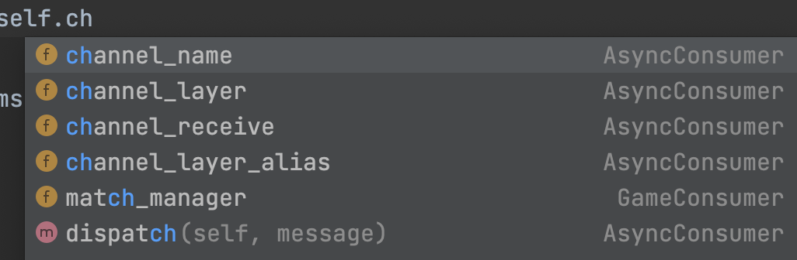

# Django Channel Layers

- 애플리케이션의 서로 다른 인스턴스 간의 통신이 필요한 경우 사용
- 데이터베이스를 통해 모든 메시지나 이벤트를 보낼 필요가 없는 분산형 실시간 애플리케이션을 만들 때 유용함
- Channel layers는 Channels의 선택적 옵션일 뿐임
  - 사용하지 않는 경우 `CHANNEL_LAYERS = {}`으로 설정
- Channel layers는 비동기 인터페이스가 포함되어 있음
    - 동기 코드에서 사용하기 위해서는 컨버터로 wrapping이 필요함

## 구성

- 장고 settings에서 CHANNEL_LAYERS를 사용하여 구성됨
- `channels.layers.get_channel_layer()` 를 사용하여 프로젝트에서 기본 채널 레이어를 가져올 수 있음
- consumer를 사용하는 경우 consumer의 `self.channel_layer` 로 copy가 자동으로 제공됨

## Redis Channel Layer

- channels_redis는 프로덕션용으로 지원되는 유일한 공식 channel layer임
  - 이 layer는 Redis를 백업 저장소로 사용함
  - 단일 서버 및 그룹을 모두 지원
- 이 layer를 사용하려면 channels_redis 패키지를 설치해야함
	[channels-redis](https://pypi.org/project/channels-redis/)

- redis가 localhost:6379에서 돌아가는 중인 경우
```python
CHANNEL_LAYERS = {
    "default": {
        "BACKEND": "channels_redis.core.RedisChannelLayer",
        "CONFIG": {
            "hosts": [("127.0.0.1", 6379)],
        },
    },
}
```

## In-Memory Channel Layer

- Channels는 in-memory 채널 레이어와 함께 패키지로 제공됨
- 이 레이어는 테스팅이나 로컬 개발에 유용함

### ! 프로덕션 환경에서는 사용하면 안됨
- In-Memory Channel Layer는 각 프로세스에서 별도의 레이어로 작동함
- 즉, 프로세스 간 메시징이 불가능
- channel layers의 핵심 목적은 분산 메시징을 제공하는 것
- 인메모리를 사용하면 멀티 인스턴스 환경에서 성능이 저하되고 데이터 손실이 발생할 수 있음

## 동기 함수

- send(), group_send(), group_add() 및 기타 함수는 비동기
  - await을 사용해야함
- 동기 코드에서 사용하려면 간단하게 `asgiref.sync.async_to_sync` 를 사용하면됨


```python
from asgiref.sync import async_to_sync

async_to_sync(channel_layer.send)("channel_name", {...})
```

## 채널 레이어를 통해 전송할 내용

- channel layer는 고수준의 애플리케이션 간 통신을 위한 계층
- 메시지를 보내면 그룹이나 채널에서 listening 중인 상대방의 consumer가 이를 수신함
- 채널 계층을 통해 고수준의 이벤트를 보낸 다음 consumer가 해당 이벤트를 처리
  - 연결된 클라이언트에 적절한 저수준의 네트워킹을 수행하도록 해야함(?)

- 채팅 애플리케이션은 아래 방법으로 channel layer를 통해 이벤트를 보낼 수 있음

```python
await self.channel_layer.group_send(
    room.group_name,
    {
        "type": "chat.message",
        "room_id": room_id,
        "username": self.scope["user"].username,
        "message": message,
    }
)
```

- 그리고 consumer는 이런 이벤트를 수신하고 웹소켓 프레임으로 변환하는 처리 함수를 정의함

```python
async def chat_message(self, event):
    """
    Called when someone has messaged our chat.
    """
    # Send a message down to the client
    await self.send_json(
        {
            "msg_type": settings.MSG_TYPE_MESSAGE,
            "room": event["room_id"],
            "username": event["username"],
            "message": event["message"],
        },
    )
```

- Channels의 `SyncConsumer` 또는 `AsyncConsumer`를 기반으로 하는 모든 consumer는 각각 channel layer 인스턴스에 대한 포인터와 consumer에게 도달한 채널 이름을 포함하는 `self.channel_layer` 및 `self.channel_name` 어트리뷰트를 자동으로 제공함



- 해당 채널 이름 또는 채널 이름이 추가된 그룹으로 전송되는 모든 메시지는 연결된 클라이언트의 이벤트와 마찬가지로 consumer에게 수신되며, consumer의 지정된 메서드로 발송됨
- 메서드의 이름은 마침표가 밑줄로 대체된 이벤트의 유형이 됨
  - 이벤트의 `type`이 `chat.join`인 경우 `chat_join`이라는 메서드가 처리함

### ! Note

- `AsyncConsumer` 클래스 트리에서 상속하는 경우 channel layer의 이벤트 핸들러를 포함한 모든 이벤트 핸들러는 비동기식(async def)이어야 함
- `SyncConsumer` 클래스 트리에 있는 경우 모두 동기식(def)이어야 함

## Single Channels

- 각 애플리케이션 인스턴스(예: 장기 실행 HTTP request 또는 열린 WebSocket)는 단일 consumer 인스턴스를 생성함
- channel layers를 활성화한 경우 consumer는 고유한 channel name을 생성하고 이벤트를 수신 대기하기 시작함

- 즉, 다른 consumer나 관리 명령 등 프로세스 외부에서 해당 consumer에게 이벤트를 보낼 수 있음
- consumer는 클라이언트 연결 이벤트처럼 이벤트에 반응하고 코드를 실행함

- channel name은 consumer에서 self.channel_name으로 사용할 수 있음
- 다음은 연결 시 channel name을 DB에 기록한 다음 그 위에 이벤트에 대한 핸들러 메서드를 지정하는 예제임

```python
class ChatConsumer(WebsocketConsumer):

    def connect(self):
        # 채널 이름으로 DB row를 만듭니다.
        Clients.objects.create(channel_name=self.channel_name)

    def disconnect(self, close_code):
        # 드문 경우(정전 등)에 연결 해제에 실패할 수 있음
        # 이 순진한 예시는 좀비 channel name을 남길 수 있음
        Clients.objects.filter(channel_name=self.channel_name).delete()

    def chat_message(self, event):
        # "chat.message" 이벤트가 전송될 때 handle함
        self.send(text_data=event["text"])
```

- channel layer와 프로토콜 커넥션에서 이벤트 처리를 함께하고 있음
  - type name이 충돌하지 않도록 주의
- 충돌을 피하기 위해 type name 앞에 접두사를 붙이는 것이 좋음(여기선 chat을 사용함)

- 단일 channel로 전송하려면 해당 channel name을 찾은 다음 channel_layer.send를 호출하면 됨
  - 위 예시에서는 DB에서 탐색

```python
from channels.layers import get_channel_layer

channel_layer = get_channel_layer()
await channel_layer.send("channel_name", {
    "type": "chat.message",
    "text": "Hello there!",
})
```

## Groups

- 물론 개별 channel로 보내는 것은 특별히 유용하지 않음
- 대부분의 경우 여러 채널, 사용자에게 한 번에 브로드캐스트 해야할 것
- 대화방에 있는 모든 사람에게 메시지를 보내는 채팅과 같은 경우뿐만 아니라 브라우저 탭이나 디바이스가 두 개 이상 연결된 개별 사용자에게 보내는 경우도 마찬가지

- 기존 데이터스토어를 사용하여 자체 솔루션을 구축할 수 있음
- 혹은 일부 channel layers에 내장된 Groups 시스템을 사용할 수 있음
- Groups는 브로드캐스트 시스템임
	- 명명된 그룹에서 channel name을 추가 및 제거
	- 해당 명명된 그룹으로 전송
	- 연결 해제 처리가 되지 못한 커넥션을 정리하기 위해 Group 만료 기능을 제공

- Group에 있는 channel을 열거하거나 나열할 수 없는 순수한 브로드캐스트 시스템
- 보다 정밀한 제어가 필요하거나 누가 연결되어 있는지 알아야 하는 경우 자체 시스템을 구축하거나 서드파티 시스템을 사용해야됨

- Group은 커넥션 중에 channel을 추가하고 연결해제 중에 제거하는 방식으로 사용함
- 아래 예시는 일반적인 WebSocket Consumer에 대해 설명함

```python
#  이 예제에서는 동기식인 WebSocketConsumer를 사용하므로 
# 비동기 채널 레이어 함수를 변환해야 합니다.
from asgiref.sync import async_to_sync

class ChatConsumer(WebsocketConsumer):

    def connect(self):
        async_to_sync(self.channel_layer.group_add)("chat", self.channel_name)

    def disconnect(self, close_code):
        async_to_sync(self.channel_layer.group_discard)("chat", self.channel_name)
```

- group 이름은 영어, 숫자, 하이픈, 마침표로만 제한됨
- 기본 백엔드에서는 최대 길이가 100으로 제한됨

- Group으로 보내려면 위 코드와 결합하여 연결된 모든 소켓에 채팅 메시지를 브로드캐스트하는 group_send를 사용

```python
class ChatConsumer(WebsocketConsumer):

    ...

    def receive(self, text_data):
        async_to_sync(self.channel_layer.group_send)(
            "chat",
            {
                "type": "chat.message",
                "text": text_data,
            },
        )

    def chat_message(self, event):
        self.send(text_data=event["text"])
```

## Consumers 밖에서 사용하기

- consumer의 바깥에서 channel layer로 전송해야 하는 경우가 많음
  - 이때는 self.channel_layer가 없을 수 있음
- 이럴땐 get_channel_layer()로 검색해야함

```python
from channels.layers import get_channel_layer
channel_layer = get_channel_layer()
```

- 그런 다음 channel layer가 생성되면 메서드를 호출하기만 하면 됨

```python
for chat_name in chats:
    await channel_layer.group_send(
        chat_name,
        {"type": "chat.system_message", "text": announcement_text},
    )
```
