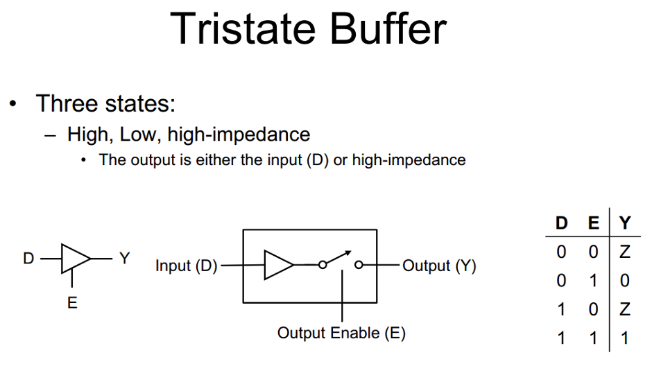
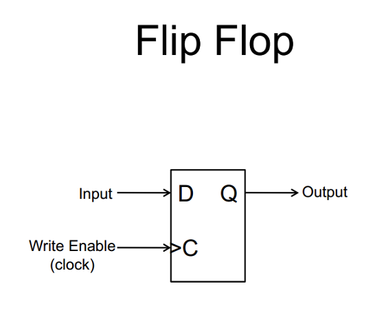
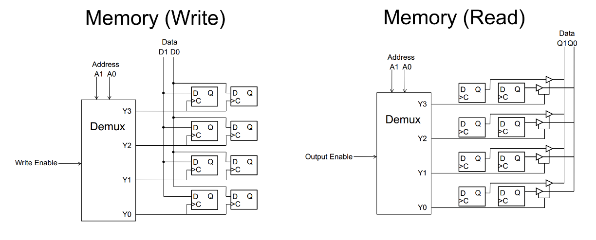
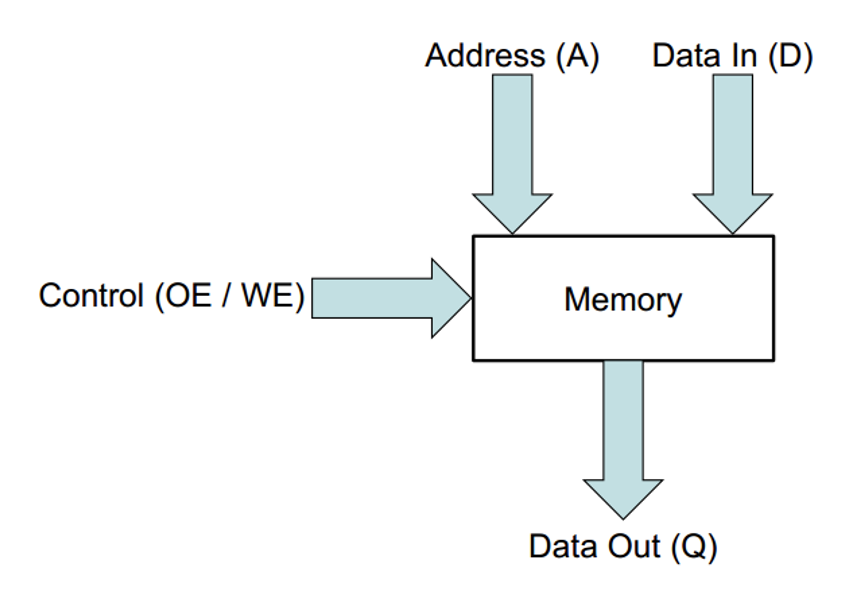
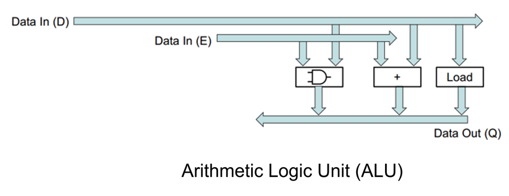
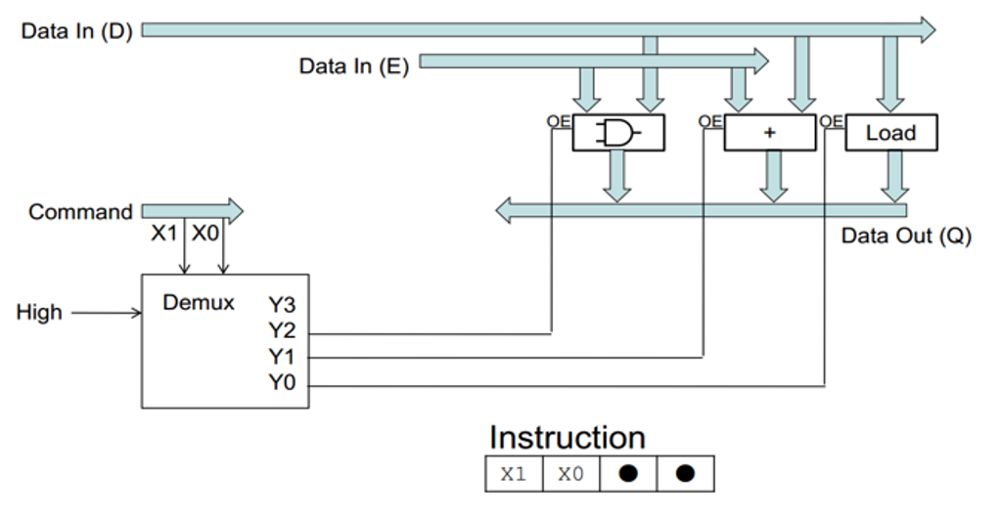
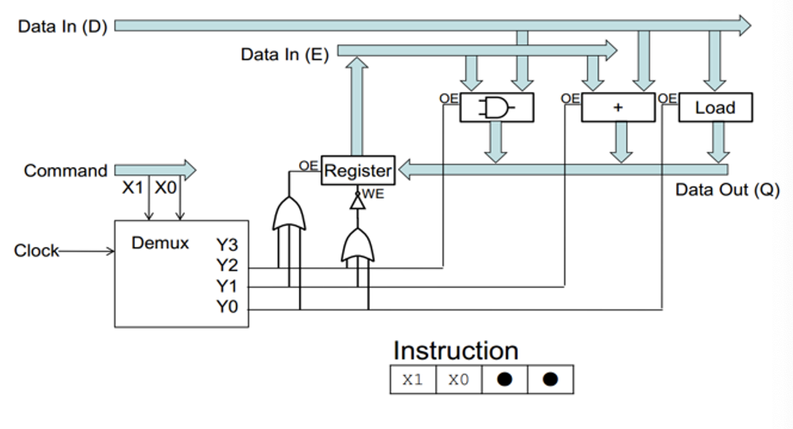
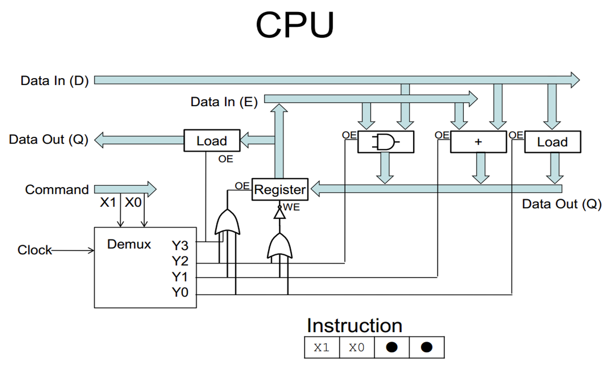

# CAOS

## Revision of Digital systems

### Tristate Buffer

- 세 가지 상태
  - High, Low, high-impedance
- high-impedance: 저항이 아주 높은 상태
  - 완전히 끊기진 않았지만 단선 상태

### Flip Flop

## Memory

- Flip flop은 바이트 단위(또는 그 이상)으로 그룹화됨
  - 각 바이트에는 고유한 주소가 있음

- 메모리에 쓰기
  - 주소와 데이터 제시
  - 메모리 칩에 쓰기 지시
- 메모리에서 읽기
  - 주소 제시
  - 메모리 칩에 읽기 지시
  - 데이터 보기

- 메모리 크기는 주소 Bus 폭에 따라 달라짐

### Read/Write Memory

- 읽기와 쓰기는 하나의 bus를 사용함
  - 단방향

## BUS

- 3가지 종류의 Bus가 있음
  - Data, Control, Address Bus

- Data Bus
  - D, Q
- Address Bus
  - 사용할 메모리 셀 선택
- Control Bus
  - 읽기 쓰기 작업 선택 + others

## Arithmetic Logic Unit (ALU)

- 산술 및 논리 연산 수행
- 서브 유닛
  - 가산기, 논리 테스트, 논리 연산, 시프팅, 비교, 곱셈, 나눗셈

## Control Unit (CU)

- 컴퓨터의 작동을 조정
- 제어 신호 생성
  - 레지스터를 bus에 연결
  - ALU 제어
  - 시스템에 타이밍 signal 제공
- CU의 동작은 명령의 디코딩 및 실행과 관련이 있음

## Registers

- 레지스터는 이름이 있는 메모리 셀
- 데이터 명령어 등을 저장함
- 다양한 크기를 가지고 있음
- 프로그램 카운터(PC)와 메모리 주소 레지스터는 주소 버스와 너비가 같아야함

- 누산기(accumulator)는 특수 레지스터
  - 피연산자 중 하나의 소스
  - 결과의 대상

- 상태 플래그(status flag)는 특수 레지스터
  - 개별 비트는 연산 결과에 대한 정보를 저장함
  - 0, carry, 오버플로우, 음수

## Central Processing Unit (CPU)

## Von Neumann Architecture

- 데이터와 명령은 단일 read-write 메모리에 저장되어 있음
- 메모리의 요소들은 주소로 저장되어 있음
  - 데이터 유형과는 상관 없음
- 실행은 한 명령어에서 다음 명령어로 순차적으로 이뤄짐

- 프로그램과 데이터는 같음
  - 따라서 소스코드(데이터)를 작성한 뒤 컴파일하여 실행하여 프로그램을 만들 수 있음

