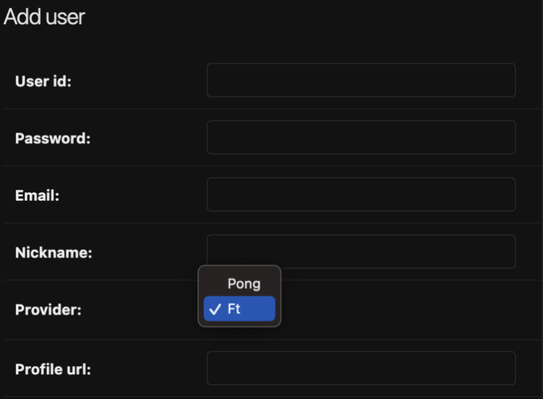
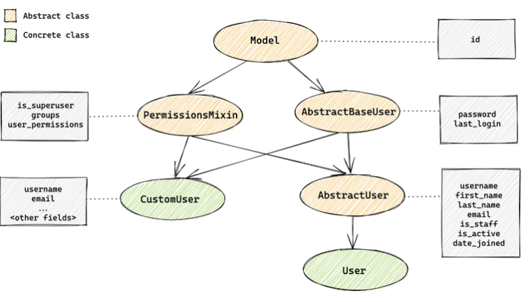

# Django models & user



# Django ORM을 사용하여 Enum 표현하기

```python
class User(models.Model):
    class Provider(models.TextChoices):
        PONG = 'PONG', 'Pong'
        FT = 'FT', 'Ft'
    
    provider = models.CharField(
        max_length=50,
        choices=Provider.choices,
        default=Provider.PONG,
    )
```

- Provider의 첫 번째 ‘PONG’은 선택지의 식별자
    - `if user.provider == User.Provider.PONG:` 과 같이 사용할 수 있음
    - 데이터베이스에 직접 저장되는 값
- Provider의 두 번째 ‘Pong’은 사용자에게 보여지는 값
    - 폼에서 선택지를 보여줄 때, 관리자 페이지에서 값을 보여줄 때 등 사용됨

# 테이블 생성하기

`python manage.py makemigrations` → `python manage.py migrate`

- makemigrations는 장고가 테이블 작업을 수행하기 위한 파일을 만드는 명령어
- 실제 테이블 생성은 migrate 명령어를 통해 이뤄짐

# 관리자 계정 생성

`python manage.py createsuperuser`

# Django User

## 자료 1 - 장고 사용자 모델에 대해 알아야 할 사항

[What You Should Know About The Django User Model](https://simpleisbetterthancomplex.com/article/2021/07/08/what-you-should-know-about-the-django-user-model.html)



### 서론

- 장고 user 모델은 최소 16년 전의 초기 구현을 기반으로 하고 있음
    - 사용자, 인증 부분은 장고를 사용하는 애플리케이션에서 핵심적인 부분이기 때문에 이전 버전과의 호환성을 위해 단점이 계속 유지됨
- 구형 유저 모델을 사용할 수 있도록 장고는 애플리케이션의 필요에 맞게 기본 구현을 재정의할 수 있는 방법을 제공함
    - 이런 변경 중 일부는 프로젝트 시작 시 바로 수행해야 함
    - 이미 프로덕션에 들어간 상황에서는 데이터베이스 구조를 변경하기 매우 어려움

### User 모델의 제한 사항

- 문제 사항: 사용자 이름 필드는 대소문자를 구분함
    - 애플리케이션은 john.doe와 John.doe를 다른 사용자로 인식함
    - 이는 보안 문제와 사용자 경험 저하를 일으킬 수 있음
- 해결 방법
    - PostgreSQL을 사용하는 경우 사용자 이름 CharField를 대소문자를 구분하지 않는 CICharField로 대체할 수 있음(대소문자를 구분하지 않음)
    - UserManager에서 `get_by_natural_key` 메서드를 오버라이드하여 데이터베이스에 쿼리하기
    - ModelBackend 구현을 기반으로 사용자 정의 인증 백엔드 만들기

---

- 문제 사항: 사용자 아이디 필드는 유니코드 문자에 대해 유효성을 검사함
    - 기본적으로 사용자 아이디 필드에 문자, 숫자, `@.+-_` 등의 문자를 사용할 수 있음
    - Django에서는 `ASCIIUsernameValidator`와 `UnicodeUsernameValidator`라는 사용자 이름 유효성 검사기를 제공함
        - A-Z까지의 문자만 허용하고 싶다면 `ASCIIUsernameValidator`를 사용하면 됨
- 해결 방법
    - 기본 user 모델을 바꾸고 사용자 이름 유효성 검사기를 `ASCIIUsernameValidator`로 변경하기
    - 기본 user 모델을 바꿀 수 없는 경우 user를 만들거나 업데이트하는 부분에서 유효성 검사기를 변경하기

---

- 문제 사항: 이메일 필드가 고유하지 않음
    - 여러 사용자가 계정에 동일한 이메일 주소를 사용할 수 있음
    - 기본적으로 이메일은 비밀번호 복구에 사용됨 
    → 동일한 사용자가 두명이면 같은 이메일을 가진 모든 계정에 대해 비밀번호 재설정이 시작됨
    - 이메일 필드가 고유하지 않으면 사용자를 인증하는 옵션을 제공할 수 없음
- 해결 방법
    - AbstractBaseUser를 사용하여 기본 User 모델을 대체하여 이메일 필드를 처음부터 다시 정의하기
    - User 모델을 교체할 수 없는 경우 create, update하는 부분에 유효성 검사를 추가하기
