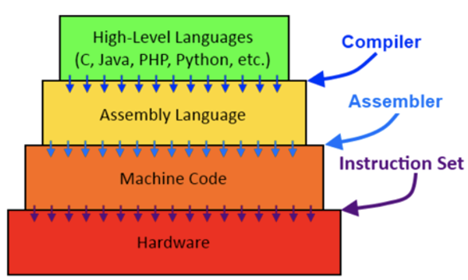
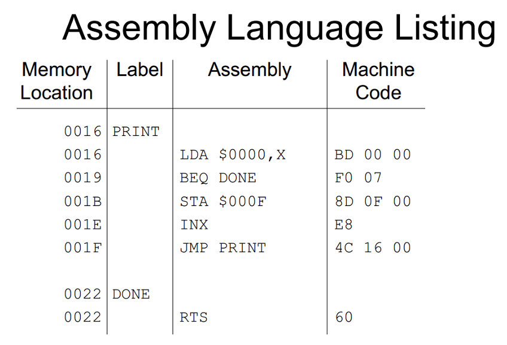
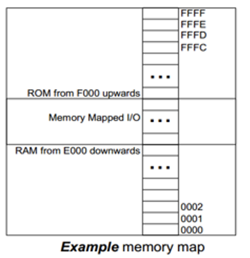
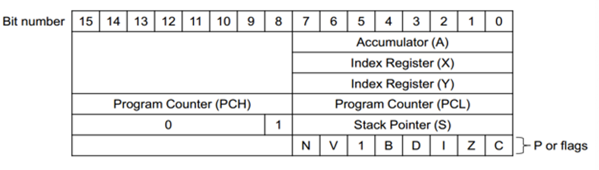
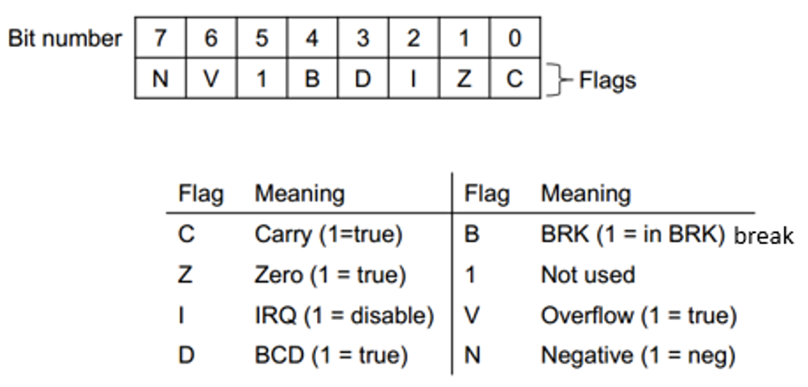
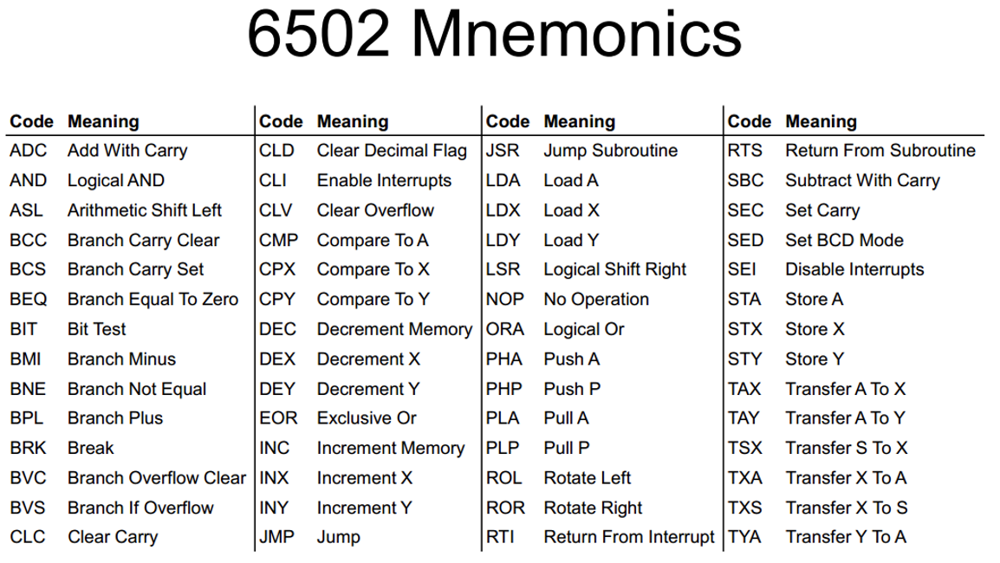

# CAOS
## Machine Code

- 숫자만을 사용해서 프로그램을 작성하기 어려움
- 프로그래머는 각 비트가 무엇을 하는지 알기 어려움
- 0과 1로만 이루어져 있어 코드를 읽기 어려움

## Assembly Language

- 가장 low-level의 언어
- 기계어에 비해 보기 편함
- CPU는 각 종류에 맞는 어셈블리어를 가지고 있음
  - 어셈블리 프로그램은 CPU에 종속적이므로 다른 아키텍쳐의 CPU에 이식이 안됨

- 메모리 구역에 이름을 지어줌
  - PRINT는 메모리 구역의 이름
  - 해당 구역에 PRINT라는 루틴이 저장되어 있음
- 어셈블러는 메모리의 절대적인 위치를 알려줌

- 어셈블리어는 기계어를 알아보기 쉽게 표현해둔 것

## Instruction Set

- CPU가 가지고 있는 모든 명령어의 집합을 instruction set이라고 부름
- opcodes: 명령어
  - X 레지스터를 증가 -> INX
- operands: 파라미터
  - Goto: JMP PRINT

### Instruction Syntax

- <label> <opcode> <operands> ; <comment>
- 파라미터
  - #: 즉시 피연산자를 사용
  - $: 16진수 값
  - %: 2진수 값
  - 0: 8진수 값
  - (): 포인터가 가르키는 곳의 값

- `STA $0F`
  - label: ST
  - opcode: A
  - operands: $0F
  
### Programmer's Model

- 컴퓨터는 각기 다른 하드웨어 모델을 사용해 만들어짐
- 하지만 프로그래머가 컴퓨터를 사용할 때는 같은 경험을 할 수 있음

## 6502 Programmer's Model

- 컴퓨터는 64KB 크기의 메모리를 가지고 있음
- 각 바이트는 번호가 매겨져 있음 ($0000 ~ $FFFF)
- 몇몇 메모리 공간에는 특별한 의미가 있음 (e.g. interrupts)
  - $FFFA ~ $FFFB: NMI (Non-maskable inputs) -> 가장 우선순위가 높은 인터럽트
  - $FFFC - $FFFD: Reset
  - $FFFE - $FFFF: IRQ (Interrupt Request)
  - 이외에도 추가적인 인터럽트들이 있음

- 메모리 공간은 3개의 청크로 구분됨
  - ROM
  - RAM
  - Memory Mapped I/O

- 메모리 공간은 256 바이트로 나뉘어져 있음 -> 이를 pages라고 부름

### 6502 Registers

- General purpose
  - A: 8bit의 accumulator
  - X: 8bit의 index register
  - Y: 8bit의 index register
- Special purpose
  - PC: Program Counter
  - S: Stack pointer
  - P: Processor flags

### 6502 Flags (P)

- P는 이전 명령의 결과를 기억하고 있음
  - 이를 ripple-carry-adder에서 봤었음

## The Stack

- 스택은 01에서 시작하는 16비트 주소를 가지고 있음
  - Page 1에 있음
  - Page 1은 스택을 위해 예약된 곳

## Procedure Calls

- C에서는 몇줄만으로 명령을 작성할 수 있지만, 어셈블리에서는 모든 것을 직접 적어야함
  - 레지스터에 파라미터를 넣고 호출
  - 파라미터를 스택에 push하고 호출 등
