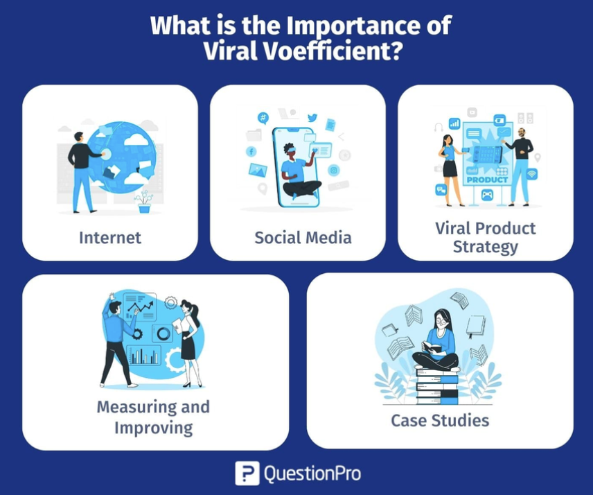

# Viral Coefficient 개념 공부

> 바이럴 엔진 설계하기 위한 viral coefficient 개념공부

[Viral Coefficient: Definition, Calculation, and Importance](https://www.questionpro.com/blog/viral-coefficient/)

# 서문

- 현재 디지털 시대에 바이럴 마케팅은 성공적인 온라인 비즈니스나 캠페인의 필수요소
- 바이럴 마케팅의 성공을 결정하는 주요 지표 중 하나는 Viral Coefficient(바이럴 계수)
    - 바이럴 계수를 이해하면 마케팅 전략의 효과를 측정할 수 있음
    - 기하급수적인 성장 가능성을 평가하는데 도움이 될 수 있음
- 서비스의 성장과 바이럴 성공을 이끄는 데 있어 바이럴 계수의 정의, 계산, 중요성, 장단점에 대해 살펴보자.

# 바이럴 계수의 정의

### 바이럴 계수란?

- 바이럴 계수는 바이럴 성장 계수(Viral Growth Coefficient) 또는 K-factor라고도 함
- 기존 제품 또는 서비스 사용자가 입소문 혹은 바이럴 수단을 통해 신규 사용자를 유입하는 비율을 측정
- 특정 기간 동안 기존 사용자가 각각 생성하는 평균 신규 사용자 수를 나타냄

### 바이럴 계수 계산

> 바이럴 계수 (K) = 사용자당 전송된 초대 수 * 전환율
> 
- 사용자당 보낸 초대 횟수: 기존 사용자가 잠재적인 신규 사용자에게 보내는 평균 초대 횟수
- 전환율: 초대를 수락하여 새 사용자가 된 수신자의 비율

# 바이럴 계수를 어떻게 계산할 수 있을까?

- 모든 비즈니스는 확실한 수치에 의존함
    - 가설은 전략을 수립해야 할 때만 유효함
    - 영업, 마케팅, 생산 모두 숫자가 중요함
    - 사실을 숫자의 형태로 표현하는 것이 중요하다.

### 비즈니스의 바이럴 계수를 계산하는 예시

1. 현재 고객 수를 살펴보자. 
    1. 예시에서는 고객 수가 10,000명이라고 가정함
2. 이 숫자에 현재 고객이 친구, 가족, 동료에게 보내는 초대 횟수를 곱함
    1. 비즈니스가 온라인에서 이뤄지는 경우, 이 숫자를 구하는 것은 어렵지 않음
    2. 비즈니스가 오프라인에서 운영되는 경우 필요한 통계를 얻기 위해 약간의 조사가 필요함
    3. 예시에서는 초대 수가 1500명이라고 가정함
3. 초대를 받은 사람 중 고객으로 전환된 사람의 비율을 찾기
    1. 초대 받은 사람 중 신규 고객이 된 사람의 비율을 구하기 → 10%로 가정
4. 10,000명의 소비자가 각각 15개의 초대를 보냈다면 이는 150,000개의 초대가 됨
    1. 150,000명 중 10%가 신규 고객이 되었다면 15,000명이 됨
5. 따라서 15,000명의 신규 고객을 확보함
    1. 비즈니스의 총 고객은 25,000명이 됨
6. 확보한 신규 고객 수를 기존 고객 수로 나누면 바이럴 계수를 계산할 수 있음
    1. 15,000  / 10,000 = 1.5
    2. 현재 바이럴 계수는 1.5

- 바이럴 계수를 계산할 때는 두 가지 중요한 사항이 존재함

## Acquisition

- 위 계산에서 숫자가 중요한 역할을 함
    - 실제 전환하여 고객이 된 사람의 수
- 각 고객이 200개의  초대를 보냈더라도 가입한 사람이 한 명도 없다면 바이럴 계수는 0이 됨

## Realistic numbers

- 고객이 친구를 계속 반복해서 초대할 가능성은 거의 없음
- 현재 측정한 실시간 숫자로 작업하는 것이 좋음

# 바이럴 계수의 중요성

- 바이럴 계수는 입소문 마케팅과 고객 추천을 통해 비즈니스 또는 제품의 기하급수적인 성장을 이끌 수 있는 능력에 있음

### 인터넷

- 인터넷은 신규 기업에게 많은 기회를 제공할 수 있음
- 웹에 콘텐츠를 올리는 데 드는 비교적 저렴한 비용으로 열린 커뮤니케이션이 가능함

### 소셜 미디어

- 페이스북, 트위터, 링크드인, 인스타그램, 텀블러 등
- 소셜 미디어 플랫폼의 성장은 긍정적인 바이럴 계수와 친구 및 가족에게 사용 사례를 공유할 때 활용되는 네트워크 효과로 일어남

### 바이럴 제품 전략

- 비즈니스는 바이럴 계수를 지속적으로 개선하는 데 초점을 맞춰야함
- 이는 결과적으로 제품과 신규 고객 확보 능력을 크게 향상시킴
- 제품 부족으로 기업이 폐업하는 경우는 거의 없음
    - 고객 부족, 더 정확하게는 신규 고객을 확보할 수 있는 역동적인 전략의 부재가 기업을 망하게 함

### 측정 및 개선

- 바이럴 계수가 양수라는 것은 비즈니스가 지속적으로 신규 고객을 확보하고 기하급수적으로 성장하고 있다는 것을 의미함
- 고객 확보는 어려울 수 있지만 제품 전략에 집중하고 바이럴 계수를 계산하면 비즈니스 성장과 성공에 더 나은 기회를 제공할 수 있음

### 사례 연구

- 바이럴 계수를 성공적으로 활용하여 바이럴 성장을 달성한 기업의 실제 사례를 분석
- 그들의 전략과 결과를 분석하여 실행 가능한 인사이트를 얻기

# 바이럴 계수의 계산 예시

- 바이럴 계수는 기존 만족한 고객이 창출하는 신규 소비자 또는 고객 수로 정의됨
- 이러한 현상을 기업의 성장에 도움이 되는 바이럴리티(virality)라고 함
    - 바이럴리티는 기존 고객이 친구, 가족, 동료를 회사나 브랜드에 추천할 때 받는 인센티브

### 두 개의 의류 브랜드 A, B의 예시

- 두 브랜드는 거의 비슷한 시기에 출시되었고, 모두 다양한 의류 디자인을 선보이고 있음
- 하지만 몇 달이 지나면서 B 브랜드는 매우 좋은 성과를 거두기 시작했지만, A 브랜드는 계속해서 어려움을 겪음
- 두 브랜드의 품질, 디자인, 가격, 쇼룸 위치 등 요소가 동일한데 이러한 현상이 발생함
- B 브랜드가 A 브랜드보다 더 많은 소비자를 보유하고 있는 이유 → 바이럴 계수 또는 바이럴리티

### 마케팅 예시

- 링크드인과 페이스북에 메시지 게시, 애드워즈 광고, 블로그 작성 등
- 구식으로 보일 수 있지만, 브랜드를 바라보는 방식에 큰 차이를 보이는 시장 조사 방법 → **입소문**
- 입소문은 소비자들이 브랜드를 다르게 보기 시작하는 지점
    - 기존 고객이 가족, 친구, 동료에게 브랜드를 추천하는 것은 놀라운 일
- 새로운 시대와 전통적인 마케팅을 적절히 조합했을 때 비즈니스가 기하급수적으로 성장할 수 있음

# 바이럴 계수의 장점

- 양수의 바이럴 계수는조직의 기하급수적인 성장과 궤적을 달성하고 있음을 나타내는 좋은 지표임
- 이 지표는 좋은 제품 자체의 결과
    - 제품이 좋으면 긍정적인 평가를 받게 됨
    - 바이럴을 개선하는 것은 제품을 개선하는 것에서 시작됨
- 가장 바이럴이 잘 되는 제품은 인터넷을 놀라게 했을 뿐만 아니라 사용자들로붙터  좋은 평가를 받은 제품
- 마케터가 입소문 확산을 평가하고 예측하려면 1보다 큰 바이럴 계수가 필요함

# 바이럴 계수의 단점

- 바이럴 계수는 저절로 변경되지 않는 지표
- 양수의 바이럴 계수는 전적으로 제품에 따라 달라짐
    - 제품이 좋을수록 바이럴 계수도 높아짐
- 양수의 바이럴 계수 지표는 바이럴 주기 시간이 짧은 경우에만 얻을 수 있음
    - 고객이 가족, 친구를 초대하고 추천받은 고객이 신규 고객이 되는데 걸리는 시간이 짧고 빨라야 함
- 바이럴 주기가 짧을수록 회사는 더 빨리 성장할 수 있음

# 결론

- 경쟁이 치열한 디지털 환경에서 바이럴 계수는 제품의 성패를 좌우할 수 있는 중요한 지표
- 바이럴 계수의 정의를 이해하고, 정확하게 계산하고, 이를 개선하기 위해 노력하는 것이 바이럴 기업의 성장 궤적을 활용하고자 하는 기업과 마케터에게 필수적인 단계
- 브랜드는 매력적이고 공유 가능한 경험을 창출함으로써 바이럴 계수의 막대한 잠재력을 활용하고 새로운 차원의 성장을 도모할 수 있음
- 각 기존 사용자를 통해 얼마나 많은 신규 사용자가 생성되는지 파악함으로써 플랫폼은 유기적인 성장과 사용자 참여를 극대화하여 시장에서 지속적인 성공을 거둘 수 있도록 전략을 조절할 수 있음

---

# 느낀점

- 애니팡의 초대 시스템이 이러한 바이럴 계수를 활용하는 대표적인 사례 같다.
- 서비스가 지속적으로 성장하기 위해서는 신규 사용자의 유입이 필요
    - 이를 객관적인 지표로 보여주는 것이 바이럴 계수
- 제품의 퀄리티에 많이 의존함
    - **MVP의 경우 제품의 퀄리티가 낮은데, 바이럴 계수가 저평가될 가능성도 있지 않을까?**
- 제품의 퀄리티 때문에 유입이 되지 않는 것인지, 바이럴 엔진이 비효율적인 것인지 판단할 방법도 궁금하다.

# Viral Engine 성공 사례

[제품 성장의 엔진, 제품 주도 성장 바이럴 전략 | 요즘IT](https://yozm.wishket.com/magazine/detail/715/)

### Dropbox

- 클라우드 서비스
- 검색 광고를 중심으로 고객을 모으려고 함 → 이미 경쟁률이 높았음
- 전략을 바꿔 입소문(WoM)과 제품 초대(Referral)에 집중하기로 함
- 사용자 초대 시스템
    - Dropbox는 사용자가 친구를 초대하면 추가 저장 공간을 받는 인센티브 전략을 도입
    - 사용자는 친구를 초대할 때마다 일정량의 무료 저장 공간을 받음
    - 이메일, 소셜 미디어, 초대 링크 등을 통해 친구를 초대할 수 있음
- 바이럴 루프
    - 초대 및 가입 → 인센티브 제공 → 반복
    - 기존 사용자가 친구를 초대 → 가입한 사용자가 앱을 설치하면 기존 사용자와 신규 사용자 모두에게 인센티브 제공
    - 신규 사용자가 다시 친구를 초대하면서 바이럴 루프 형성
- Dropbox 바이럴 엔진의 성공 요인
    - 추가 저장 공간이라는 명확하고 실질적인 혜택을 제공
    - 쌍방 인센티브: 기존 사용자와 신규 사용자 모두에게 혜택을 제공
    - 쉬운 초대 프로세스: 가입 절차 간소화
    - 지속적 참여 유도: 지속적으로 친구를 초대할 수 있도록 함

## 우리 서비스에 적용할만한 바이럴 방법

### 사용자 분석

- 클라이밍 사용자들이 인스타에 영상을 올리는 이유
    - 자신이 클라이밍 하는 모습을 많은 사람들이 봐주길 원함
    - 클라이머 뿐만 아니라 일반 친구에게도 자신의 클라이밍 영상을 보여주길 원함
- 자신의 문제 풀이 영상이 우리 서비스에 등재되면 기분이 좋을 것임
    - 아직 아무도 풀지 않은 문제를 첫 번째로 풀어 자신의 영상을 올리기
- 클라이밍 영상을 올리기 위해서 하는 작업
    - 자신이 등반할 벽을 향해 삼각대 설치
    - 동영상 시작 버튼 터치
    - 등반 → 등반 완료
    - 동영상 정지 버튼 터치
- 인스타에 업로드하기 위해 영상 편집, 등반 실패한 영상 제거, 문제별 분류 과정이 필요함
- 영상 편집 기능을 제공하면서 문제 난이도 등의 워터마크를 다는 것은 어떨까?
    - 서비스를 특정할 수 있는 디자인
    - 암장 이름, 벽 이름, 문제 난이도 등의 정보가 영상에 함께 나올 수 있도록 하기
    - 디자인을 통해 자연스럽게 서비스 바이럴
- 게임 요소를 추가하면 좋을 것 같다.

## 바이럴 엔진

### 사용자 기여 영상 공유 시스템

- 사용자가 동영상을 업로드하고 공유할 수 있음
- 문제 풀이 영상 업로드
    - 사용자가 자신의 문제 풀이 영상을 서비스에 업로드.
    - 첫 번째로 문제를 푼 사용자는 ‘First Ascent’ 배지를 받음
- 편집 기능 제공
    - 서비스 내에서 간편한 영상 편집 기능을 제공
    - 사용자가 실패한 영상을 제거하고, 등반 성공 영상을 문제별로 분류할 수 있도록 함
- 워터마크 추가
    - 영상에 서비스 로고, 암장 이름, 벽 이름, 문제 난이도 등의 정보를 포함한 워터마크를 자동으로 추가
    - 서비스의 아이덴티티를 유지
- 자동 공유 옵션
    - 인스타그램 등 소셜 미디어에 영상을 손쉽게 공유할 수 있는 옵션을 제공
    - 공유 시 자동으로 해시태그 추가
    - 혹은 편집한 영상을 저장하여 바로 인스타에 업로드할 수 있도록 제공 → 스토리, 게시글 형태 모두 제공

### 사용자 참여 유도 인센티브

- 리워드 시스템 구축
- 포인트 시스템
    - 사용자가 영상을 업로드하거나 공유할 때마다 포인트를 적립
    - 포인트는 서비스 내에서 사용할 수 있는 혜택으로 교환(프로필 꾸미기, 영상 워터마크 변경, 실제 상품으로 교환)
- 배지와 등급 시스템
    - 다양한 활동(첫 번째로 문제를 푼 경우, 영상 공유 횟수)에 대해 배지와 등급을 부여
    - 사용자들이 지속적으로 활동에 참여하도록 유도
- 월간 챌린지
    - 월별로 특정 문제를 해결한 사용자들에게 보상을 제공하는 챌린지 진행
    - 지속적인 참여 유도
    - 추후에 특정 암장과의 콜라보를 통해 사용자를 해당 암장으로 유도

### 사용자 경험 개선

- 문제 검색 기능
    - 사용자가 특정 문제를 쉽게 찾을 수 있도록 검색 기능 강화
    - 벽 사진만 찍으면 해당 벽에 있는 문제 리스트들이 나오도록 하기 (Embedding 기술 적용)
- 문제별 해결법 제공
    - 각 문제에 대한 해결법을 영상과 텍스트로 제공
    - 텍스트의 경우 생성형 AI를 활용

### 소셜 기능 강화

- 커뮤니티 형성
    - 사용자가 업로드한 영상에 댓글을 남기고 좋아요를 누를 수 있도록 함
    - 궁극적으로는 인스타 = 일반인에게 자랑, 우리 서비스 = 클라이머에게 자랑 목적이 되도록하기

### 파트너십 및 협업

- 암장과의 협업
- 암장 프로모션
    - 암장과 협력하여 특정 문제를 해결하는 사용자에게 혜택을 제공하는 프로모션 제공
    - 특정 문제를 풀면 암장에서 사용할 수 있는 할인 쿠폰 제공 or 암장 내 상품 제공
- 암장 정보 제공
    - 각 암장의 정보(운영 시간, 위치, 문제 수명)등을 서비스에 포함

### 데이터 분석 및 피드백

- 사용자 활동 분석
    - 사용자의 활동 데이터를 분석
    - 인기있는 문제, 빈번하게 공유되는 영상 등을 파악함
- 피드백 시스템
    - 정기적인 설문조사, 피드백 양식 등을 통해 사용자 의견 수렴
    - 게임 내 리워드로 설문조사 유도